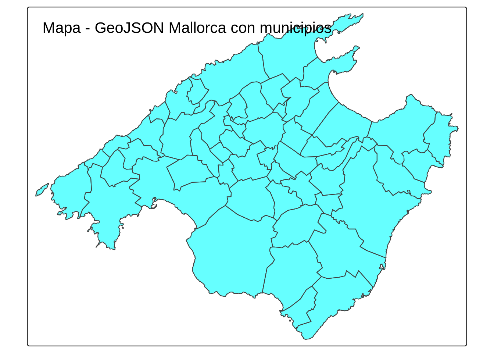
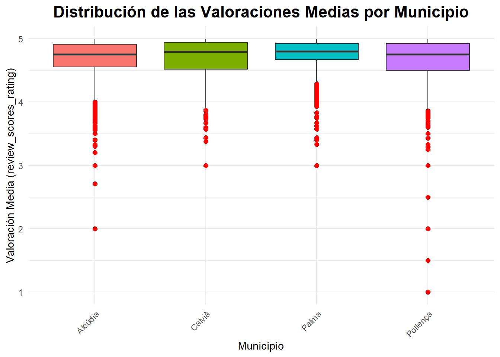
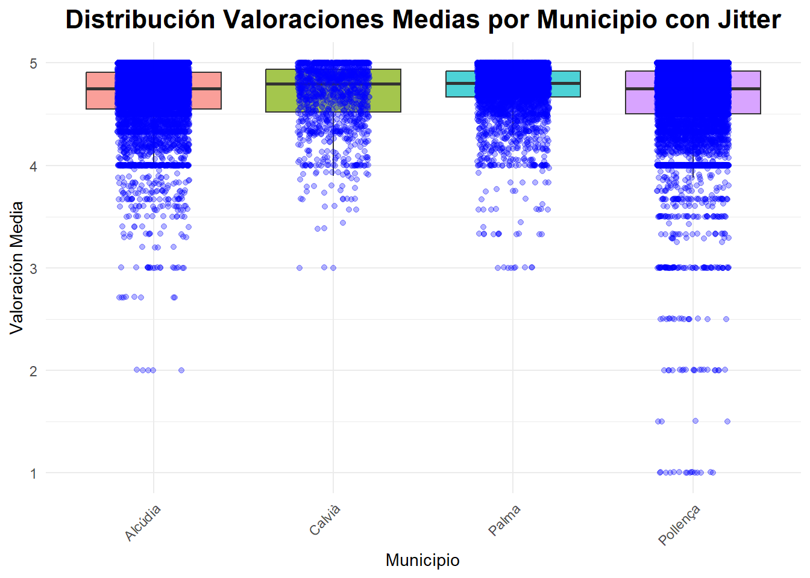
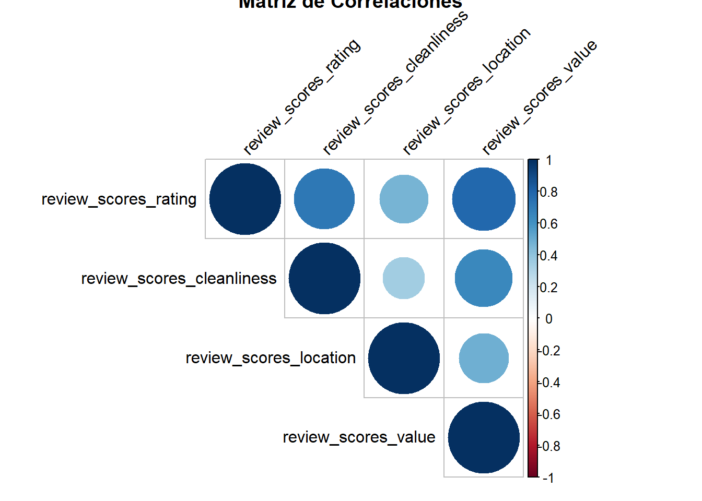
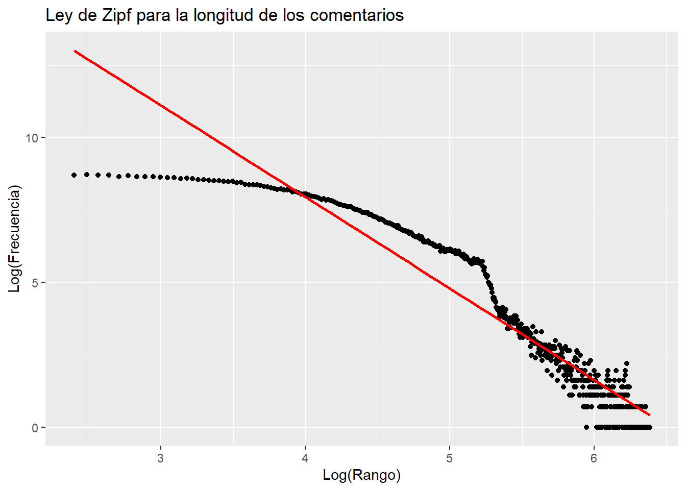

# Instrucciones para el taller

Se entrega en grupos que deben de estar constituidos en la actividad de grupos. Los grupos son de 2 o 3 ESTUDIANTES, loa caso especiales consultadlos con el profesor para que los autorice.

**Enlaces y Bibliografía**

-   [R for data science, Hadley Wickham, Garret Grolemund.](https://r4ds.had.co.nz/)
-   [Fundamentos de ciencia de datos con R.](https://cdr-book.github.io/)
-   [Tablas avanzadas: kable, KableExtra.](https://haozhu233.github.io/kableExtra/awesome_table_in_html.html)
-   [Geocomputation with R, Robin Lovelace, Jakub Nowosad, Jannes Muenchow](https://r.geocompx.org/)
-   Apuntes de R-basico y tidyverse moodel MAT3.

## Objetivo MALLORCA

Leeremos los siguientes datos de la zona de etiqueta `mallorca` con el código siguiente:


::: {.cell}

```{.r .cell-code}
load("clean_data/mallorca/listing_common0.RData")
ls()
```

::: {.cell-output .cell-output-stdout}

```
[1] "listings_common0"
```


:::

```{.r .cell-code}
listings0 = listings_common0 %>%
  select(id, scrape_id, listing_url,
         neighbourhood_cleansed, price,
         number_of_reviews,
         review_scores_rating,
         review_scores_rating,
         review_scores_cleanliness,
         review_scores_location,
         review_scores_value,
         number_of_reviews,
         accommodates,
         bathrooms_text,
         bedrooms,
         beds,
         minimum_nights,
         description,
         latitude,
         longitude,
         property_type,
         room_type)
```
:::


**listings**

Generamos la  tibble `listings0` con datos DE  8 periodos  DE  apartamentos de inside Airbnb de Mallorca Y  seleccionando cuantas variables nos parecen más interesantes.

Separararemos la fecha del scrapping que es en la que se observaron  los datos de cada apartamento  nos quedaremos con los apartamentos que aparecen en las 8 periodos "scrapeados".


::: {.cell}

```{.r .cell-code}
listings0= listings0 %>% 
  mutate(date=as.Date(substr(
    as.character(scrape_id),1,8),
    format="%Y%m%d"),
    .after=id)
```
:::


Ahora  analizamos  las fechas de los scrapings y el número de veces que aparecen cada  apartamentos.


::: {.cell}

```{.r .cell-code}
table(listings0$date)
```

::: {.cell-output .cell-output-stdout}

```

2023-12-17 2024-03-23 2024-06-19 2024-09-13 2024-12-14 2025-03-07 2025-06-15 
      9197       9197       9197       9197       9197       9197       9197 
2025-09-21 
      9197 
```


:::
:::

Hay 8 periodos de scrapping y vamos a quedarnos con los apartamentos que aparecen en todos los periodos


Vemos que cada apartamento aparece 8 veces una por periodo.


::: {.cell}

```{.r .cell-code}
table(table(listings0$id))
```

::: {.cell-output .cell-output-stdout}

```

   8 
9197 
```


:::
:::


Notemos que cada apartamento:

-   queda identificado por id y por date que nos da el periodo en la que apareció el dato.
-   así que cada apartamento aparece 8 veces ya que hemos elegido solo los apartamentos que aparecen en las 8 muestras.
-   Las muestras son 2023-12-17, 2024-03-23, 2024-06-19, 2024-09-13, 2024-12-14, 2025-03-07, 2025-06-15, 2025-09-21,


::: {.cell}

```{.r .cell-code}
unique(listings0$date)
```

::: {.cell-output .cell-output-stdout}

```
[1] "2023-12-17" "2024-03-23" "2024-06-19" "2024-09-13" "2024-12-14"
[6] "2025-03-07" "2025-06-15" "2025-09-21"
```


:::
:::


**reviews**

Estos datos necesitan leerse de forma adecuada, las columnas 1, 2 y 4 deben ser de tipo `character` las otras son correctas


::: {.cell}

```{.r .cell-code}
reviews=read_csv("data/mallorca/2025-09-21/reviews.csv.gz")
str(reviews)
```

::: {.cell-output .cell-output-stdout}

```
spc_tbl_ [398,782 × 6] (S3: spec_tbl_df/tbl_df/tbl/data.frame)
 $ listing_id   : num [1:398782] 69998 69998 69998 69998 69998 ...
 $ id           : num [1:398782] 881474 4007103 4170371 4408459 4485779 ...
 $ date         : Date[1:398782], format: "2012-01-24" "2013-04-02" ...
 $ reviewer_id  : num [1:398782] 1595616 3868130 5730759 5921885 810469 ...
 $ reviewer_name: chr [1:398782] "Jean-Pierre" "Jo And Mike" "Elizabeth" "Jone" ...
 $ comments     : chr [1:398782] "This place was charming! Lorenzo himself is a very warm and engaging host and made us feel very welcome. \r<br/"| __truncated__ "We had a four night stay at this gorgeous apartment and it was absolutely perfect. It's really pretty, beautifu"| __truncated__ "Lor's apartment looks exactly like the pictures! It is perfectly located for historic Palma - close to the Cath"| __truncated__ "Wonderful place! 10/10. Charming, spacious and comfortable. Looks even more splendid than in the pictures. The "| __truncated__ ...
 - attr(*, "spec")=
  .. cols(
  ..   listing_id = col_double(),
  ..   id = col_double(),
  ..   date = col_date(format = ""),
  ..   reviewer_id = col_double(),
  ..   reviewer_name = col_character(),
  ..   comments = col_character()
  .. )
 - attr(*, "problems")=<externalptr> 
```


:::

```{.r .cell-code}
head(reviews)
```

::: {.cell-output .cell-output-stdout}

```
# A tibble: 6 × 6
  listing_id      id date       reviewer_id reviewer_name comments              
       <dbl>   <dbl> <date>           <dbl> <chr>         <chr>                 
1      69998  881474 2012-01-24     1595616 Jean-Pierre   "This place was charm…
2      69998 4007103 2013-04-02     3868130 Jo And Mike   "We had a four night …
3      69998 4170371 2013-04-15     5730759 Elizabeth     "Lor's apartment look…
4      69998 4408459 2013-05-03     5921885 Jone          "Wonderful place! 10/…
5      69998 4485779 2013-05-07      810469 Andrea        "My boyfriend and I, …
6      69998 4619699 2013-05-15     3318059 Devii         "We had a very last m…
```


:::
:::


**neighbourhoods.csv**

Son dos columnas y la primera es una agrupación de municipios (están NA) y la segunda es el nombre del municipio


::: {.cell}

```{.r .cell-code}
municipios=read_csv("data/mallorca/2025-09-21/neighbourhoods.csv")
str(municipios)
```

::: {.cell-output .cell-output-stdout}

```
spc_tbl_ [53 × 2] (S3: spec_tbl_df/tbl_df/tbl/data.frame)
 $ neighbourhood_group: logi [1:53] NA NA NA NA NA NA ...
 $ neighbourhood      : chr [1:53] "Alaró" "Alcúdia" "Algaida" "Andratx" ...
 - attr(*, "spec")=
  .. cols(
  ..   neighbourhood_group = col_logical(),
  ..   neighbourhood = col_character()
  .. )
 - attr(*, "problems")=<externalptr> 
```


:::

```{.r .cell-code}
head(municipios)
```

::: {.cell-output .cell-output-stdout}

```
# A tibble: 6 × 2
  neighbourhood_group neighbourhood
  <lgl>               <chr>        
1 NA                  Alaró        
2 NA                  Alcúdia      
3 NA                  Algaida      
4 NA                  Andratx      
5 NA                  Ariany       
6 NA                  Artà         
```


:::
:::


**neighbourhoods.geojson**

Es el mapa de Mallorca, o podemos leer así:


::: {.cell}

```{.r .cell-code}
library(sf)
library(tmap)

# Leer el archivo GeoJSON
geojson_sf <- sf::st_read("data/mallorca/2025-09-21/neighbourhoods.geojson")
```

::: {.cell-output .cell-output-stdout}

```
Reading layer `neighbourhoods' from data source 
  `C:\Users\pausa\Documents\GitHub\tallerMat3_25_26\data\mallorca\2025-09-21\neighbourhoods.geojson' 
  using driver `GeoJSON'
Simple feature collection with 53 features and 2 fields
Geometry type: MULTIPOLYGON
Dimension:     XY
Bounding box:  xmin: 2.303195 ymin: 39.26403 xmax: 3.479028 ymax: 39.96236
Geodetic CRS:  WGS 84
```


:::

```{.r .cell-code}
# Crear un mapa

# interactivo
tmap_mode("plot") # Cambiar a modo  view/plot   que es interactivo/estático
tm_shape(geojson_sf) +
  tm_polygons(col = "cyan", alpha = 0.6) +
  tm_layout(title = "Mapa - GeoJSON Mallorca con municipios")
```

::: {.cell-output-display}
{width=672}
:::
:::


Tenéis que consultar en la documentación de inside Airbnb para saber que significa cada variable. Os puede ser útil leer los ficheros [DATA_ABB_modelo_de_datos.html](DATA_ABB_modelo_de_datos.html) y [DATA_ABB_modelo_de_datos.pdf](DATA_ABB_modelo_de_datos.html) en los que se explica el modelo de datos de inside Airbnb y como se cargan en el espacio de trabajo.

Responder las siguientes preguntas con formato Rmarkdown (.Rmd) o quarto (.qmd) y entregad la fuente un fichero en formato html como salida del informe. Se puntúa la claridad de la respuesta, la calidad de la redacción y la corrección de la respuesta.

## Pregunta 1 (**1punto**)

Del fichero con los datos de listings `listings0` calcula los estadísticos descriptivos de las variable `price` y de la variable `number_of_reviews` agrupados por municipio y por periodo.

Presenta los resultados con una tabla de kableExtra.

Resolución:

::: {.cell}

```{.r .cell-code}
library(kableExtra)

listings0 %>%
  group_by(neighbourhood_cleansed, date) %>%
  summarise(
    mean_price = mean(price, na.rm = TRUE),
    sd_price = sd(price, na.rm = TRUE),
    median_price = median(price, na.rm = TRUE),
    mean_reviews = mean(number_of_reviews, na.rm = TRUE),
    sd_reviews = sd(number_of_reviews, na.rm = TRUE),
    median_reviews = median(number_of_reviews, na.rm = TRUE)
  ) %>%
  ungroup() %>%
  kable(
    format = "html", 
    col.names = c("Municipio", "Fecha", "Media Precio", "Desv. Típica Precio",
                  "Mediana Precio", "Media Nº Reseñas", "Desv. Típica Nº Reseñas",
                  "Mediana Nº Reseñas"),
    caption = "Estadísticos descriptivos de Precio y Número de Reseñas por Municipio y Periodo"
  ) %>%
  kable_styling(
    bootstrap_options = c("striped", "hover", "condensed"), 
    full_width = FALSE
  ) %>%
  row_spec(0, background = "#2B3E50", color = "#EBEBEB") %>%  # <---- Color cabecera
  scroll_box(width = "1700px", height = "500px")
```

::: {.cell-output-display}
`````{=html}
<div style="border: 1px solid #ddd; padding: 0px; overflow-y: scroll; height:500px; overflow-x: scroll; width:1700px; "><table class="table table-striped table-hover table-condensed" style="width: auto !important; margin-left: auto; margin-right: auto;">
<caption>Estadísticos descriptivos de Precio y Número de Reseñas por Municipio y Periodo</caption>
 <thead>
  <tr>
   <th style="text-align:left;color: rgba(235, 235, 235, 255) !important;background-color: rgba(43, 62, 80, 255) !important;position: sticky; top:0; background-color: #FFFFFF;"> Municipio </th>
   <th style="text-align:left;color: rgba(235, 235, 235, 255) !important;background-color: rgba(43, 62, 80, 255) !important;position: sticky; top:0; background-color: #FFFFFF;"> Fecha </th>
   <th style="text-align:right;color: rgba(235, 235, 235, 255) !important;background-color: rgba(43, 62, 80, 255) !important;position: sticky; top:0; background-color: #FFFFFF;"> Media Precio </th>
   <th style="text-align:right;color: rgba(235, 235, 235, 255) !important;background-color: rgba(43, 62, 80, 255) !important;position: sticky; top:0; background-color: #FFFFFF;"> Desv. Típica Precio </th>
   <th style="text-align:right;color: rgba(235, 235, 235, 255) !important;background-color: rgba(43, 62, 80, 255) !important;position: sticky; top:0; background-color: #FFFFFF;"> Mediana Precio </th>
   <th style="text-align:right;color: rgba(235, 235, 235, 255) !important;background-color: rgba(43, 62, 80, 255) !important;position: sticky; top:0; background-color: #FFFFFF;"> Media Nº Reseñas </th>
   <th style="text-align:right;color: rgba(235, 235, 235, 255) !important;background-color: rgba(43, 62, 80, 255) !important;position: sticky; top:0; background-color: #FFFFFF;"> Desv. Típica Nº Reseñas </th>
   <th style="text-align:right;color: rgba(235, 235, 235, 255) !important;background-color: rgba(43, 62, 80, 255) !important;position: sticky; top:0; background-color: #FFFFFF;"> Mediana Nº Reseñas </th>
  </tr>
 </thead>
<tbody>
  <tr>
   <td style="text-align:left;"> Alaró </td>
   <td style="text-align:left;"> 2023-12-17 </td>
   <td style="text-align:right;"> 425.2258 </td>
   <td style="text-align:right;"> 884.07296 </td>
   <td style="text-align:right;"> 194.0 </td>
   <td style="text-align:right;"> 39.112903 </td>
   <td style="text-align:right;"> 65.62289 </td>
   <td style="text-align:right;"> 19.5 </td>
  </tr>
  <tr>
   <td style="text-align:left;"> Alaró </td>
   <td style="text-align:left;"> 2024-03-23 </td>
   <td style="text-align:right;"> 400.1452 </td>
   <td style="text-align:right;"> 771.30050 </td>
   <td style="text-align:right;"> 187.5 </td>
   <td style="text-align:right;"> 39.951613 </td>
   <td style="text-align:right;"> 68.45782 </td>
   <td style="text-align:right;"> 20.0 </td>
  </tr>
  <tr>
   <td style="text-align:left;"> Alaró </td>
   <td style="text-align:left;"> 2024-06-19 </td>
   <td style="text-align:right;"> 439.5714 </td>
   <td style="text-align:right;"> 831.15646 </td>
   <td style="text-align:right;"> 221.0 </td>
   <td style="text-align:right;"> 41.920635 </td>
   <td style="text-align:right;"> 71.48546 </td>
   <td style="text-align:right;"> 20.0 </td>
  </tr>
  <tr>
   <td style="text-align:left;"> Alaró </td>
   <td style="text-align:left;"> 2024-09-13 </td>
   <td style="text-align:right;"> 599.9153 </td>
   <td style="text-align:right;"> 1496.86310 </td>
   <td style="text-align:right;"> 220.0 </td>
   <td style="text-align:right;"> 46.322581 </td>
   <td style="text-align:right;"> 75.30871 </td>
   <td style="text-align:right;"> 22.5 </td>
  </tr>
  <tr>
   <td style="text-align:left;"> Alaró </td>
   <td style="text-align:left;"> 2024-12-14 </td>
   <td style="text-align:right;"> 567.1579 </td>
   <td style="text-align:right;"> 1487.23467 </td>
   <td style="text-align:right;"> 206.0 </td>
   <td style="text-align:right;"> 48.822581 </td>
   <td style="text-align:right;"> 78.39089 </td>
   <td style="text-align:right;"> 25.0 </td>
  </tr>
  <tr>
   <td style="text-align:left;"> Alaró </td>
   <td style="text-align:left;"> 2025-03-07 </td>
   <td style="text-align:right;"> 537.3770 </td>
   <td style="text-align:right;"> 1321.92940 </td>
   <td style="text-align:right;"> 220.0 </td>
   <td style="text-align:right;"> 49.564516 </td>
   <td style="text-align:right;"> 80.49124 </td>
   <td style="text-align:right;"> 25.0 </td>
  </tr>
  <tr>
   <td style="text-align:left;"> Alaró </td>
   <td style="text-align:left;"> 2025-06-15 </td>
   <td style="text-align:right;"> 724.1290 </td>
   <td style="text-align:right;"> 1795.41401 </td>
   <td style="text-align:right;"> 231.5 </td>
   <td style="text-align:right;"> 52.887097 </td>
   <td style="text-align:right;"> 83.89867 </td>
   <td style="text-align:right;"> 29.0 </td>
  </tr>
  <tr>
   <td style="text-align:left;"> Alaró </td>
   <td style="text-align:left;"> 2025-09-21 </td>
   <td style="text-align:right;"> 851.3548 </td>
   <td style="text-align:right;"> 2020.01230 </td>
   <td style="text-align:right;"> 253.5 </td>
   <td style="text-align:right;"> 56.241935 </td>
   <td style="text-align:right;"> 85.95761 </td>
   <td style="text-align:right;"> 33.0 </td>
  </tr>
  <tr>
   <td style="text-align:left;"> Alcúdia </td>
   <td style="text-align:left;"> 2023-12-17 </td>
   <td style="text-align:right;"> 210.3846 </td>
   <td style="text-align:right;"> 164.43181 </td>
   <td style="text-align:right;"> 169.0 </td>
   <td style="text-align:right;"> 20.677824 </td>
   <td style="text-align:right;"> 33.53914 </td>
   <td style="text-align:right;"> 10.0 </td>
  </tr>
  <tr>
   <td style="text-align:left;"> Alcúdia </td>
   <td style="text-align:left;"> 2024-03-23 </td>
   <td style="text-align:right;"> 209.8241 </td>
   <td style="text-align:right;"> 170.98442 </td>
   <td style="text-align:right;"> 166.0 </td>
   <td style="text-align:right;"> 21.360209 </td>
   <td style="text-align:right;"> 34.50118 </td>
   <td style="text-align:right;"> 10.0 </td>
  </tr>
  <tr>
   <td style="text-align:left;"> Alcúdia </td>
   <td style="text-align:left;"> 2024-06-19 </td>
   <td style="text-align:right;"> 272.2298 </td>
   <td style="text-align:right;"> 196.03641 </td>
   <td style="text-align:right;"> 219.0 </td>
   <td style="text-align:right;"> 23.730890 </td>
   <td style="text-align:right;"> 37.37511 </td>
   <td style="text-align:right;"> 11.0 </td>
  </tr>
  <tr>
   <td style="text-align:left;"> Alcúdia </td>
   <td style="text-align:left;"> 2024-09-13 </td>
   <td style="text-align:right;"> 284.6092 </td>
   <td style="text-align:right;"> 485.22917 </td>
   <td style="text-align:right;"> 219.5 </td>
   <td style="text-align:right;"> 26.208377 </td>
   <td style="text-align:right;"> 39.91497 </td>
   <td style="text-align:right;"> 13.0 </td>
  </tr>
  <tr>
   <td style="text-align:left;"> Alcúdia </td>
   <td style="text-align:left;"> 2024-12-14 </td>
   <td style="text-align:right;"> 259.8901 </td>
   <td style="text-align:right;"> 583.90674 </td>
   <td style="text-align:right;"> 178.0 </td>
   <td style="text-align:right;"> 28.240294 </td>
   <td style="text-align:right;"> 42.38085 </td>
   <td style="text-align:right;"> 15.0 </td>
  </tr>
  <tr>
   <td style="text-align:left;"> Alcúdia </td>
   <td style="text-align:left;"> 2025-03-07 </td>
   <td style="text-align:right;"> 753.8571 </td>
   <td style="text-align:right;"> 2151.09964 </td>
   <td style="text-align:right;"> 186.0 </td>
   <td style="text-align:right;"> 28.691099 </td>
   <td style="text-align:right;"> 43.01587 </td>
   <td style="text-align:right;"> 15.0 </td>
  </tr>
  <tr>
   <td style="text-align:left;"> Alcúdia </td>
   <td style="text-align:left;"> 2025-06-15 </td>
   <td style="text-align:right;"> 909.0679 </td>
   <td style="text-align:right;"> 2309.23930 </td>
   <td style="text-align:right;"> 249.0 </td>
   <td style="text-align:right;"> 31.454450 </td>
   <td style="text-align:right;"> 46.42144 </td>
   <td style="text-align:right;"> 17.0 </td>
  </tr>
  <tr>
   <td style="text-align:left;"> Alcúdia </td>
   <td style="text-align:left;"> 2025-09-21 </td>
   <td style="text-align:right;"> 816.6827 </td>
   <td style="text-align:right;"> 2158.35824 </td>
   <td style="text-align:right;"> 242.0 </td>
   <td style="text-align:right;"> 34.000000 </td>
   <td style="text-align:right;"> 49.40677 </td>
   <td style="text-align:right;"> 19.0 </td>
  </tr>
  <tr>
   <td style="text-align:left;"> Algaida </td>
   <td style="text-align:left;"> 2023-12-17 </td>
   <td style="text-align:right;"> 279.0000 </td>
   <td style="text-align:right;"> 402.79484 </td>
   <td style="text-align:right;"> 187.0 </td>
   <td style="text-align:right;"> 22.885246 </td>
   <td style="text-align:right;"> 33.26515 </td>
   <td style="text-align:right;"> 11.0 </td>
  </tr>
  <tr>
   <td style="text-align:left;"> Algaida </td>
   <td style="text-align:left;"> 2024-03-23 </td>
   <td style="text-align:right;"> 255.9508 </td>
   <td style="text-align:right;"> 261.49407 </td>
   <td style="text-align:right;"> 187.0 </td>
   <td style="text-align:right;"> 23.114754 </td>
   <td style="text-align:right;"> 33.67843 </td>
   <td style="text-align:right;"> 11.0 </td>
  </tr>
  <tr>
   <td style="text-align:left;"> Algaida </td>
   <td style="text-align:left;"> 2024-06-19 </td>
   <td style="text-align:right;"> 313.1897 </td>
   <td style="text-align:right;"> 397.37920 </td>
   <td style="text-align:right;"> 232.5 </td>
   <td style="text-align:right;"> 25.166667 </td>
   <td style="text-align:right;"> 35.61002 </td>
   <td style="text-align:right;"> 12.5 </td>
  </tr>
  <tr>
   <td style="text-align:left;"> Algaida </td>
   <td style="text-align:left;"> 2024-09-13 </td>
   <td style="text-align:right;"> 310.7069 </td>
   <td style="text-align:right;"> 403.78985 </td>
   <td style="text-align:right;"> 224.5 </td>
   <td style="text-align:right;"> 27.450000 </td>
   <td style="text-align:right;"> 36.97751 </td>
   <td style="text-align:right;"> 14.0 </td>
  </tr>
  <tr>
   <td style="text-align:left;"> Algaida </td>
   <td style="text-align:left;"> 2024-12-14 </td>
   <td style="text-align:right;"> 300.3898 </td>
   <td style="text-align:right;"> 301.83296 </td>
   <td style="text-align:right;"> 203.0 </td>
   <td style="text-align:right;"> 28.916667 </td>
   <td style="text-align:right;"> 38.30887 </td>
   <td style="text-align:right;"> 14.0 </td>
  </tr>
  <tr>
   <td style="text-align:left;"> Algaida </td>
   <td style="text-align:left;"> 2025-03-07 </td>
   <td style="text-align:right;"> 1372.3654 </td>
   <td style="text-align:right;"> 3014.45601 </td>
   <td style="text-align:right;"> 240.0 </td>
   <td style="text-align:right;"> 29.183333 </td>
   <td style="text-align:right;"> 38.94041 </td>
   <td style="text-align:right;"> 14.0 </td>
  </tr>
  <tr>
   <td style="text-align:left;"> Algaida </td>
   <td style="text-align:left;"> 2025-06-15 </td>
   <td style="text-align:right;"> 1536.3704 </td>
   <td style="text-align:right;"> 3190.42198 </td>
   <td style="text-align:right;"> 232.0 </td>
   <td style="text-align:right;"> 31.133333 </td>
   <td style="text-align:right;"> 40.88490 </td>
   <td style="text-align:right;"> 17.5 </td>
  </tr>
  <tr>
   <td style="text-align:left;"> Algaida </td>
   <td style="text-align:left;"> 2025-09-21 </td>
   <td style="text-align:right;"> 1380.8667 </td>
   <td style="text-align:right;"> 2952.53144 </td>
   <td style="text-align:right;"> 233.0 </td>
   <td style="text-align:right;"> 33.466667 </td>
   <td style="text-align:right;"> 42.70612 </td>
   <td style="text-align:right;"> 21.0 </td>
  </tr>
  <tr>
   <td style="text-align:left;"> Andratx </td>
   <td style="text-align:left;"> 2023-12-17 </td>
   <td style="text-align:right;"> 586.3407 </td>
   <td style="text-align:right;"> 1058.44264 </td>
   <td style="text-align:right;"> 221.0 </td>
   <td style="text-align:right;"> 27.764706 </td>
   <td style="text-align:right;"> 49.86370 </td>
   <td style="text-align:right;"> 11.5 </td>
  </tr>
  <tr>
   <td style="text-align:left;"> Andratx </td>
   <td style="text-align:left;"> 2024-03-23 </td>
   <td style="text-align:right;"> 584.7059 </td>
   <td style="text-align:right;"> 933.89941 </td>
   <td style="text-align:right;"> 223.5 </td>
   <td style="text-align:right;"> 28.647059 </td>
   <td style="text-align:right;"> 50.87421 </td>
   <td style="text-align:right;"> 11.5 </td>
  </tr>
  <tr>
   <td style="text-align:left;"> Andratx </td>
   <td style="text-align:left;"> 2024-06-19 </td>
   <td style="text-align:right;"> 752.5588 </td>
   <td style="text-align:right;"> 1253.31600 </td>
   <td style="text-align:right;"> 311.0 </td>
   <td style="text-align:right;"> 31.029412 </td>
   <td style="text-align:right;"> 52.95965 </td>
   <td style="text-align:right;"> 13.0 </td>
  </tr>
  <tr>
   <td style="text-align:left;"> Andratx </td>
   <td style="text-align:left;"> 2024-09-13 </td>
   <td style="text-align:right;"> 795.5956 </td>
   <td style="text-align:right;"> 1415.73552 </td>
   <td style="text-align:right;"> 317.0 </td>
   <td style="text-align:right;"> 33.742647 </td>
   <td style="text-align:right;"> 54.70351 </td>
   <td style="text-align:right;"> 15.0 </td>
  </tr>
  <tr>
   <td style="text-align:left;"> Andratx </td>
   <td style="text-align:left;"> 2024-12-14 </td>
   <td style="text-align:right;"> 693.6970 </td>
   <td style="text-align:right;"> 1350.73088 </td>
   <td style="text-align:right;"> 260.0 </td>
   <td style="text-align:right;"> 35.536765 </td>
   <td style="text-align:right;"> 56.09488 </td>
   <td style="text-align:right;"> 15.0 </td>
  </tr>
  <tr>
   <td style="text-align:left;"> Andratx </td>
   <td style="text-align:left;"> 2025-03-07 </td>
   <td style="text-align:right;"> 930.9925 </td>
   <td style="text-align:right;"> 1866.28643 </td>
   <td style="text-align:right;"> 262.0 </td>
   <td style="text-align:right;"> 36.125000 </td>
   <td style="text-align:right;"> 56.90661 </td>
   <td style="text-align:right;"> 15.5 </td>
  </tr>
  <tr>
   <td style="text-align:left;"> Andratx </td>
   <td style="text-align:left;"> 2025-06-15 </td>
   <td style="text-align:right;"> 1020.5185 </td>
   <td style="text-align:right;"> 1844.39406 </td>
   <td style="text-align:right;"> 326.0 </td>
   <td style="text-align:right;"> 38.691176 </td>
   <td style="text-align:right;"> 59.57249 </td>
   <td style="text-align:right;"> 17.5 </td>
  </tr>
  <tr>
   <td style="text-align:left;"> Andratx </td>
   <td style="text-align:left;"> 2025-09-21 </td>
   <td style="text-align:right;"> 1120.1176 </td>
   <td style="text-align:right;"> 2070.24988 </td>
   <td style="text-align:right;"> 326.0 </td>
   <td style="text-align:right;"> 41.058824 </td>
   <td style="text-align:right;"> 61.24689 </td>
   <td style="text-align:right;"> 18.0 </td>
  </tr>
  <tr>
   <td style="text-align:left;"> Ariany </td>
   <td style="text-align:left;"> 2023-12-17 </td>
   <td style="text-align:right;"> 218.3778 </td>
   <td style="text-align:right;"> 154.55924 </td>
   <td style="text-align:right;"> 151.0 </td>
   <td style="text-align:right;"> 8.413044 </td>
   <td style="text-align:right;"> 11.31680 </td>
   <td style="text-align:right;"> 4.0 </td>
  </tr>
  <tr>
   <td style="text-align:left;"> Ariany </td>
   <td style="text-align:left;"> 2024-03-23 </td>
   <td style="text-align:right;"> 211.9348 </td>
   <td style="text-align:right;"> 150.06227 </td>
   <td style="text-align:right;"> 153.0 </td>
   <td style="text-align:right;"> 8.565217 </td>
   <td style="text-align:right;"> 11.40108 </td>
   <td style="text-align:right;"> 4.0 </td>
  </tr>
  <tr>
   <td style="text-align:left;"> Ariany </td>
   <td style="text-align:left;"> 2024-06-19 </td>
   <td style="text-align:right;"> 256.5217 </td>
   <td style="text-align:right;"> 195.54059 </td>
   <td style="text-align:right;"> 190.5 </td>
   <td style="text-align:right;"> 9.652174 </td>
   <td style="text-align:right;"> 12.38138 </td>
   <td style="text-align:right;"> 5.0 </td>
  </tr>
  <tr>
   <td style="text-align:left;"> Ariany </td>
   <td style="text-align:left;"> 2024-09-13 </td>
   <td style="text-align:right;"> 243.2955 </td>
   <td style="text-align:right;"> 179.95369 </td>
   <td style="text-align:right;"> 180.5 </td>
   <td style="text-align:right;"> 11.478261 </td>
   <td style="text-align:right;"> 13.77072 </td>
   <td style="text-align:right;"> 6.0 </td>
  </tr>
  <tr>
   <td style="text-align:left;"> Ariany </td>
   <td style="text-align:left;"> 2024-12-14 </td>
   <td style="text-align:right;"> 222.3864 </td>
   <td style="text-align:right;"> 122.51022 </td>
   <td style="text-align:right;"> 165.0 </td>
   <td style="text-align:right;"> 12.304348 </td>
   <td style="text-align:right;"> 14.47737 </td>
   <td style="text-align:right;"> 6.5 </td>
  </tr>
  <tr>
   <td style="text-align:left;"> Ariany </td>
   <td style="text-align:left;"> 2025-03-07 </td>
   <td style="text-align:right;"> 2705.7556 </td>
   <td style="text-align:right;"> 4159.35585 </td>
   <td style="text-align:right;"> 283.0 </td>
   <td style="text-align:right;"> 12.391304 </td>
   <td style="text-align:right;"> 14.60818 </td>
   <td style="text-align:right;"> 6.5 </td>
  </tr>
  <tr>
   <td style="text-align:left;"> Ariany </td>
   <td style="text-align:left;"> 2025-06-15 </td>
   <td style="text-align:right;"> 3069.3696 </td>
   <td style="text-align:right;"> 4268.56160 </td>
   <td style="text-align:right;"> 276.0 </td>
   <td style="text-align:right;"> 13.652174 </td>
   <td style="text-align:right;"> 15.79341 </td>
   <td style="text-align:right;"> 7.0 </td>
  </tr>
  <tr>
   <td style="text-align:left;"> Ariany </td>
   <td style="text-align:left;"> 2025-09-21 </td>
   <td style="text-align:right;"> 2861.7174 </td>
   <td style="text-align:right;"> 4136.70325 </td>
   <td style="text-align:right;"> 285.5 </td>
   <td style="text-align:right;"> 15.195652 </td>
   <td style="text-align:right;"> 17.45549 </td>
   <td style="text-align:right;"> 7.5 </td>
  </tr>
  <tr>
   <td style="text-align:left;"> Artà </td>
   <td style="text-align:left;"> 2023-12-17 </td>
   <td style="text-align:right;"> 244.5116 </td>
   <td style="text-align:right;"> 226.56568 </td>
   <td style="text-align:right;"> 200.0 </td>
   <td style="text-align:right;"> 13.664740 </td>
   <td style="text-align:right;"> 24.48404 </td>
   <td style="text-align:right;"> 4.0 </td>
  </tr>
  <tr>
   <td style="text-align:left;"> Artà </td>
   <td style="text-align:left;"> 2024-03-23 </td>
   <td style="text-align:right;"> 248.7803 </td>
   <td style="text-align:right;"> 230.45231 </td>
   <td style="text-align:right;"> 202.0 </td>
   <td style="text-align:right;"> 14.000000 </td>
   <td style="text-align:right;"> 24.81326 </td>
   <td style="text-align:right;"> 5.0 </td>
  </tr>
  <tr>
   <td style="text-align:left;"> Artà </td>
   <td style="text-align:left;"> 2024-06-19 </td>
   <td style="text-align:right;"> 247.1850 </td>
   <td style="text-align:right;"> 132.02629 </td>
   <td style="text-align:right;"> 225.0 </td>
   <td style="text-align:right;"> 15.196532 </td>
   <td style="text-align:right;"> 26.14109 </td>
   <td style="text-align:right;"> 5.0 </td>
  </tr>
  <tr>
   <td style="text-align:left;"> Artà </td>
   <td style="text-align:left;"> 2024-09-13 </td>
   <td style="text-align:right;"> 298.4335 </td>
   <td style="text-align:right;"> 750.49752 </td>
   <td style="text-align:right;"> 229.0 </td>
   <td style="text-align:right;"> 17.132948 </td>
   <td style="text-align:right;"> 27.71323 </td>
   <td style="text-align:right;"> 6.0 </td>
  </tr>
  <tr>
   <td style="text-align:left;"> Artà </td>
   <td style="text-align:left;"> 2024-12-14 </td>
   <td style="text-align:right;"> 291.4971 </td>
   <td style="text-align:right;"> 757.48195 </td>
   <td style="text-align:right;"> 224.0 </td>
   <td style="text-align:right;"> 18.208092 </td>
   <td style="text-align:right;"> 28.88837 </td>
   <td style="text-align:right;"> 7.0 </td>
  </tr>
  <tr>
   <td style="text-align:left;"> Artà </td>
   <td style="text-align:left;"> 2025-03-07 </td>
   <td style="text-align:right;"> 1611.7143 </td>
   <td style="text-align:right;"> 3306.08014 </td>
   <td style="text-align:right;"> 251.0 </td>
   <td style="text-align:right;"> 18.497110 </td>
   <td style="text-align:right;"> 29.28779 </td>
   <td style="text-align:right;"> 7.0 </td>
  </tr>
  <tr>
   <td style="text-align:left;"> Artà </td>
   <td style="text-align:left;"> 2025-06-15 </td>
   <td style="text-align:right;"> 2329.9458 </td>
   <td style="text-align:right;"> 3843.42941 </td>
   <td style="text-align:right;"> 275.0 </td>
   <td style="text-align:right;"> 19.884393 </td>
   <td style="text-align:right;"> 30.68877 </td>
   <td style="text-align:right;"> 8.0 </td>
  </tr>
  <tr>
   <td style="text-align:left;"> Artà </td>
   <td style="text-align:left;"> 2025-09-21 </td>
   <td style="text-align:right;"> 1954.4798 </td>
   <td style="text-align:right;"> 3570.04473 </td>
   <td style="text-align:right;"> 285.0 </td>
   <td style="text-align:right;"> 21.658960 </td>
   <td style="text-align:right;"> 32.14022 </td>
   <td style="text-align:right;"> 9.0 </td>
  </tr>
  <tr>
   <td style="text-align:left;"> Banyalbufar </td>
   <td style="text-align:left;"> 2023-12-17 </td>
   <td style="text-align:right;"> 213.8636 </td>
   <td style="text-align:right;"> 161.27019 </td>
   <td style="text-align:right;"> 167.0 </td>
   <td style="text-align:right;"> 64.409091 </td>
   <td style="text-align:right;"> 84.44520 </td>
   <td style="text-align:right;"> 27.0 </td>
  </tr>
  <tr>
   <td style="text-align:left;"> Banyalbufar </td>
   <td style="text-align:left;"> 2024-03-23 </td>
   <td style="text-align:right;"> 219.2045 </td>
   <td style="text-align:right;"> 168.24381 </td>
   <td style="text-align:right;"> 159.5 </td>
   <td style="text-align:right;"> 66.250000 </td>
   <td style="text-align:right;"> 86.79517 </td>
   <td style="text-align:right;"> 31.0 </td>
  </tr>
  <tr>
   <td style="text-align:left;"> Banyalbufar </td>
   <td style="text-align:left;"> 2024-06-19 </td>
   <td style="text-align:right;"> 258.5455 </td>
   <td style="text-align:right;"> 233.54502 </td>
   <td style="text-align:right;"> 188.0 </td>
   <td style="text-align:right;"> 70.500000 </td>
   <td style="text-align:right;"> 90.21589 </td>
   <td style="text-align:right;"> 32.0 </td>
  </tr>
  <tr>
   <td style="text-align:left;"> Banyalbufar </td>
   <td style="text-align:left;"> 2024-09-13 </td>
   <td style="text-align:right;"> 257.6136 </td>
   <td style="text-align:right;"> 169.12638 </td>
   <td style="text-align:right;"> 202.0 </td>
   <td style="text-align:right;"> 75.522727 </td>
   <td style="text-align:right;"> 93.92835 </td>
   <td style="text-align:right;"> 34.5 </td>
  </tr>
  <tr>
   <td style="text-align:left;"> Banyalbufar </td>
   <td style="text-align:left;"> 2024-12-14 </td>
   <td style="text-align:right;"> 244.6364 </td>
   <td style="text-align:right;"> 206.85205 </td>
   <td style="text-align:right;"> 183.0 </td>
   <td style="text-align:right;"> 78.750000 </td>
   <td style="text-align:right;"> 96.97209 </td>
   <td style="text-align:right;"> 37.0 </td>
  </tr>
  <tr>
   <td style="text-align:left;"> Banyalbufar </td>
   <td style="text-align:left;"> 2025-03-07 </td>
   <td style="text-align:right;"> 666.2439 </td>
   <td style="text-align:right;"> 2033.87047 </td>
   <td style="text-align:right;"> 172.0 </td>
   <td style="text-align:right;"> 80.340909 </td>
   <td style="text-align:right;"> 99.03533 </td>
   <td style="text-align:right;"> 37.5 </td>
  </tr>
  <tr>
   <td style="text-align:left;"> Banyalbufar </td>
   <td style="text-align:left;"> 2025-06-15 </td>
   <td style="text-align:right;"> 660.9545 </td>
   <td style="text-align:right;"> 1849.59131 </td>
   <td style="text-align:right;"> 202.0 </td>
   <td style="text-align:right;"> 85.568182 </td>
   <td style="text-align:right;"> 102.83231 </td>
   <td style="text-align:right;"> 43.0 </td>
  </tr>
  <tr>
   <td style="text-align:left;"> Banyalbufar </td>
   <td style="text-align:left;"> 2025-09-21 </td>
   <td style="text-align:right;"> 647.6136 </td>
   <td style="text-align:right;"> 1849.14969 </td>
   <td style="text-align:right;"> 208.5 </td>
   <td style="text-align:right;"> 91.181818 </td>
   <td style="text-align:right;"> 107.33652 </td>
   <td style="text-align:right;"> 55.0 </td>
  </tr>
  <tr>
   <td style="text-align:left;"> Binissalem </td>
   <td style="text-align:left;"> 2023-12-17 </td>
   <td style="text-align:right;"> 259.0714 </td>
   <td style="text-align:right;"> 194.74467 </td>
   <td style="text-align:right;"> 222.5 </td>
   <td style="text-align:right;"> 26.071429 </td>
   <td style="text-align:right;"> 39.77247 </td>
   <td style="text-align:right;"> 10.0 </td>
  </tr>
  <tr>
   <td style="text-align:left;"> Binissalem </td>
   <td style="text-align:left;"> 2024-03-23 </td>
   <td style="text-align:right;"> 264.0000 </td>
   <td style="text-align:right;"> 193.16484 </td>
   <td style="text-align:right;"> 195.0 </td>
   <td style="text-align:right;"> 26.482143 </td>
   <td style="text-align:right;"> 40.20447 </td>
   <td style="text-align:right;"> 10.0 </td>
  </tr>
  <tr>
   <td style="text-align:left;"> Binissalem </td>
   <td style="text-align:left;"> 2024-06-19 </td>
   <td style="text-align:right;"> 281.2000 </td>
   <td style="text-align:right;"> 198.78943 </td>
   <td style="text-align:right;"> 235.0 </td>
   <td style="text-align:right;"> 28.160714 </td>
   <td style="text-align:right;"> 41.94532 </td>
   <td style="text-align:right;"> 11.0 </td>
  </tr>
  <tr>
   <td style="text-align:left;"> Binissalem </td>
   <td style="text-align:left;"> 2024-09-13 </td>
   <td style="text-align:right;"> 294.3889 </td>
   <td style="text-align:right;"> 221.81247 </td>
   <td style="text-align:right;"> 235.0 </td>
   <td style="text-align:right;"> 30.821429 </td>
   <td style="text-align:right;"> 44.03639 </td>
   <td style="text-align:right;"> 11.5 </td>
  </tr>
  <tr>
   <td style="text-align:left;"> Binissalem </td>
   <td style="text-align:left;"> 2024-12-14 </td>
   <td style="text-align:right;"> 281.2500 </td>
   <td style="text-align:right;"> 256.96867 </td>
   <td style="text-align:right;"> 197.5 </td>
   <td style="text-align:right;"> 32.392857 </td>
   <td style="text-align:right;"> 45.36626 </td>
   <td style="text-align:right;"> 12.5 </td>
  </tr>
  <tr>
   <td style="text-align:left;"> Binissalem </td>
   <td style="text-align:left;"> 2025-03-07 </td>
   <td style="text-align:right;"> 969.5556 </td>
   <td style="text-align:right;"> 2428.47231 </td>
   <td style="text-align:right;"> 239.5 </td>
   <td style="text-align:right;"> 32.678571 </td>
   <td style="text-align:right;"> 45.72292 </td>
   <td style="text-align:right;"> 12.5 </td>
  </tr>
  <tr>
   <td style="text-align:left;"> Binissalem </td>
   <td style="text-align:left;"> 2025-06-15 </td>
   <td style="text-align:right;"> 1000.4200 </td>
   <td style="text-align:right;"> 2372.77946 </td>
   <td style="text-align:right;"> 261.0 </td>
   <td style="text-align:right;"> 34.964912 </td>
   <td style="text-align:right;"> 47.59275 </td>
   <td style="text-align:right;"> 15.0 </td>
  </tr>
  <tr>
   <td style="text-align:left;"> Binissalem </td>
   <td style="text-align:left;"> 2025-09-21 </td>
   <td style="text-align:right;"> 1124.8036 </td>
   <td style="text-align:right;"> 2600.39478 </td>
   <td style="text-align:right;"> 266.0 </td>
   <td style="text-align:right;"> 37.517857 </td>
   <td style="text-align:right;"> 50.31356 </td>
   <td style="text-align:right;"> 17.0 </td>
  </tr>
  <tr>
   <td style="text-align:left;"> Bunyola </td>
   <td style="text-align:left;"> 2023-12-17 </td>
   <td style="text-align:right;"> 288.2791 </td>
   <td style="text-align:right;"> 230.46654 </td>
   <td style="text-align:right;"> 235.0 </td>
   <td style="text-align:right;"> 35.465116 </td>
   <td style="text-align:right;"> 48.23077 </td>
   <td style="text-align:right;"> 18.0 </td>
  </tr>
  <tr>
   <td style="text-align:left;"> Bunyola </td>
   <td style="text-align:left;"> 2024-03-23 </td>
   <td style="text-align:right;"> 298.5116 </td>
   <td style="text-align:right;"> 223.69360 </td>
   <td style="text-align:right;"> 250.0 </td>
   <td style="text-align:right;"> 36.162791 </td>
   <td style="text-align:right;"> 48.73980 </td>
   <td style="text-align:right;"> 19.0 </td>
  </tr>
  <tr>
   <td style="text-align:left;"> Bunyola </td>
   <td style="text-align:left;"> 2024-06-19 </td>
   <td style="text-align:right;"> 354.1892 </td>
   <td style="text-align:right;"> 269.20891 </td>
   <td style="text-align:right;"> 289.0 </td>
   <td style="text-align:right;"> 38.813953 </td>
   <td style="text-align:right;"> 50.49812 </td>
   <td style="text-align:right;"> 19.0 </td>
  </tr>
  <tr>
   <td style="text-align:left;"> Bunyola </td>
   <td style="text-align:left;"> 2024-09-13 </td>
   <td style="text-align:right;"> 350.8837 </td>
   <td style="text-align:right;"> 269.17353 </td>
   <td style="text-align:right;"> 300.0 </td>
   <td style="text-align:right;"> 42.558140 </td>
   <td style="text-align:right;"> 52.36516 </td>
   <td style="text-align:right;"> 23.0 </td>
  </tr>
  <tr>
   <td style="text-align:left;"> Bunyola </td>
   <td style="text-align:left;"> 2024-12-14 </td>
   <td style="text-align:right;"> 316.3488 </td>
   <td style="text-align:right;"> 271.64209 </td>
   <td style="text-align:right;"> 236.0 </td>
   <td style="text-align:right;"> 44.767442 </td>
   <td style="text-align:right;"> 54.05061 </td>
   <td style="text-align:right;"> 24.0 </td>
  </tr>
  <tr>
   <td style="text-align:left;"> Bunyola </td>
   <td style="text-align:left;"> 2025-03-07 </td>
   <td style="text-align:right;"> 752.6429 </td>
   <td style="text-align:right;"> 1832.91974 </td>
   <td style="text-align:right;"> 297.0 </td>
   <td style="text-align:right;"> 46.285714 </td>
   <td style="text-align:right;"> 55.03936 </td>
   <td style="text-align:right;"> 25.5 </td>
  </tr>
  <tr>
   <td style="text-align:left;"> Bunyola </td>
   <td style="text-align:left;"> 2025-06-15 </td>
   <td style="text-align:right;"> 786.4878 </td>
   <td style="text-align:right;"> 1845.49819 </td>
   <td style="text-align:right;"> 323.0 </td>
   <td style="text-align:right;"> 49.119048 </td>
   <td style="text-align:right;"> 57.32543 </td>
   <td style="text-align:right;"> 27.0 </td>
  </tr>
  <tr>
   <td style="text-align:left;"> Bunyola </td>
   <td style="text-align:left;"> 2025-09-21 </td>
   <td style="text-align:right;"> 769.8571 </td>
   <td style="text-align:right;"> 1823.79099 </td>
   <td style="text-align:right;"> 319.0 </td>
   <td style="text-align:right;"> 53.333333 </td>
   <td style="text-align:right;"> 59.50309 </td>
   <td style="text-align:right;"> 29.5 </td>
  </tr>
  <tr>
   <td style="text-align:left;"> Búger </td>
   <td style="text-align:left;"> 2023-12-17 </td>
   <td style="text-align:right;"> 254.6429 </td>
   <td style="text-align:right;"> 146.95972 </td>
   <td style="text-align:right;"> 196.5 </td>
   <td style="text-align:right;"> 10.938776 </td>
   <td style="text-align:right;"> 21.52525 </td>
   <td style="text-align:right;"> 2.0 </td>
  </tr>
  <tr>
   <td style="text-align:left;"> Búger </td>
   <td style="text-align:left;"> 2024-03-23 </td>
   <td style="text-align:right;"> 252.6122 </td>
   <td style="text-align:right;"> 145.21208 </td>
   <td style="text-align:right;"> 203.0 </td>
   <td style="text-align:right;"> 11.071429 </td>
   <td style="text-align:right;"> 21.74418 </td>
   <td style="text-align:right;"> 2.0 </td>
  </tr>
  <tr>
   <td style="text-align:left;"> Búger </td>
   <td style="text-align:left;"> 2024-06-19 </td>
   <td style="text-align:right;"> 297.8571 </td>
   <td style="text-align:right;"> 171.24354 </td>
   <td style="text-align:right;"> 238.5 </td>
   <td style="text-align:right;"> 11.918367 </td>
   <td style="text-align:right;"> 22.79567 </td>
   <td style="text-align:right;"> 2.0 </td>
  </tr>
  <tr>
   <td style="text-align:left;"> Búger </td>
   <td style="text-align:left;"> 2024-09-13 </td>
   <td style="text-align:right;"> 305.3571 </td>
   <td style="text-align:right;"> 182.88987 </td>
   <td style="text-align:right;"> 236.5 </td>
   <td style="text-align:right;"> 13.204082 </td>
   <td style="text-align:right;"> 24.63673 </td>
   <td style="text-align:right;"> 2.0 </td>
  </tr>
  <tr>
   <td style="text-align:left;"> Búger </td>
   <td style="text-align:left;"> 2024-12-14 </td>
   <td style="text-align:right;"> 283.9592 </td>
   <td style="text-align:right;"> 168.51791 </td>
   <td style="text-align:right;"> 223.0 </td>
   <td style="text-align:right;"> 13.908163 </td>
   <td style="text-align:right;"> 25.49190 </td>
   <td style="text-align:right;"> 3.0 </td>
  </tr>
  <tr>
   <td style="text-align:left;"> Búger </td>
   <td style="text-align:left;"> 2025-03-07 </td>
   <td style="text-align:right;"> 851.9474 </td>
   <td style="text-align:right;"> 2223.09662 </td>
   <td style="text-align:right;"> 227.0 </td>
   <td style="text-align:right;"> 13.979592 </td>
   <td style="text-align:right;"> 25.60806 </td>
   <td style="text-align:right;"> 3.0 </td>
  </tr>
  <tr>
   <td style="text-align:left;"> Búger </td>
   <td style="text-align:left;"> 2025-06-15 </td>
   <td style="text-align:right;"> 718.5591 </td>
   <td style="text-align:right;"> 1838.50339 </td>
   <td style="text-align:right;"> 265.0 </td>
   <td style="text-align:right;"> 14.836735 </td>
   <td style="text-align:right;"> 26.55968 </td>
   <td style="text-align:right;"> 3.0 </td>
  </tr>
  <tr>
   <td style="text-align:left;"> Búger </td>
   <td style="text-align:left;"> 2025-09-21 </td>
   <td style="text-align:right;"> 784.1327 </td>
   <td style="text-align:right;"> 2025.51812 </td>
   <td style="text-align:right;"> 277.5 </td>
   <td style="text-align:right;"> 16.091837 </td>
   <td style="text-align:right;"> 28.37891 </td>
   <td style="text-align:right;"> 3.0 </td>
  </tr>
  <tr>
   <td style="text-align:left;"> Calvià </td>
   <td style="text-align:left;"> 2023-12-17 </td>
   <td style="text-align:right;"> 462.8852 </td>
   <td style="text-align:right;"> 600.58376 </td>
   <td style="text-align:right;"> 245.0 </td>
   <td style="text-align:right;"> 38.693989 </td>
   <td style="text-align:right;"> 91.97058 </td>
   <td style="text-align:right;"> 15.0 </td>
  </tr>
  <tr>
   <td style="text-align:left;"> Calvià </td>
   <td style="text-align:left;"> 2024-03-23 </td>
   <td style="text-align:right;"> 448.3060 </td>
   <td style="text-align:right;"> 543.36523 </td>
   <td style="text-align:right;"> 240.0 </td>
   <td style="text-align:right;"> 40.191257 </td>
   <td style="text-align:right;"> 96.68075 </td>
   <td style="text-align:right;"> 16.0 </td>
  </tr>
  <tr>
   <td style="text-align:left;"> Calvià </td>
   <td style="text-align:left;"> 2024-06-19 </td>
   <td style="text-align:right;"> 508.4835 </td>
   <td style="text-align:right;"> 490.07136 </td>
   <td style="text-align:right;"> 332.0 </td>
   <td style="text-align:right;"> 45.683060 </td>
   <td style="text-align:right;"> 110.76010 </td>
   <td style="text-align:right;"> 17.0 </td>
  </tr>
  <tr>
   <td style="text-align:left;"> Calvià </td>
   <td style="text-align:left;"> 2024-09-13 </td>
   <td style="text-align:right;"> 510.7923 </td>
   <td style="text-align:right;"> 533.10131 </td>
   <td style="text-align:right;"> 294.0 </td>
   <td style="text-align:right;"> 51.065574 </td>
   <td style="text-align:right;"> 122.70440 </td>
   <td style="text-align:right;"> 19.0 </td>
  </tr>
  <tr>
   <td style="text-align:left;"> Calvià </td>
   <td style="text-align:left;"> 2024-12-14 </td>
   <td style="text-align:right;"> 451.7232 </td>
   <td style="text-align:right;"> 510.44177 </td>
   <td style="text-align:right;"> 250.0 </td>
   <td style="text-align:right;"> 54.765027 </td>
   <td style="text-align:right;"> 129.53320 </td>
   <td style="text-align:right;"> 22.0 </td>
  </tr>
  <tr>
   <td style="text-align:left;"> Calvià </td>
   <td style="text-align:left;"> 2025-03-07 </td>
   <td style="text-align:right;"> 740.8571 </td>
   <td style="text-align:right;"> 1731.76965 </td>
   <td style="text-align:right;"> 239.0 </td>
   <td style="text-align:right;"> 55.595628 </td>
   <td style="text-align:right;"> 131.51890 </td>
   <td style="text-align:right;"> 23.0 </td>
  </tr>
  <tr>
   <td style="text-align:left;"> Calvià </td>
   <td style="text-align:left;"> 2025-06-15 </td>
   <td style="text-align:right;"> 791.2222 </td>
   <td style="text-align:right;"> 1538.35657 </td>
   <td style="text-align:right;"> 356.5 </td>
   <td style="text-align:right;"> 60.683060 </td>
   <td style="text-align:right;"> 139.62779 </td>
   <td style="text-align:right;"> 25.0 </td>
  </tr>
  <tr>
   <td style="text-align:left;"> Calvià </td>
   <td style="text-align:left;"> 2025-09-21 </td>
   <td style="text-align:right;"> 833.7978 </td>
   <td style="text-align:right;"> 1760.19966 </td>
   <td style="text-align:right;"> 315.0 </td>
   <td style="text-align:right;"> 64.737705 </td>
   <td style="text-align:right;"> 146.25477 </td>
   <td style="text-align:right;"> 28.0 </td>
  </tr>
  <tr>
   <td style="text-align:left;"> Campanet </td>
   <td style="text-align:left;"> 2023-12-17 </td>
   <td style="text-align:right;"> 195.7333 </td>
   <td style="text-align:right;"> 123.23804 </td>
   <td style="text-align:right;"> 160.0 </td>
   <td style="text-align:right;"> 23.061856 </td>
   <td style="text-align:right;"> 33.89623 </td>
   <td style="text-align:right;"> 9.0 </td>
  </tr>
  <tr>
   <td style="text-align:left;"> Campanet </td>
   <td style="text-align:left;"> 2024-03-23 </td>
   <td style="text-align:right;"> 200.3196 </td>
   <td style="text-align:right;"> 154.01904 </td>
   <td style="text-align:right;"> 164.0 </td>
   <td style="text-align:right;"> 23.360825 </td>
   <td style="text-align:right;"> 34.32054 </td>
   <td style="text-align:right;"> 9.0 </td>
  </tr>
  <tr>
   <td style="text-align:left;"> Campanet </td>
   <td style="text-align:left;"> 2024-06-19 </td>
   <td style="text-align:right;"> 244.5361 </td>
   <td style="text-align:right;"> 207.36818 </td>
   <td style="text-align:right;"> 216.0 </td>
   <td style="text-align:right;"> 25.340206 </td>
   <td style="text-align:right;"> 36.46171 </td>
   <td style="text-align:right;"> 12.0 </td>
  </tr>
  <tr>
   <td style="text-align:left;"> Campanet </td>
   <td style="text-align:left;"> 2024-09-13 </td>
   <td style="text-align:right;"> 240.0745 </td>
   <td style="text-align:right;"> 204.85260 </td>
   <td style="text-align:right;"> 209.0 </td>
   <td style="text-align:right;"> 28.463918 </td>
   <td style="text-align:right;"> 39.42611 </td>
   <td style="text-align:right;"> 14.0 </td>
  </tr>
  <tr>
   <td style="text-align:left;"> Campanet </td>
   <td style="text-align:left;"> 2024-12-14 </td>
   <td style="text-align:right;"> 220.0109 </td>
   <td style="text-align:right;"> 131.41015 </td>
   <td style="text-align:right;"> 192.0 </td>
   <td style="text-align:right;"> 30.329897 </td>
   <td style="text-align:right;"> 41.76190 </td>
   <td style="text-align:right;"> 15.0 </td>
  </tr>
  <tr>
   <td style="text-align:left;"> Campanet </td>
   <td style="text-align:left;"> 2025-03-07 </td>
   <td style="text-align:right;"> 1423.4783 </td>
   <td style="text-align:right;"> 3129.20230 </td>
   <td style="text-align:right;"> 210.0 </td>
   <td style="text-align:right;"> 30.463918 </td>
   <td style="text-align:right;"> 41.82231 </td>
   <td style="text-align:right;"> 15.0 </td>
  </tr>
  <tr>
   <td style="text-align:left;"> Campanet </td>
   <td style="text-align:left;"> 2025-06-15 </td>
   <td style="text-align:right;"> 1365.4457 </td>
   <td style="text-align:right;"> 2983.56180 </td>
   <td style="text-align:right;"> 258.5 </td>
   <td style="text-align:right;"> 32.835051 </td>
   <td style="text-align:right;"> 44.99368 </td>
   <td style="text-align:right;"> 17.0 </td>
  </tr>
  <tr>
   <td style="text-align:left;"> Campanet </td>
   <td style="text-align:left;"> 2025-09-21 </td>
   <td style="text-align:right;"> 1299.5567 </td>
   <td style="text-align:right;"> 2918.05277 </td>
   <td style="text-align:right;"> 255.0 </td>
   <td style="text-align:right;"> 35.536082 </td>
   <td style="text-align:right;"> 47.97679 </td>
   <td style="text-align:right;"> 20.0 </td>
  </tr>
  <tr>
   <td style="text-align:left;"> Campos </td>
   <td style="text-align:left;"> 2023-12-17 </td>
   <td style="text-align:right;"> 263.5599 </td>
   <td style="text-align:right;"> 245.69373 </td>
   <td style="text-align:right;"> 191.0 </td>
   <td style="text-align:right;"> 14.604502 </td>
   <td style="text-align:right;"> 21.48686 </td>
   <td style="text-align:right;"> 7.0 </td>
  </tr>
  <tr>
   <td style="text-align:left;"> Campos </td>
   <td style="text-align:left;"> 2024-03-23 </td>
   <td style="text-align:right;"> 260.8167 </td>
   <td style="text-align:right;"> 216.53915 </td>
   <td style="text-align:right;"> 197.0 </td>
   <td style="text-align:right;"> 14.836013 </td>
   <td style="text-align:right;"> 21.73362 </td>
   <td style="text-align:right;"> 7.0 </td>
  </tr>
  <tr>
   <td style="text-align:left;"> Campos </td>
   <td style="text-align:left;"> 2024-06-19 </td>
   <td style="text-align:right;"> 293.2908 </td>
   <td style="text-align:right;"> 230.80260 </td>
   <td style="text-align:right;"> 235.0 </td>
   <td style="text-align:right;"> 16.083871 </td>
   <td style="text-align:right;"> 22.86033 </td>
   <td style="text-align:right;"> 8.0 </td>
  </tr>
  <tr>
   <td style="text-align:left;"> Campos </td>
   <td style="text-align:left;"> 2024-09-13 </td>
   <td style="text-align:right;"> 322.6981 </td>
   <td style="text-align:right;"> 599.77735 </td>
   <td style="text-align:right;"> 239.5 </td>
   <td style="text-align:right;"> 17.816129 </td>
   <td style="text-align:right;"> 24.25061 </td>
   <td style="text-align:right;"> 9.0 </td>
  </tr>
  <tr>
   <td style="text-align:left;"> Campos </td>
   <td style="text-align:left;"> 2024-12-14 </td>
   <td style="text-align:right;"> 323.2157 </td>
   <td style="text-align:right;"> 609.11099 </td>
   <td style="text-align:right;"> 220.0 </td>
   <td style="text-align:right;"> 19.003226 </td>
   <td style="text-align:right;"> 25.37441 </td>
   <td style="text-align:right;"> 9.5 </td>
  </tr>
  <tr>
   <td style="text-align:left;"> Campos </td>
   <td style="text-align:left;"> 2025-03-07 </td>
   <td style="text-align:right;"> 1171.1623 </td>
   <td style="text-align:right;"> 2777.67599 </td>
   <td style="text-align:right;"> 237.0 </td>
   <td style="text-align:right;"> 19.115756 </td>
   <td style="text-align:right;"> 25.60480 </td>
   <td style="text-align:right;"> 10.0 </td>
  </tr>
  <tr>
   <td style="text-align:left;"> Campos </td>
   <td style="text-align:left;"> 2025-06-15 </td>
   <td style="text-align:right;"> 1455.0066 </td>
   <td style="text-align:right;"> 3029.79884 </td>
   <td style="text-align:right;"> 265.0 </td>
   <td style="text-align:right;"> 20.762058 </td>
   <td style="text-align:right;"> 26.92309 </td>
   <td style="text-align:right;"> 11.0 </td>
  </tr>
  <tr>
   <td style="text-align:left;"> Campos </td>
   <td style="text-align:left;"> 2025-09-21 </td>
   <td style="text-align:right;"> 1346.7212 </td>
   <td style="text-align:right;"> 2927.00330 </td>
   <td style="text-align:right;"> 257.5 </td>
   <td style="text-align:right;"> 22.951923 </td>
   <td style="text-align:right;"> 28.84097 </td>
   <td style="text-align:right;"> 12.0 </td>
  </tr>
  <tr>
   <td style="text-align:left;"> Capdepera </td>
   <td style="text-align:left;"> 2023-12-17 </td>
   <td style="text-align:right;"> 222.2230 </td>
   <td style="text-align:right;"> 259.10376 </td>
   <td style="text-align:right;"> 150.5 </td>
   <td style="text-align:right;"> 12.558719 </td>
   <td style="text-align:right;"> 18.14557 </td>
   <td style="text-align:right;"> 5.0 </td>
  </tr>
  <tr>
   <td style="text-align:left;"> Capdepera </td>
   <td style="text-align:left;"> 2024-03-23 </td>
   <td style="text-align:right;"> 224.8043 </td>
   <td style="text-align:right;"> 257.59517 </td>
   <td style="text-align:right;"> 151.0 </td>
   <td style="text-align:right;"> 12.935943 </td>
   <td style="text-align:right;"> 18.68889 </td>
   <td style="text-align:right;"> 5.0 </td>
  </tr>
  <tr>
   <td style="text-align:left;"> Capdepera </td>
   <td style="text-align:left;"> 2024-06-19 </td>
   <td style="text-align:right;"> 259.5072 </td>
   <td style="text-align:right;"> 282.05093 </td>
   <td style="text-align:right;"> 171.5 </td>
   <td style="text-align:right;"> 14.153025 </td>
   <td style="text-align:right;"> 20.05033 </td>
   <td style="text-align:right;"> 5.0 </td>
  </tr>
  <tr>
   <td style="text-align:left;"> Capdepera </td>
   <td style="text-align:left;"> 2024-09-13 </td>
   <td style="text-align:right;"> 262.4731 </td>
   <td style="text-align:right;"> 287.17148 </td>
   <td style="text-align:right;"> 178.0 </td>
   <td style="text-align:right;"> 16.120996 </td>
   <td style="text-align:right;"> 21.73032 </td>
   <td style="text-align:right;"> 7.0 </td>
  </tr>
  <tr>
   <td style="text-align:left;"> Capdepera </td>
   <td style="text-align:left;"> 2024-12-14 </td>
   <td style="text-align:right;"> 241.4337 </td>
   <td style="text-align:right;"> 289.45564 </td>
   <td style="text-align:right;"> 158.0 </td>
   <td style="text-align:right;"> 17.291815 </td>
   <td style="text-align:right;"> 22.90665 </td>
   <td style="text-align:right;"> 8.0 </td>
  </tr>
  <tr>
   <td style="text-align:left;"> Capdepera </td>
   <td style="text-align:left;"> 2025-03-07 </td>
   <td style="text-align:right;"> 2503.6519 </td>
   <td style="text-align:right;"> 3937.40218 </td>
   <td style="text-align:right;"> 270.5 </td>
   <td style="text-align:right;"> 17.558719 </td>
   <td style="text-align:right;"> 23.25858 </td>
   <td style="text-align:right;"> 8.0 </td>
  </tr>
  <tr>
   <td style="text-align:left;"> Capdepera </td>
   <td style="text-align:left;"> 2025-06-15 </td>
   <td style="text-align:right;"> 2879.3008 </td>
   <td style="text-align:right;"> 4080.55021 </td>
   <td style="text-align:right;"> 343.0 </td>
   <td style="text-align:right;"> 19.241993 </td>
   <td style="text-align:right;"> 24.95478 </td>
   <td style="text-align:right;"> 8.0 </td>
  </tr>
  <tr>
   <td style="text-align:left;"> Capdepera </td>
   <td style="text-align:left;"> 2025-09-21 </td>
   <td style="text-align:right;"> 2850.4342 </td>
   <td style="text-align:right;"> 4079.31710 </td>
   <td style="text-align:right;"> 316.0 </td>
   <td style="text-align:right;"> 21.366548 </td>
   <td style="text-align:right;"> 26.75746 </td>
   <td style="text-align:right;"> 10.0 </td>
  </tr>
  <tr>
   <td style="text-align:left;"> Consell </td>
   <td style="text-align:left;"> 2023-12-17 </td>
   <td style="text-align:right;"> 253.1429 </td>
   <td style="text-align:right;"> 135.75398 </td>
   <td style="text-align:right;"> 250.0 </td>
   <td style="text-align:right;"> 42.428571 </td>
   <td style="text-align:right;"> 41.26684 </td>
   <td style="text-align:right;"> 34.0 </td>
  </tr>
  <tr>
   <td style="text-align:left;"> Consell </td>
   <td style="text-align:left;"> 2024-03-23 </td>
   <td style="text-align:right;"> 253.7143 </td>
   <td style="text-align:right;"> 125.92950 </td>
   <td style="text-align:right;"> 258.0 </td>
   <td style="text-align:right;"> 42.714286 </td>
   <td style="text-align:right;"> 41.68419 </td>
   <td style="text-align:right;"> 34.0 </td>
  </tr>
  <tr>
   <td style="text-align:left;"> Consell </td>
   <td style="text-align:left;"> 2024-06-19 </td>
   <td style="text-align:right;"> 288.7143 </td>
   <td style="text-align:right;"> 131.98070 </td>
   <td style="text-align:right;"> 270.0 </td>
   <td style="text-align:right;"> 46.000000 </td>
   <td style="text-align:right;"> 44.30952 </td>
   <td style="text-align:right;"> 36.0 </td>
  </tr>
  <tr>
   <td style="text-align:left;"> Consell </td>
   <td style="text-align:left;"> 2024-09-13 </td>
   <td style="text-align:right;"> 260.8571 </td>
   <td style="text-align:right;"> 136.74115 </td>
   <td style="text-align:right;"> 258.0 </td>
   <td style="text-align:right;"> 51.000000 </td>
   <td style="text-align:right;"> 46.11580 </td>
   <td style="text-align:right;"> 39.0 </td>
  </tr>
  <tr>
   <td style="text-align:left;"> Consell </td>
   <td style="text-align:left;"> 2024-12-14 </td>
   <td style="text-align:right;"> 252.2857 </td>
   <td style="text-align:right;"> 169.25495 </td>
   <td style="text-align:right;"> 220.0 </td>
   <td style="text-align:right;"> 53.857143 </td>
   <td style="text-align:right;"> 47.85892 </td>
   <td style="text-align:right;"> 40.0 </td>
  </tr>
  <tr>
   <td style="text-align:left;"> Consell </td>
   <td style="text-align:left;"> 2025-03-07 </td>
   <td style="text-align:right;"> 1622.8571 </td>
   <td style="text-align:right;"> 3695.46616 </td>
   <td style="text-align:right;"> 240.0 </td>
   <td style="text-align:right;"> 53.857143 </td>
   <td style="text-align:right;"> 47.85892 </td>
   <td style="text-align:right;"> 40.0 </td>
  </tr>
  <tr>
   <td style="text-align:left;"> Consell </td>
   <td style="text-align:left;"> 2025-06-15 </td>
   <td style="text-align:right;"> 3376.5000 </td>
   <td style="text-align:right;"> 4756.19784 </td>
   <td style="text-align:right;"> 452.5 </td>
   <td style="text-align:right;"> 57.857143 </td>
   <td style="text-align:right;"> 51.21337 </td>
   <td style="text-align:right;"> 41.0 </td>
  </tr>
  <tr>
   <td style="text-align:left;"> Consell </td>
   <td style="text-align:left;"> 2025-09-21 </td>
   <td style="text-align:right;"> 2908.8571 </td>
   <td style="text-align:right;"> 4513.85842 </td>
   <td style="text-align:right;"> 347.0 </td>
   <td style="text-align:right;"> 62.428571 </td>
   <td style="text-align:right;"> 54.65912 </td>
   <td style="text-align:right;"> 42.0 </td>
  </tr>
  <tr>
   <td style="text-align:left;"> Costitx </td>
   <td style="text-align:left;"> 2023-12-17 </td>
   <td style="text-align:right;"> 185.1333 </td>
   <td style="text-align:right;"> 118.01278 </td>
   <td style="text-align:right;"> 135.0 </td>
   <td style="text-align:right;"> 16.225807 </td>
   <td style="text-align:right;"> 22.68731 </td>
   <td style="text-align:right;"> 6.0 </td>
  </tr>
  <tr>
   <td style="text-align:left;"> Costitx </td>
   <td style="text-align:left;"> 2024-03-23 </td>
   <td style="text-align:right;"> 197.2903 </td>
   <td style="text-align:right;"> 122.89350 </td>
   <td style="text-align:right;"> 159.0 </td>
   <td style="text-align:right;"> 16.580645 </td>
   <td style="text-align:right;"> 22.96486 </td>
   <td style="text-align:right;"> 6.0 </td>
  </tr>
  <tr>
   <td style="text-align:left;"> Costitx </td>
   <td style="text-align:left;"> 2024-06-19 </td>
   <td style="text-align:right;"> 231.6774 </td>
   <td style="text-align:right;"> 152.09216 </td>
   <td style="text-align:right;"> 200.0 </td>
   <td style="text-align:right;"> 18.258064 </td>
   <td style="text-align:right;"> 24.45399 </td>
   <td style="text-align:right;"> 7.0 </td>
  </tr>
  <tr>
   <td style="text-align:left;"> Costitx </td>
   <td style="text-align:left;"> 2024-09-13 </td>
   <td style="text-align:right;"> 241.4839 </td>
   <td style="text-align:right;"> 149.56601 </td>
   <td style="text-align:right;"> 178.0 </td>
   <td style="text-align:right;"> 20.677419 </td>
   <td style="text-align:right;"> 25.82942 </td>
   <td style="text-align:right;"> 9.0 </td>
  </tr>
  <tr>
   <td style="text-align:left;"> Costitx </td>
   <td style="text-align:left;"> 2024-12-14 </td>
   <td style="text-align:right;"> 204.3548 </td>
   <td style="text-align:right;"> 127.13157 </td>
   <td style="text-align:right;"> 174.0 </td>
   <td style="text-align:right;"> 22.580645 </td>
   <td style="text-align:right;"> 27.20144 </td>
   <td style="text-align:right;"> 10.0 </td>
  </tr>
  <tr>
   <td style="text-align:left;"> Costitx </td>
   <td style="text-align:left;"> 2025-03-07 </td>
   <td style="text-align:right;"> 2035.4483 </td>
   <td style="text-align:right;"> 3723.49720 </td>
   <td style="text-align:right;"> 184.0 </td>
   <td style="text-align:right;"> 23.354839 </td>
   <td style="text-align:right;"> 27.48521 </td>
   <td style="text-align:right;"> 11.0 </td>
  </tr>
  <tr>
   <td style="text-align:left;"> Costitx </td>
   <td style="text-align:left;"> 2025-06-15 </td>
   <td style="text-align:right;"> 2262.4333 </td>
   <td style="text-align:right;"> 3793.17620 </td>
   <td style="text-align:right;"> 218.0 </td>
   <td style="text-align:right;"> 25.516129 </td>
   <td style="text-align:right;"> 28.95269 </td>
   <td style="text-align:right;"> 16.0 </td>
  </tr>
  <tr>
   <td style="text-align:left;"> Costitx </td>
   <td style="text-align:left;"> 2025-09-21 </td>
   <td style="text-align:right;"> 2055.8710 </td>
   <td style="text-align:right;"> 3715.31936 </td>
   <td style="text-align:right;"> 245.0 </td>
   <td style="text-align:right;"> 27.741936 </td>
   <td style="text-align:right;"> 30.47400 </td>
   <td style="text-align:right;"> 21.0 </td>
  </tr>
  <tr>
   <td style="text-align:left;"> Deyá </td>
   <td style="text-align:left;"> 2023-12-17 </td>
   <td style="text-align:right;"> 462.5000 </td>
   <td style="text-align:right;"> 368.93963 </td>
   <td style="text-align:right;"> 393.0 </td>
   <td style="text-align:right;"> 40.348837 </td>
   <td style="text-align:right;"> 46.98879 </td>
   <td style="text-align:right;"> 26.0 </td>
  </tr>
  <tr>
   <td style="text-align:left;"> Deyá </td>
   <td style="text-align:left;"> 2024-03-23 </td>
   <td style="text-align:right;"> 494.4419 </td>
   <td style="text-align:right;"> 411.75532 </td>
   <td style="text-align:right;"> 391.0 </td>
   <td style="text-align:right;"> 41.139535 </td>
   <td style="text-align:right;"> 47.87115 </td>
   <td style="text-align:right;"> 27.0 </td>
  </tr>
  <tr>
   <td style="text-align:left;"> Deyá </td>
   <td style="text-align:left;"> 2024-06-19 </td>
   <td style="text-align:right;"> 657.0455 </td>
   <td style="text-align:right;"> 590.02597 </td>
   <td style="text-align:right;"> 475.0 </td>
   <td style="text-align:right;"> 42.704546 </td>
   <td style="text-align:right;"> 49.99701 </td>
   <td style="text-align:right;"> 28.0 </td>
  </tr>
  <tr>
   <td style="text-align:left;"> Deyá </td>
   <td style="text-align:left;"> 2024-09-13 </td>
   <td style="text-align:right;"> 656.4048 </td>
   <td style="text-align:right;"> 575.33927 </td>
   <td style="text-align:right;"> 456.5 </td>
   <td style="text-align:right;"> 46.363636 </td>
   <td style="text-align:right;"> 51.83744 </td>
   <td style="text-align:right;"> 31.0 </td>
  </tr>
  <tr>
   <td style="text-align:left;"> Deyá </td>
   <td style="text-align:left;"> 2024-12-14 </td>
   <td style="text-align:right;"> 515.5476 </td>
   <td style="text-align:right;"> 493.97863 </td>
   <td style="text-align:right;"> 359.0 </td>
   <td style="text-align:right;"> 48.340909 </td>
   <td style="text-align:right;"> 53.65824 </td>
   <td style="text-align:right;"> 32.0 </td>
  </tr>
  <tr>
   <td style="text-align:left;"> Deyá </td>
   <td style="text-align:left;"> 2025-03-07 </td>
   <td style="text-align:right;"> 545.2558 </td>
   <td style="text-align:right;"> 470.99733 </td>
   <td style="text-align:right;"> 387.0 </td>
   <td style="text-align:right;"> 48.750000 </td>
   <td style="text-align:right;"> 54.00005 </td>
   <td style="text-align:right;"> 32.0 </td>
  </tr>
  <tr>
   <td style="text-align:left;"> Deyá </td>
   <td style="text-align:left;"> 2025-06-15 </td>
   <td style="text-align:right;"> 698.7674 </td>
   <td style="text-align:right;"> 618.51288 </td>
   <td style="text-align:right;"> 475.0 </td>
   <td style="text-align:right;"> 51.431818 </td>
   <td style="text-align:right;"> 56.49013 </td>
   <td style="text-align:right;"> 34.5 </td>
  </tr>
  <tr>
   <td style="text-align:left;"> Deyá </td>
   <td style="text-align:left;"> 2025-09-21 </td>
   <td style="text-align:right;"> 652.0455 </td>
   <td style="text-align:right;"> 576.26181 </td>
   <td style="text-align:right;"> 467.0 </td>
   <td style="text-align:right;"> 55.068182 </td>
   <td style="text-align:right;"> 58.65405 </td>
   <td style="text-align:right;"> 38.0 </td>
  </tr>
  <tr>
   <td style="text-align:left;"> Escorca </td>
   <td style="text-align:left;"> 2023-12-17 </td>
   <td style="text-align:right;"> 243.4737 </td>
   <td style="text-align:right;"> 209.09311 </td>
   <td style="text-align:right;"> 187.0 </td>
   <td style="text-align:right;"> 35.105263 </td>
   <td style="text-align:right;"> 43.62835 </td>
   <td style="text-align:right;"> 26.0 </td>
  </tr>
  <tr>
   <td style="text-align:left;"> Escorca </td>
   <td style="text-align:left;"> 2024-03-23 </td>
   <td style="text-align:right;"> 246.9474 </td>
   <td style="text-align:right;"> 228.31569 </td>
   <td style="text-align:right;"> 183.0 </td>
   <td style="text-align:right;"> 35.421053 </td>
   <td style="text-align:right;"> 44.07987 </td>
   <td style="text-align:right;"> 26.0 </td>
  </tr>
  <tr>
   <td style="text-align:left;"> Escorca </td>
   <td style="text-align:left;"> 2024-06-19 </td>
   <td style="text-align:right;"> 280.4211 </td>
   <td style="text-align:right;"> 288.70945 </td>
   <td style="text-align:right;"> 196.0 </td>
   <td style="text-align:right;"> 37.736842 </td>
   <td style="text-align:right;"> 46.32835 </td>
   <td style="text-align:right;"> 27.0 </td>
  </tr>
  <tr>
   <td style="text-align:left;"> Escorca </td>
   <td style="text-align:left;"> 2024-09-13 </td>
   <td style="text-align:right;"> 277.2105 </td>
   <td style="text-align:right;"> 290.08841 </td>
   <td style="text-align:right;"> 190.0 </td>
   <td style="text-align:right;"> 41.000000 </td>
   <td style="text-align:right;"> 47.58034 </td>
   <td style="text-align:right;"> 31.0 </td>
  </tr>
  <tr>
   <td style="text-align:left;"> Escorca </td>
   <td style="text-align:left;"> 2024-12-14 </td>
   <td style="text-align:right;"> 264.1053 </td>
   <td style="text-align:right;"> 222.30282 </td>
   <td style="text-align:right;"> 200.0 </td>
   <td style="text-align:right;"> 43.000000 </td>
   <td style="text-align:right;"> 49.06798 </td>
   <td style="text-align:right;"> 33.0 </td>
  </tr>
  <tr>
   <td style="text-align:left;"> Escorca </td>
   <td style="text-align:left;"> 2025-03-07 </td>
   <td style="text-align:right;"> 794.5294 </td>
   <td style="text-align:right;"> 2128.49040 </td>
   <td style="text-align:right;"> 223.0 </td>
   <td style="text-align:right;"> 43.210526 </td>
   <td style="text-align:right;"> 49.29005 </td>
   <td style="text-align:right;"> 33.0 </td>
  </tr>
  <tr>
   <td style="text-align:left;"> Escorca </td>
   <td style="text-align:left;"> 2025-06-15 </td>
   <td style="text-align:right;"> 240.7500 </td>
   <td style="text-align:right;"> 145.47508 </td>
   <td style="text-align:right;"> 198.0 </td>
   <td style="text-align:right;"> 45.315790 </td>
   <td style="text-align:right;"> 50.85497 </td>
   <td style="text-align:right;"> 33.0 </td>
  </tr>
  <tr>
   <td style="text-align:left;"> Escorca </td>
   <td style="text-align:left;"> 2025-09-21 </td>
   <td style="text-align:right;"> 296.1579 </td>
   <td style="text-align:right;"> 288.55141 </td>
   <td style="text-align:right;"> 200.0 </td>
   <td style="text-align:right;"> 47.842105 </td>
   <td style="text-align:right;"> 52.78074 </td>
   <td style="text-align:right;"> 35.0 </td>
  </tr>
  <tr>
   <td style="text-align:left;"> Esporles </td>
   <td style="text-align:left;"> 2023-12-17 </td>
   <td style="text-align:right;"> 373.2424 </td>
   <td style="text-align:right;"> 310.75453 </td>
   <td style="text-align:right;"> 273.0 </td>
   <td style="text-align:right;"> 22.242424 </td>
   <td style="text-align:right;"> 39.25719 </td>
   <td style="text-align:right;"> 5.0 </td>
  </tr>
  <tr>
   <td style="text-align:left;"> Esporles </td>
   <td style="text-align:left;"> 2024-03-23 </td>
   <td style="text-align:right;"> 417.4412 </td>
   <td style="text-align:right;"> 266.36591 </td>
   <td style="text-align:right;"> 352.5 </td>
   <td style="text-align:right;"> 22.088235 </td>
   <td style="text-align:right;"> 40.15905 </td>
   <td style="text-align:right;"> 4.5 </td>
  </tr>
  <tr>
   <td style="text-align:left;"> Esporles </td>
   <td style="text-align:left;"> 2024-06-19 </td>
   <td style="text-align:right;"> 488.5000 </td>
   <td style="text-align:right;"> 244.38497 </td>
   <td style="text-align:right;"> 447.0 </td>
   <td style="text-align:right;"> 24.058823 </td>
   <td style="text-align:right;"> 42.30262 </td>
   <td style="text-align:right;"> 5.0 </td>
  </tr>
  <tr>
   <td style="text-align:left;"> Esporles </td>
   <td style="text-align:left;"> 2024-09-13 </td>
   <td style="text-align:right;"> 502.2647 </td>
   <td style="text-align:right;"> 251.01869 </td>
   <td style="text-align:right;"> 482.0 </td>
   <td style="text-align:right;"> 27.058823 </td>
   <td style="text-align:right;"> 44.61277 </td>
   <td style="text-align:right;"> 6.5 </td>
  </tr>
  <tr>
   <td style="text-align:left;"> Esporles </td>
   <td style="text-align:left;"> 2024-12-14 </td>
   <td style="text-align:right;"> 569.3529 </td>
   <td style="text-align:right;"> 373.51361 </td>
   <td style="text-align:right;"> 495.5 </td>
   <td style="text-align:right;"> 28.147059 </td>
   <td style="text-align:right;"> 46.06131 </td>
   <td style="text-align:right;"> 6.5 </td>
  </tr>
  <tr>
   <td style="text-align:left;"> Esporles </td>
   <td style="text-align:left;"> 2025-03-07 </td>
   <td style="text-align:right;"> 716.2121 </td>
   <td style="text-align:right;"> 1686.60830 </td>
   <td style="text-align:right;"> 375.0 </td>
   <td style="text-align:right;"> 28.382353 </td>
   <td style="text-align:right;"> 46.79615 </td>
   <td style="text-align:right;"> 6.5 </td>
  </tr>
  <tr>
   <td style="text-align:left;"> Esporles </td>
   <td style="text-align:left;"> 2025-06-15 </td>
   <td style="text-align:right;"> 1018.6471 </td>
   <td style="text-align:right;"> 2055.42852 </td>
   <td style="text-align:right;"> 544.0 </td>
   <td style="text-align:right;"> 30.235294 </td>
   <td style="text-align:right;"> 49.24525 </td>
   <td style="text-align:right;"> 6.5 </td>
  </tr>
  <tr>
   <td style="text-align:left;"> Esporles </td>
   <td style="text-align:left;"> 2025-09-21 </td>
   <td style="text-align:right;"> 992.0588 </td>
   <td style="text-align:right;"> 2043.63651 </td>
   <td style="text-align:right;"> 509.0 </td>
   <td style="text-align:right;"> 32.294118 </td>
   <td style="text-align:right;"> 51.27557 </td>
   <td style="text-align:right;"> 7.5 </td>
  </tr>
  <tr>
   <td style="text-align:left;"> Estellencs </td>
   <td style="text-align:left;"> 2023-12-17 </td>
   <td style="text-align:right;"> 514.3333 </td>
   <td style="text-align:right;"> 390.84418 </td>
   <td style="text-align:right;"> 448.0 </td>
   <td style="text-align:right;"> 19.500000 </td>
   <td style="text-align:right;"> 40.74779 </td>
   <td style="text-align:right;"> 1.5 </td>
  </tr>
  <tr>
   <td style="text-align:left;"> Estellencs </td>
   <td style="text-align:left;"> 2024-03-23 </td>
   <td style="text-align:right;"> 242.3889 </td>
   <td style="text-align:right;"> 165.94334 </td>
   <td style="text-align:right;"> 201.5 </td>
   <td style="text-align:right;"> 19.888889 </td>
   <td style="text-align:right;"> 41.49967 </td>
   <td style="text-align:right;"> 1.5 </td>
  </tr>
  <tr>
   <td style="text-align:left;"> Estellencs </td>
   <td style="text-align:left;"> 2024-06-19 </td>
   <td style="text-align:right;"> 297.7222 </td>
   <td style="text-align:right;"> 186.26509 </td>
   <td style="text-align:right;"> 251.0 </td>
   <td style="text-align:right;"> 21.333333 </td>
   <td style="text-align:right;"> 43.73315 </td>
   <td style="text-align:right;"> 2.0 </td>
  </tr>
  <tr>
   <td style="text-align:left;"> Estellencs </td>
   <td style="text-align:left;"> 2024-09-13 </td>
   <td style="text-align:right;"> 1898.2222 </td>
   <td style="text-align:right;"> 3731.47062 </td>
   <td style="text-align:right;"> 275.0 </td>
   <td style="text-align:right;"> 23.611111 </td>
   <td style="text-align:right;"> 45.34721 </td>
   <td style="text-align:right;"> 5.0 </td>
  </tr>
  <tr>
   <td style="text-align:left;"> Estellencs </td>
   <td style="text-align:left;"> 2024-12-14 </td>
   <td style="text-align:right;"> 2114.0000 </td>
   <td style="text-align:right;"> 3647.72903 </td>
   <td style="text-align:right;"> 787.0 </td>
   <td style="text-align:right;"> 25.000000 </td>
   <td style="text-align:right;"> 47.12936 </td>
   <td style="text-align:right;"> 6.5 </td>
  </tr>
  <tr>
   <td style="text-align:left;"> Estellencs </td>
   <td style="text-align:left;"> 2025-03-07 </td>
   <td style="text-align:right;"> 766.5000 </td>
   <td style="text-align:right;"> 2308.93719 </td>
   <td style="text-align:right;"> 203.5 </td>
   <td style="text-align:right;"> 25.277778 </td>
   <td style="text-align:right;"> 47.63810 </td>
   <td style="text-align:right;"> 6.5 </td>
  </tr>
  <tr>
   <td style="text-align:left;"> Estellencs </td>
   <td style="text-align:left;"> 2025-06-15 </td>
   <td style="text-align:right;"> 1894.6667 </td>
   <td style="text-align:right;"> 3742.63088 </td>
   <td style="text-align:right;"> 244.5 </td>
   <td style="text-align:right;"> 27.111111 </td>
   <td style="text-align:right;"> 51.28340 </td>
   <td style="text-align:right;"> 7.0 </td>
  </tr>
  <tr>
   <td style="text-align:left;"> Estellencs </td>
   <td style="text-align:left;"> 2025-09-21 </td>
   <td style="text-align:right;"> 1376.2778 </td>
   <td style="text-align:right;"> 3142.08151 </td>
   <td style="text-align:right;"> 290.5 </td>
   <td style="text-align:right;"> 29.000000 </td>
   <td style="text-align:right;"> 53.54382 </td>
   <td style="text-align:right;"> 8.0 </td>
  </tr>
  <tr>
   <td style="text-align:left;"> Felanitx </td>
   <td style="text-align:left;"> 2023-12-17 </td>
   <td style="text-align:right;"> 351.8203 </td>
   <td style="text-align:right;"> 378.64796 </td>
   <td style="text-align:right;"> 213.0 </td>
   <td style="text-align:right;"> 17.834625 </td>
   <td style="text-align:right;"> 31.98475 </td>
   <td style="text-align:right;"> 6.0 </td>
  </tr>
  <tr>
   <td style="text-align:left;"> Felanitx </td>
   <td style="text-align:left;"> 2024-03-23 </td>
   <td style="text-align:right;"> 337.7364 </td>
   <td style="text-align:right;"> 365.72101 </td>
   <td style="text-align:right;"> 218.0 </td>
   <td style="text-align:right;"> 18.080103 </td>
   <td style="text-align:right;"> 32.51506 </td>
   <td style="text-align:right;"> 6.0 </td>
  </tr>
  <tr>
   <td style="text-align:left;"> Felanitx </td>
   <td style="text-align:left;"> 2024-06-19 </td>
   <td style="text-align:right;"> 327.7905 </td>
   <td style="text-align:right;"> 266.58329 </td>
   <td style="text-align:right;"> 255.0 </td>
   <td style="text-align:right;"> 19.901809 </td>
   <td style="text-align:right;"> 34.12345 </td>
   <td style="text-align:right;"> 7.0 </td>
  </tr>
  <tr>
   <td style="text-align:left;"> Felanitx </td>
   <td style="text-align:left;"> 2024-09-13 </td>
   <td style="text-align:right;"> 342.5132 </td>
   <td style="text-align:right;"> 550.94512 </td>
   <td style="text-align:right;"> 255.0 </td>
   <td style="text-align:right;"> 22.366925 </td>
   <td style="text-align:right;"> 35.71860 </td>
   <td style="text-align:right;"> 9.0 </td>
  </tr>
  <tr>
   <td style="text-align:left;"> Felanitx </td>
   <td style="text-align:left;"> 2024-12-14 </td>
   <td style="text-align:right;"> 394.5241 </td>
   <td style="text-align:right;"> 621.51630 </td>
   <td style="text-align:right;"> 239.5 </td>
   <td style="text-align:right;"> 23.932817 </td>
   <td style="text-align:right;"> 37.26402 </td>
   <td style="text-align:right;"> 10.0 </td>
  </tr>
  <tr>
   <td style="text-align:left;"> Felanitx </td>
   <td style="text-align:left;"> 2025-03-07 </td>
   <td style="text-align:right;"> 1502.9840 </td>
   <td style="text-align:right;"> 2987.92534 </td>
   <td style="text-align:right;"> 300.5 </td>
   <td style="text-align:right;"> 24.124031 </td>
   <td style="text-align:right;"> 37.59913 </td>
   <td style="text-align:right;"> 10.0 </td>
  </tr>
  <tr>
   <td style="text-align:left;"> Felanitx </td>
   <td style="text-align:left;"> 2025-06-15 </td>
   <td style="text-align:right;"> 1633.1414 </td>
   <td style="text-align:right;"> 3155.24359 </td>
   <td style="text-align:right;"> 346.0 </td>
   <td style="text-align:right;"> 26.458763 </td>
   <td style="text-align:right;"> 39.77704 </td>
   <td style="text-align:right;"> 12.0 </td>
  </tr>
  <tr>
   <td style="text-align:left;"> Felanitx </td>
   <td style="text-align:left;"> 2025-09-21 </td>
   <td style="text-align:right;"> 1567.7345 </td>
   <td style="text-align:right;"> 3121.42071 </td>
   <td style="text-align:right;"> 329.5 </td>
   <td style="text-align:right;"> 28.981959 </td>
   <td style="text-align:right;"> 41.59876 </td>
   <td style="text-align:right;"> 14.0 </td>
  </tr>
  <tr>
   <td style="text-align:left;"> Fornalutx </td>
   <td style="text-align:left;"> 2023-12-17 </td>
   <td style="text-align:right;"> 245.1579 </td>
   <td style="text-align:right;"> 233.46832 </td>
   <td style="text-align:right;"> 180.0 </td>
   <td style="text-align:right;"> 44.771930 </td>
   <td style="text-align:right;"> 51.80458 </td>
   <td style="text-align:right;"> 30.0 </td>
  </tr>
  <tr>
   <td style="text-align:left;"> Fornalutx </td>
   <td style="text-align:left;"> 2024-03-23 </td>
   <td style="text-align:right;"> 249.3793 </td>
   <td style="text-align:right;"> 220.00987 </td>
   <td style="text-align:right;"> 174.5 </td>
   <td style="text-align:right;"> 45.206897 </td>
   <td style="text-align:right;"> 52.72629 </td>
   <td style="text-align:right;"> 29.5 </td>
  </tr>
  <tr>
   <td style="text-align:left;"> Fornalutx </td>
   <td style="text-align:left;"> 2024-06-19 </td>
   <td style="text-align:right;"> 248.1509 </td>
   <td style="text-align:right;"> 139.32508 </td>
   <td style="text-align:right;"> 207.0 </td>
   <td style="text-align:right;"> 48.034483 </td>
   <td style="text-align:right;"> 54.12687 </td>
   <td style="text-align:right;"> 34.5 </td>
  </tr>
  <tr>
   <td style="text-align:left;"> Fornalutx </td>
   <td style="text-align:left;"> 2024-09-13 </td>
   <td style="text-align:right;"> 245.1481 </td>
   <td style="text-align:right;"> 127.87810 </td>
   <td style="text-align:right;"> 196.0 </td>
   <td style="text-align:right;"> 51.758621 </td>
   <td style="text-align:right;"> 56.34303 </td>
   <td style="text-align:right;"> 38.0 </td>
  </tr>
  <tr>
   <td style="text-align:left;"> Fornalutx </td>
   <td style="text-align:left;"> 2024-12-14 </td>
   <td style="text-align:right;"> 221.5818 </td>
   <td style="text-align:right;"> 127.55067 </td>
   <td style="text-align:right;"> 175.0 </td>
   <td style="text-align:right;"> 54.482759 </td>
   <td style="text-align:right;"> 58.43882 </td>
   <td style="text-align:right;"> 40.5 </td>
  </tr>
  <tr>
   <td style="text-align:left;"> Fornalutx </td>
   <td style="text-align:left;"> 2025-03-07 </td>
   <td style="text-align:right;"> 1040.9138 </td>
   <td style="text-align:right;"> 2659.07351 </td>
   <td style="text-align:right;"> 200.5 </td>
   <td style="text-align:right;"> 55.120690 </td>
   <td style="text-align:right;"> 59.01860 </td>
   <td style="text-align:right;"> 41.0 </td>
  </tr>
  <tr>
   <td style="text-align:left;"> Fornalutx </td>
   <td style="text-align:left;"> 2025-06-15 </td>
   <td style="text-align:right;"> 1125.0000 </td>
   <td style="text-align:right;"> 2714.82828 </td>
   <td style="text-align:right;"> 229.0 </td>
   <td style="text-align:right;"> 58.689655 </td>
   <td style="text-align:right;"> 61.58754 </td>
   <td style="text-align:right;"> 45.0 </td>
  </tr>
  <tr>
   <td style="text-align:left;"> Fornalutx </td>
   <td style="text-align:left;"> 2025-09-21 </td>
   <td style="text-align:right;"> 1357.3276 </td>
   <td style="text-align:right;"> 2970.10546 </td>
   <td style="text-align:right;"> 251.5 </td>
   <td style="text-align:right;"> 62.741379 </td>
   <td style="text-align:right;"> 63.38951 </td>
   <td style="text-align:right;"> 49.0 </td>
  </tr>
  <tr>
   <td style="text-align:left;"> Inca </td>
   <td style="text-align:left;"> 2023-12-17 </td>
   <td style="text-align:right;"> 241.4577 </td>
   <td style="text-align:right;"> 165.95811 </td>
   <td style="text-align:right;"> 199.5 </td>
   <td style="text-align:right;"> 16.272727 </td>
   <td style="text-align:right;"> 26.81842 </td>
   <td style="text-align:right;"> 5.0 </td>
  </tr>
  <tr>
   <td style="text-align:left;"> Inca </td>
   <td style="text-align:left;"> 2024-03-23 </td>
   <td style="text-align:right;"> 246.2727 </td>
   <td style="text-align:right;"> 176.18749 </td>
   <td style="text-align:right;"> 199.0 </td>
   <td style="text-align:right;"> 16.608392 </td>
   <td style="text-align:right;"> 27.63648 </td>
   <td style="text-align:right;"> 5.0 </td>
  </tr>
  <tr>
   <td style="text-align:left;"> Inca </td>
   <td style="text-align:left;"> 2024-06-19 </td>
   <td style="text-align:right;"> 278.3916 </td>
   <td style="text-align:right;"> 243.25003 </td>
   <td style="text-align:right;"> 233.0 </td>
   <td style="text-align:right;"> 17.902098 </td>
   <td style="text-align:right;"> 28.77237 </td>
   <td style="text-align:right;"> 6.0 </td>
  </tr>
  <tr>
   <td style="text-align:left;"> Inca </td>
   <td style="text-align:left;"> 2024-09-13 </td>
   <td style="text-align:right;"> 272.8662 </td>
   <td style="text-align:right;"> 243.34204 </td>
   <td style="text-align:right;"> 231.5 </td>
   <td style="text-align:right;"> 19.951049 </td>
   <td style="text-align:right;"> 30.92934 </td>
   <td style="text-align:right;"> 7.0 </td>
  </tr>
  <tr>
   <td style="text-align:left;"> Inca </td>
   <td style="text-align:left;"> 2024-12-14 </td>
   <td style="text-align:right;"> 249.8500 </td>
   <td style="text-align:right;"> 139.93739 </td>
   <td style="text-align:right;"> 221.5 </td>
   <td style="text-align:right;"> 20.930070 </td>
   <td style="text-align:right;"> 31.88462 </td>
   <td style="text-align:right;"> 8.0 </td>
  </tr>
  <tr>
   <td style="text-align:left;"> Inca </td>
   <td style="text-align:left;"> 2025-03-07 </td>
   <td style="text-align:right;"> 769.5315 </td>
   <td style="text-align:right;"> 2144.97735 </td>
   <td style="text-align:right;"> 221.0 </td>
   <td style="text-align:right;"> 21.286713 </td>
   <td style="text-align:right;"> 32.58134 </td>
   <td style="text-align:right;"> 8.0 </td>
  </tr>
  <tr>
   <td style="text-align:left;"> Inca </td>
   <td style="text-align:left;"> 2025-06-15 </td>
   <td style="text-align:right;"> 790.4296 </td>
   <td style="text-align:right;"> 2116.63475 </td>
   <td style="text-align:right;"> 260.5 </td>
   <td style="text-align:right;"> 22.706294 </td>
   <td style="text-align:right;"> 34.19926 </td>
   <td style="text-align:right;"> 10.0 </td>
  </tr>
  <tr>
   <td style="text-align:left;"> Inca </td>
   <td style="text-align:left;"> 2025-09-21 </td>
   <td style="text-align:right;"> 866.8741 </td>
   <td style="text-align:right;"> 2230.28691 </td>
   <td style="text-align:right;"> 258.0 </td>
   <td style="text-align:right;"> 24.727273 </td>
   <td style="text-align:right;"> 35.96853 </td>
   <td style="text-align:right;"> 13.0 </td>
  </tr>
  <tr>
   <td style="text-align:left;"> Lloret de Vistalegre </td>
   <td style="text-align:left;"> 2023-12-17 </td>
   <td style="text-align:right;"> 191.4615 </td>
   <td style="text-align:right;"> 80.50353 </td>
   <td style="text-align:right;"> 183.5 </td>
   <td style="text-align:right;"> 23.923077 </td>
   <td style="text-align:right;"> 52.42131 </td>
   <td style="text-align:right;"> 2.5 </td>
  </tr>
  <tr>
   <td style="text-align:left;"> Lloret de Vistalegre </td>
   <td style="text-align:left;"> 2024-03-23 </td>
   <td style="text-align:right;"> 187.2692 </td>
   <td style="text-align:right;"> 65.89116 </td>
   <td style="text-align:right;"> 186.0 </td>
   <td style="text-align:right;"> 24.384615 </td>
   <td style="text-align:right;"> 53.59931 </td>
   <td style="text-align:right;"> 2.5 </td>
  </tr>
  <tr>
   <td style="text-align:left;"> Lloret de Vistalegre </td>
   <td style="text-align:left;"> 2024-06-19 </td>
   <td style="text-align:right;"> 223.9630 </td>
   <td style="text-align:right;"> 86.17758 </td>
   <td style="text-align:right;"> 200.0 </td>
   <td style="text-align:right;"> 24.888889 </td>
   <td style="text-align:right;"> 54.77600 </td>
   <td style="text-align:right;"> 2.0 </td>
  </tr>
  <tr>
   <td style="text-align:left;"> Lloret de Vistalegre </td>
   <td style="text-align:left;"> 2024-09-13 </td>
   <td style="text-align:right;"> 215.8148 </td>
   <td style="text-align:right;"> 71.11802 </td>
   <td style="text-align:right;"> 205.0 </td>
   <td style="text-align:right;"> 26.518518 </td>
   <td style="text-align:right;"> 56.71479 </td>
   <td style="text-align:right;"> 3.0 </td>
  </tr>
  <tr>
   <td style="text-align:left;"> Lloret de Vistalegre </td>
   <td style="text-align:left;"> 2024-12-14 </td>
   <td style="text-align:right;"> 200.4074 </td>
   <td style="text-align:right;"> 94.74592 </td>
   <td style="text-align:right;"> 190.0 </td>
   <td style="text-align:right;"> 27.444444 </td>
   <td style="text-align:right;"> 57.99359 </td>
   <td style="text-align:right;"> 3.0 </td>
  </tr>
  <tr>
   <td style="text-align:left;"> Lloret de Vistalegre </td>
   <td style="text-align:left;"> 2025-03-07 </td>
   <td style="text-align:right;"> 200.0370 </td>
   <td style="text-align:right;"> 88.05221 </td>
   <td style="text-align:right;"> 195.0 </td>
   <td style="text-align:right;"> 27.814815 </td>
   <td style="text-align:right;"> 59.24008 </td>
   <td style="text-align:right;"> 3.0 </td>
  </tr>
  <tr>
   <td style="text-align:left;"> Lloret de Vistalegre </td>
   <td style="text-align:left;"> 2025-06-15 </td>
   <td style="text-align:right;"> 239.5185 </td>
   <td style="text-align:right;"> 95.95647 </td>
   <td style="text-align:right;"> 221.0 </td>
   <td style="text-align:right;"> 29.444444 </td>
   <td style="text-align:right;"> 60.75191 </td>
   <td style="text-align:right;"> 4.0 </td>
  </tr>
  <tr>
   <td style="text-align:left;"> Lloret de Vistalegre </td>
   <td style="text-align:left;"> 2025-09-21 </td>
   <td style="text-align:right;"> 232.7407 </td>
   <td style="text-align:right;"> 93.53880 </td>
   <td style="text-align:right;"> 209.0 </td>
   <td style="text-align:right;"> 31.111111 </td>
   <td style="text-align:right;"> 62.20706 </td>
   <td style="text-align:right;"> 4.0 </td>
  </tr>
  <tr>
   <td style="text-align:left;"> Lloseta </td>
   <td style="text-align:left;"> 2023-12-17 </td>
   <td style="text-align:right;"> 246.1818 </td>
   <td style="text-align:right;"> 180.33328 </td>
   <td style="text-align:right;"> 223.0 </td>
   <td style="text-align:right;"> 21.606061 </td>
   <td style="text-align:right;"> 27.86007 </td>
   <td style="text-align:right;"> 5.0 </td>
  </tr>
  <tr>
   <td style="text-align:left;"> Lloseta </td>
   <td style="text-align:left;"> 2024-03-23 </td>
   <td style="text-align:right;"> 241.8788 </td>
   <td style="text-align:right;"> 155.03462 </td>
   <td style="text-align:right;"> 190.0 </td>
   <td style="text-align:right;"> 22.000000 </td>
   <td style="text-align:right;"> 28.20350 </td>
   <td style="text-align:right;"> 6.0 </td>
  </tr>
  <tr>
   <td style="text-align:left;"> Lloseta </td>
   <td style="text-align:left;"> 2024-06-19 </td>
   <td style="text-align:right;"> 282.2424 </td>
   <td style="text-align:right;"> 144.42365 </td>
   <td style="text-align:right;"> 260.0 </td>
   <td style="text-align:right;"> 24.151515 </td>
   <td style="text-align:right;"> 30.68094 </td>
   <td style="text-align:right;"> 9.0 </td>
  </tr>
  <tr>
   <td style="text-align:left;"> Lloseta </td>
   <td style="text-align:left;"> 2024-09-13 </td>
   <td style="text-align:right;"> 284.4242 </td>
   <td style="text-align:right;"> 130.39532 </td>
   <td style="text-align:right;"> 262.0 </td>
   <td style="text-align:right;"> 26.636364 </td>
   <td style="text-align:right;"> 32.73074 </td>
   <td style="text-align:right;"> 11.0 </td>
  </tr>
  <tr>
   <td style="text-align:left;"> Lloseta </td>
   <td style="text-align:left;"> 2024-12-14 </td>
   <td style="text-align:right;"> 293.0909 </td>
   <td style="text-align:right;"> 198.64893 </td>
   <td style="text-align:right;"> 236.0 </td>
   <td style="text-align:right;"> 28.363636 </td>
   <td style="text-align:right;"> 35.02215 </td>
   <td style="text-align:right;"> 14.0 </td>
  </tr>
  <tr>
   <td style="text-align:left;"> Lloseta </td>
   <td style="text-align:left;"> 2025-03-07 </td>
   <td style="text-align:right;"> 824.7273 </td>
   <td style="text-align:right;"> 2246.55242 </td>
   <td style="text-align:right;"> 222.0 </td>
   <td style="text-align:right;"> 29.181818 </td>
   <td style="text-align:right;"> 35.91697 </td>
   <td style="text-align:right;"> 15.0 </td>
  </tr>
  <tr>
   <td style="text-align:left;"> Lloseta </td>
   <td style="text-align:left;"> 2025-06-15 </td>
   <td style="text-align:right;"> 1132.3636 </td>
   <td style="text-align:right;"> 2641.08093 </td>
   <td style="text-align:right;"> 319.0 </td>
   <td style="text-align:right;"> 32.151515 </td>
   <td style="text-align:right;"> 38.35290 </td>
   <td style="text-align:right;"> 18.0 </td>
  </tr>
  <tr>
   <td style="text-align:left;"> Lloseta </td>
   <td style="text-align:left;"> 2025-09-21 </td>
   <td style="text-align:right;"> 1089.8485 </td>
   <td style="text-align:right;"> 2543.63351 </td>
   <td style="text-align:right;"> 289.0 </td>
   <td style="text-align:right;"> 34.757576 </td>
   <td style="text-align:right;"> 40.40964 </td>
   <td style="text-align:right;"> 21.0 </td>
  </tr>
  <tr>
   <td style="text-align:left;"> Llubí </td>
   <td style="text-align:left;"> 2023-12-17 </td>
   <td style="text-align:right;"> 208.0714 </td>
   <td style="text-align:right;"> 239.18717 </td>
   <td style="text-align:right;"> 135.0 </td>
   <td style="text-align:right;"> 19.678571 </td>
   <td style="text-align:right;"> 29.42053 </td>
   <td style="text-align:right;"> 7.5 </td>
  </tr>
  <tr>
   <td style="text-align:left;"> Llubí </td>
   <td style="text-align:left;"> 2024-03-23 </td>
   <td style="text-align:right;"> 184.9821 </td>
   <td style="text-align:right;"> 153.39414 </td>
   <td style="text-align:right;"> 156.0 </td>
   <td style="text-align:right;"> 19.964286 </td>
   <td style="text-align:right;"> 29.97997 </td>
   <td style="text-align:right;"> 8.0 </td>
  </tr>
  <tr>
   <td style="text-align:left;"> Llubí </td>
   <td style="text-align:left;"> 2024-06-19 </td>
   <td style="text-align:right;"> 217.5893 </td>
   <td style="text-align:right;"> 155.73752 </td>
   <td style="text-align:right;"> 175.5 </td>
   <td style="text-align:right;"> 21.571429 </td>
   <td style="text-align:right;"> 30.80310 </td>
   <td style="text-align:right;"> 8.5 </td>
  </tr>
  <tr>
   <td style="text-align:left;"> Llubí </td>
   <td style="text-align:left;"> 2024-09-13 </td>
   <td style="text-align:right;"> 226.0714 </td>
   <td style="text-align:right;"> 190.76333 </td>
   <td style="text-align:right;"> 179.0 </td>
   <td style="text-align:right;"> 23.910714 </td>
   <td style="text-align:right;"> 32.06997 </td>
   <td style="text-align:right;"> 11.0 </td>
  </tr>
  <tr>
   <td style="text-align:left;"> Llubí </td>
   <td style="text-align:left;"> 2024-12-14 </td>
   <td style="text-align:right;"> 233.7857 </td>
   <td style="text-align:right;"> 264.84182 </td>
   <td style="text-align:right;"> 144.0 </td>
   <td style="text-align:right;"> 25.446429 </td>
   <td style="text-align:right;"> 33.24779 </td>
   <td style="text-align:right;"> 13.0 </td>
  </tr>
  <tr>
   <td style="text-align:left;"> Llubí </td>
   <td style="text-align:left;"> 2025-03-07 </td>
   <td style="text-align:right;"> 552.2453 </td>
   <td style="text-align:right;"> 1720.69761 </td>
   <td style="text-align:right;"> 143.0 </td>
   <td style="text-align:right;"> 25.660714 </td>
   <td style="text-align:right;"> 33.47579 </td>
   <td style="text-align:right;"> 13.0 </td>
  </tr>
  <tr>
   <td style="text-align:left;"> Llubí </td>
   <td style="text-align:left;"> 2025-06-15 </td>
   <td style="text-align:right;"> 598.5273 </td>
   <td style="text-align:right;"> 1693.27808 </td>
   <td style="text-align:right;"> 198.0 </td>
   <td style="text-align:right;"> 27.875000 </td>
   <td style="text-align:right;"> 35.21470 </td>
   <td style="text-align:right;"> 13.5 </td>
  </tr>
  <tr>
   <td style="text-align:left;"> Llubí </td>
   <td style="text-align:left;"> 2025-09-21 </td>
   <td style="text-align:right;"> 448.8929 </td>
   <td style="text-align:right;"> 1345.08078 </td>
   <td style="text-align:right;"> 186.5 </td>
   <td style="text-align:right;"> 30.357143 </td>
   <td style="text-align:right;"> 36.52965 </td>
   <td style="text-align:right;"> 16.0 </td>
  </tr>
  <tr>
   <td style="text-align:left;"> Llucmajor </td>
   <td style="text-align:left;"> 2023-12-17 </td>
   <td style="text-align:right;"> 321.7781 </td>
   <td style="text-align:right;"> 487.34650 </td>
   <td style="text-align:right;"> 195.0 </td>
   <td style="text-align:right;"> 22.455414 </td>
   <td style="text-align:right;"> 33.03652 </td>
   <td style="text-align:right;"> 12.0 </td>
  </tr>
  <tr>
   <td style="text-align:left;"> Llucmajor </td>
   <td style="text-align:left;"> 2024-03-23 </td>
   <td style="text-align:right;"> 258.1975 </td>
   <td style="text-align:right;"> 242.69664 </td>
   <td style="text-align:right;"> 200.0 </td>
   <td style="text-align:right;"> 22.955414 </td>
   <td style="text-align:right;"> 33.96895 </td>
   <td style="text-align:right;"> 12.0 </td>
  </tr>
  <tr>
   <td style="text-align:left;"> Llucmajor </td>
   <td style="text-align:left;"> 2024-06-19 </td>
   <td style="text-align:right;"> 313.4727 </td>
   <td style="text-align:right;"> 239.31890 </td>
   <td style="text-align:right;"> 246.0 </td>
   <td style="text-align:right;"> 25.187302 </td>
   <td style="text-align:right;"> 36.01875 </td>
   <td style="text-align:right;"> 13.0 </td>
  </tr>
  <tr>
   <td style="text-align:left;"> Llucmajor </td>
   <td style="text-align:left;"> 2024-09-13 </td>
   <td style="text-align:right;"> 367.1629 </td>
   <td style="text-align:right;"> 808.68566 </td>
   <td style="text-align:right;"> 247.0 </td>
   <td style="text-align:right;"> 28.095238 </td>
   <td style="text-align:right;"> 38.19657 </td>
   <td style="text-align:right;"> 15.0 </td>
  </tr>
  <tr>
   <td style="text-align:left;"> Llucmajor </td>
   <td style="text-align:left;"> 2024-12-14 </td>
   <td style="text-align:right;"> 372.1857 </td>
   <td style="text-align:right;"> 988.65859 </td>
   <td style="text-align:right;"> 211.0 </td>
   <td style="text-align:right;"> 29.699680 </td>
   <td style="text-align:right;"> 40.16551 </td>
   <td style="text-align:right;"> 16.0 </td>
  </tr>
  <tr>
   <td style="text-align:left;"> Llucmajor </td>
   <td style="text-align:left;"> 2025-03-07 </td>
   <td style="text-align:right;"> 1178.6164 </td>
   <td style="text-align:right;"> 2721.51774 </td>
   <td style="text-align:right;"> 245.0 </td>
   <td style="text-align:right;"> 30.038339 </td>
   <td style="text-align:right;"> 40.86938 </td>
   <td style="text-align:right;"> 16.0 </td>
  </tr>
  <tr>
   <td style="text-align:left;"> Llucmajor </td>
   <td style="text-align:left;"> 2025-06-15 </td>
   <td style="text-align:right;"> 1622.1645 </td>
   <td style="text-align:right;"> 3140.46708 </td>
   <td style="text-align:right;"> 325.0 </td>
   <td style="text-align:right;"> 32.476038 </td>
   <td style="text-align:right;"> 43.42072 </td>
   <td style="text-align:right;"> 18.0 </td>
  </tr>
  <tr>
   <td style="text-align:left;"> Llucmajor </td>
   <td style="text-align:left;"> 2025-09-21 </td>
   <td style="text-align:right;"> 1624.2875 </td>
   <td style="text-align:right;"> 3161.07995 </td>
   <td style="text-align:right;"> 309.0 </td>
   <td style="text-align:right;"> 35.261981 </td>
   <td style="text-align:right;"> 45.80997 </td>
   <td style="text-align:right;"> 21.0 </td>
  </tr>
  <tr>
   <td style="text-align:left;"> Manacor </td>
   <td style="text-align:left;"> 2023-12-17 </td>
   <td style="text-align:right;"> 251.0113 </td>
   <td style="text-align:right;"> 212.63620 </td>
   <td style="text-align:right;"> 190.0 </td>
   <td style="text-align:right;"> 16.190045 </td>
   <td style="text-align:right;"> 25.79538 </td>
   <td style="text-align:right;"> 5.0 </td>
  </tr>
  <tr>
   <td style="text-align:left;"> Manacor </td>
   <td style="text-align:left;"> 2024-03-23 </td>
   <td style="text-align:right;"> 247.3665 </td>
   <td style="text-align:right;"> 200.90500 </td>
   <td style="text-align:right;"> 196.0 </td>
   <td style="text-align:right;"> 16.595023 </td>
   <td style="text-align:right;"> 26.39842 </td>
   <td style="text-align:right;"> 5.5 </td>
  </tr>
  <tr>
   <td style="text-align:left;"> Manacor </td>
   <td style="text-align:left;"> 2024-06-19 </td>
   <td style="text-align:right;"> 285.8384 </td>
   <td style="text-align:right;"> 221.21742 </td>
   <td style="text-align:right;"> 230.0 </td>
   <td style="text-align:right;"> 18.359728 </td>
   <td style="text-align:right;"> 28.36344 </td>
   <td style="text-align:right;"> 6.0 </td>
  </tr>
  <tr>
   <td style="text-align:left;"> Manacor </td>
   <td style="text-align:left;"> 2024-09-13 </td>
   <td style="text-align:right;"> 350.5149 </td>
   <td style="text-align:right;"> 833.98712 </td>
   <td style="text-align:right;"> 230.0 </td>
   <td style="text-align:right;"> 20.866817 </td>
   <td style="text-align:right;"> 30.70459 </td>
   <td style="text-align:right;"> 8.0 </td>
  </tr>
  <tr>
   <td style="text-align:left;"> Manacor </td>
   <td style="text-align:left;"> 2024-12-14 </td>
   <td style="text-align:right;"> 340.4871 </td>
   <td style="text-align:right;"> 844.27507 </td>
   <td style="text-align:right;"> 210.0 </td>
   <td style="text-align:right;"> 22.494357 </td>
   <td style="text-align:right;"> 32.74040 </td>
   <td style="text-align:right;"> 9.0 </td>
  </tr>
  <tr>
   <td style="text-align:left;"> Manacor </td>
   <td style="text-align:left;"> 2025-03-07 </td>
   <td style="text-align:right;"> 1101.7026 </td>
   <td style="text-align:right;"> 2665.69602 </td>
   <td style="text-align:right;"> 231.0 </td>
   <td style="text-align:right;"> 22.823928 </td>
   <td style="text-align:right;"> 33.34973 </td>
   <td style="text-align:right;"> 9.0 </td>
  </tr>
  <tr>
   <td style="text-align:left;"> Manacor </td>
   <td style="text-align:left;"> 2025-06-15 </td>
   <td style="text-align:right;"> 1170.6347 </td>
   <td style="text-align:right;"> 2704.69535 </td>
   <td style="text-align:right;"> 274.5 </td>
   <td style="text-align:right;"> 24.948081 </td>
   <td style="text-align:right;"> 36.42440 </td>
   <td style="text-align:right;"> 11.0 </td>
  </tr>
  <tr>
   <td style="text-align:left;"> Manacor </td>
   <td style="text-align:left;"> 2025-09-21 </td>
   <td style="text-align:right;"> 1178.3544 </td>
   <td style="text-align:right;"> 2725.71559 </td>
   <td style="text-align:right;"> 268.0 </td>
   <td style="text-align:right;"> 27.431151 </td>
   <td style="text-align:right;"> 38.87329 </td>
   <td style="text-align:right;"> 13.0 </td>
  </tr>
  <tr>
   <td style="text-align:left;"> Mancor de la Vall </td>
   <td style="text-align:left;"> 2023-12-17 </td>
   <td style="text-align:right;"> 219.8929 </td>
   <td style="text-align:right;"> 100.08898 </td>
   <td style="text-align:right;"> 208.5 </td>
   <td style="text-align:right;"> 27.892857 </td>
   <td style="text-align:right;"> 37.27211 </td>
   <td style="text-align:right;"> 13.5 </td>
  </tr>
  <tr>
   <td style="text-align:left;"> Mancor de la Vall </td>
   <td style="text-align:left;"> 2024-03-23 </td>
   <td style="text-align:right;"> 216.5000 </td>
   <td style="text-align:right;"> 85.38085 </td>
   <td style="text-align:right;"> 210.0 </td>
   <td style="text-align:right;"> 28.392857 </td>
   <td style="text-align:right;"> 38.06850 </td>
   <td style="text-align:right;"> 13.5 </td>
  </tr>
  <tr>
   <td style="text-align:left;"> Mancor de la Vall </td>
   <td style="text-align:left;"> 2024-06-19 </td>
   <td style="text-align:right;"> 275.3571 </td>
   <td style="text-align:right;"> 106.58164 </td>
   <td style="text-align:right;"> 298.0 </td>
   <td style="text-align:right;"> 29.750000 </td>
   <td style="text-align:right;"> 39.61259 </td>
   <td style="text-align:right;"> 14.0 </td>
  </tr>
  <tr>
   <td style="text-align:left;"> Mancor de la Vall </td>
   <td style="text-align:left;"> 2024-09-13 </td>
   <td style="text-align:right;"> 276.1429 </td>
   <td style="text-align:right;"> 107.47979 </td>
   <td style="text-align:right;"> 291.5 </td>
   <td style="text-align:right;"> 31.857143 </td>
   <td style="text-align:right;"> 41.42527 </td>
   <td style="text-align:right;"> 16.0 </td>
  </tr>
  <tr>
   <td style="text-align:left;"> Mancor de la Vall </td>
   <td style="text-align:left;"> 2024-12-14 </td>
   <td style="text-align:right;"> 264.3333 </td>
   <td style="text-align:right;"> 117.67687 </td>
   <td style="text-align:right;"> 241.0 </td>
   <td style="text-align:right;"> 33.642857 </td>
   <td style="text-align:right;"> 43.29418 </td>
   <td style="text-align:right;"> 17.0 </td>
  </tr>
  <tr>
   <td style="text-align:left;"> Mancor de la Vall </td>
   <td style="text-align:left;"> 2025-03-07 </td>
   <td style="text-align:right;"> 388.1429 </td>
   <td style="text-align:right;"> 628.63218 </td>
   <td style="text-align:right;"> 253.5 </td>
   <td style="text-align:right;"> 33.928571 </td>
   <td style="text-align:right;"> 43.80929 </td>
   <td style="text-align:right;"> 17.0 </td>
  </tr>
  <tr>
   <td style="text-align:left;"> Mancor de la Vall </td>
   <td style="text-align:left;"> 2025-06-15 </td>
   <td style="text-align:right;"> 301.5357 </td>
   <td style="text-align:right;"> 108.65763 </td>
   <td style="text-align:right;"> 339.0 </td>
   <td style="text-align:right;"> 35.642857 </td>
   <td style="text-align:right;"> 45.61531 </td>
   <td style="text-align:right;"> 21.0 </td>
  </tr>
  <tr>
   <td style="text-align:left;"> Mancor de la Vall </td>
   <td style="text-align:left;"> 2025-09-21 </td>
   <td style="text-align:right;"> 289.7857 </td>
   <td style="text-align:right;"> 117.17709 </td>
   <td style="text-align:right;"> 300.5 </td>
   <td style="text-align:right;"> 37.571429 </td>
   <td style="text-align:right;"> 47.07711 </td>
   <td style="text-align:right;"> 21.0 </td>
  </tr>
  <tr>
   <td style="text-align:left;"> Maria de la Salut </td>
   <td style="text-align:left;"> 2023-12-17 </td>
   <td style="text-align:right;"> 160.8500 </td>
   <td style="text-align:right;"> 73.36231 </td>
   <td style="text-align:right;"> 155.5 </td>
   <td style="text-align:right;"> 18.400000 </td>
   <td style="text-align:right;"> 38.20176 </td>
   <td style="text-align:right;"> 5.5 </td>
  </tr>
  <tr>
   <td style="text-align:left;"> Maria de la Salut </td>
   <td style="text-align:left;"> 2024-03-23 </td>
   <td style="text-align:right;"> 177.3250 </td>
   <td style="text-align:right;"> 85.70444 </td>
   <td style="text-align:right;"> 161.5 </td>
   <td style="text-align:right;"> 19.100000 </td>
   <td style="text-align:right;"> 39.88432 </td>
   <td style="text-align:right;"> 5.5 </td>
  </tr>
  <tr>
   <td style="text-align:left;"> Maria de la Salut </td>
   <td style="text-align:left;"> 2024-06-19 </td>
   <td style="text-align:right;"> 212.4737 </td>
   <td style="text-align:right;"> 94.59751 </td>
   <td style="text-align:right;"> 208.0 </td>
   <td style="text-align:right;"> 20.600000 </td>
   <td style="text-align:right;"> 41.12009 </td>
   <td style="text-align:right;"> 7.0 </td>
  </tr>
  <tr>
   <td style="text-align:left;"> Maria de la Salut </td>
   <td style="text-align:left;"> 2024-09-13 </td>
   <td style="text-align:right;"> 224.5000 </td>
   <td style="text-align:right;"> 116.77091 </td>
   <td style="text-align:right;"> 210.0 </td>
   <td style="text-align:right;"> 22.550000 </td>
   <td style="text-align:right;"> 42.87247 </td>
   <td style="text-align:right;"> 8.0 </td>
  </tr>
  <tr>
   <td style="text-align:left;"> Maria de la Salut </td>
   <td style="text-align:left;"> 2024-12-14 </td>
   <td style="text-align:right;"> 209.3000 </td>
   <td style="text-align:right;"> 109.29499 </td>
   <td style="text-align:right;"> 194.5 </td>
   <td style="text-align:right;"> 23.900000 </td>
   <td style="text-align:right;"> 44.40132 </td>
   <td style="text-align:right;"> 9.0 </td>
  </tr>
  <tr>
   <td style="text-align:left;"> Maria de la Salut </td>
   <td style="text-align:left;"> 2025-03-07 </td>
   <td style="text-align:right;"> 903.5897 </td>
   <td style="text-align:right;"> 2567.45099 </td>
   <td style="text-align:right;"> 166.0 </td>
   <td style="text-align:right;"> 24.450000 </td>
   <td style="text-align:right;"> 45.56424 </td>
   <td style="text-align:right;"> 9.0 </td>
  </tr>
  <tr>
   <td style="text-align:left;"> Maria de la Salut </td>
   <td style="text-align:left;"> 2025-06-15 </td>
   <td style="text-align:right;"> 901.4615 </td>
   <td style="text-align:right;"> 2369.66321 </td>
   <td style="text-align:right;"> 208.0 </td>
   <td style="text-align:right;"> 26.275000 </td>
   <td style="text-align:right;"> 47.45199 </td>
   <td style="text-align:right;"> 9.0 </td>
  </tr>
  <tr>
   <td style="text-align:left;"> Maria de la Salut </td>
   <td style="text-align:left;"> 2025-09-21 </td>
   <td style="text-align:right;"> 893.3250 </td>
   <td style="text-align:right;"> 2339.80461 </td>
   <td style="text-align:right;"> 204.5 </td>
   <td style="text-align:right;"> 27.900000 </td>
   <td style="text-align:right;"> 48.15083 </td>
   <td style="text-align:right;"> 9.0 </td>
  </tr>
  <tr>
   <td style="text-align:left;"> Marratxí </td>
   <td style="text-align:left;"> 2023-12-17 </td>
   <td style="text-align:right;"> 351.0968 </td>
   <td style="text-align:right;"> 243.92149 </td>
   <td style="text-align:right;"> 285.0 </td>
   <td style="text-align:right;"> 24.523809 </td>
   <td style="text-align:right;"> 29.05049 </td>
   <td style="text-align:right;"> 14.0 </td>
  </tr>
  <tr>
   <td style="text-align:left;"> Marratxí </td>
   <td style="text-align:left;"> 2024-03-23 </td>
   <td style="text-align:right;"> 298.1587 </td>
   <td style="text-align:right;"> 131.76558 </td>
   <td style="text-align:right;"> 271.0 </td>
   <td style="text-align:right;"> 24.809524 </td>
   <td style="text-align:right;"> 29.31192 </td>
   <td style="text-align:right;"> 14.0 </td>
  </tr>
  <tr>
   <td style="text-align:left;"> Marratxí </td>
   <td style="text-align:left;"> 2024-06-19 </td>
   <td style="text-align:right;"> 365.4921 </td>
   <td style="text-align:right;"> 173.20181 </td>
   <td style="text-align:right;"> 365.0 </td>
   <td style="text-align:right;"> 26.968254 </td>
   <td style="text-align:right;"> 31.06495 </td>
   <td style="text-align:right;"> 14.0 </td>
  </tr>
  <tr>
   <td style="text-align:left;"> Marratxí </td>
   <td style="text-align:left;"> 2024-09-13 </td>
   <td style="text-align:right;"> 520.4355 </td>
   <td style="text-align:right;"> 1236.49674 </td>
   <td style="text-align:right;"> 324.5 </td>
   <td style="text-align:right;"> 30.365079 </td>
   <td style="text-align:right;"> 33.29647 </td>
   <td style="text-align:right;"> 17.0 </td>
  </tr>
  <tr>
   <td style="text-align:left;"> Marratxí </td>
   <td style="text-align:left;"> 2024-12-14 </td>
   <td style="text-align:right;"> 490.4667 </td>
   <td style="text-align:right;"> 1262.20231 </td>
   <td style="text-align:right;"> 283.5 </td>
   <td style="text-align:right;"> 31.952381 </td>
   <td style="text-align:right;"> 34.64773 </td>
   <td style="text-align:right;"> 20.0 </td>
  </tr>
  <tr>
   <td style="text-align:left;"> Marratxí </td>
   <td style="text-align:left;"> 2025-03-07 </td>
   <td style="text-align:right;"> 2024.0333 </td>
   <td style="text-align:right;"> 3569.58817 </td>
   <td style="text-align:right;"> 358.5 </td>
   <td style="text-align:right;"> 32.238095 </td>
   <td style="text-align:right;"> 34.87615 </td>
   <td style="text-align:right;"> 20.0 </td>
  </tr>
  <tr>
   <td style="text-align:left;"> Marratxí </td>
   <td style="text-align:left;"> 2025-06-15 </td>
   <td style="text-align:right;"> 1566.7097 </td>
   <td style="text-align:right;"> 3080.42451 </td>
   <td style="text-align:right;"> 421.5 </td>
   <td style="text-align:right;"> 34.873016 </td>
   <td style="text-align:right;"> 36.62165 </td>
   <td style="text-align:right;"> 24.0 </td>
  </tr>
  <tr>
   <td style="text-align:left;"> Marratxí </td>
   <td style="text-align:left;"> 2025-09-21 </td>
   <td style="text-align:right;"> 1761.2222 </td>
   <td style="text-align:right;"> 3182.08190 </td>
   <td style="text-align:right;"> 429.0 </td>
   <td style="text-align:right;"> 38.158730 </td>
   <td style="text-align:right;"> 38.15047 </td>
   <td style="text-align:right;"> 27.0 </td>
  </tr>
  <tr>
   <td style="text-align:left;"> Montuïri </td>
   <td style="text-align:left;"> 2023-12-17 </td>
   <td style="text-align:right;"> 165.3448 </td>
   <td style="text-align:right;"> 99.24151 </td>
   <td style="text-align:right;"> 150.0 </td>
   <td style="text-align:right;"> 26.333333 </td>
   <td style="text-align:right;"> 38.12532 </td>
   <td style="text-align:right;"> 9.5 </td>
  </tr>
  <tr>
   <td style="text-align:left;"> Montuïri </td>
   <td style="text-align:left;"> 2024-03-23 </td>
   <td style="text-align:right;"> 175.0000 </td>
   <td style="text-align:right;"> 97.31074 </td>
   <td style="text-align:right;"> 145.5 </td>
   <td style="text-align:right;"> 26.900000 </td>
   <td style="text-align:right;"> 39.09965 </td>
   <td style="text-align:right;"> 9.5 </td>
  </tr>
  <tr>
   <td style="text-align:left;"> Montuïri </td>
   <td style="text-align:left;"> 2024-06-19 </td>
   <td style="text-align:right;"> 224.7333 </td>
   <td style="text-align:right;"> 115.81821 </td>
   <td style="text-align:right;"> 184.5 </td>
   <td style="text-align:right;"> 27.933333 </td>
   <td style="text-align:right;"> 40.21831 </td>
   <td style="text-align:right;"> 10.0 </td>
  </tr>
  <tr>
   <td style="text-align:left;"> Montuïri </td>
   <td style="text-align:left;"> 2024-09-13 </td>
   <td style="text-align:right;"> 235.4138 </td>
   <td style="text-align:right;"> 120.16433 </td>
   <td style="text-align:right;"> 201.0 </td>
   <td style="text-align:right;"> 30.400000 </td>
   <td style="text-align:right;"> 41.49915 </td>
   <td style="text-align:right;"> 12.0 </td>
  </tr>
  <tr>
   <td style="text-align:left;"> Montuïri </td>
   <td style="text-align:left;"> 2024-12-14 </td>
   <td style="text-align:right;"> 221.1724 </td>
   <td style="text-align:right;"> 182.25984 </td>
   <td style="text-align:right;"> 150.0 </td>
   <td style="text-align:right;"> 31.666667 </td>
   <td style="text-align:right;"> 42.79408 </td>
   <td style="text-align:right;"> 13.0 </td>
  </tr>
  <tr>
   <td style="text-align:left;"> Montuïri </td>
   <td style="text-align:left;"> 2025-03-07 </td>
   <td style="text-align:right;"> 209.9310 </td>
   <td style="text-align:right;"> 155.39763 </td>
   <td style="text-align:right;"> 150.0 </td>
   <td style="text-align:right;"> 31.966667 </td>
   <td style="text-align:right;"> 43.00079 </td>
   <td style="text-align:right;"> 13.0 </td>
  </tr>
  <tr>
   <td style="text-align:left;"> Montuïri </td>
   <td style="text-align:left;"> 2025-06-15 </td>
   <td style="text-align:right;"> 561.9000 </td>
   <td style="text-align:right;"> 1787.66485 </td>
   <td style="text-align:right;"> 191.0 </td>
   <td style="text-align:right;"> 33.733333 </td>
   <td style="text-align:right;"> 45.49948 </td>
   <td style="text-align:right;"> 14.0 </td>
  </tr>
  <tr>
   <td style="text-align:left;"> Montuïri </td>
   <td style="text-align:left;"> 2025-09-21 </td>
   <td style="text-align:right;"> 232.9667 </td>
   <td style="text-align:right;"> 136.24306 </td>
   <td style="text-align:right;"> 209.0 </td>
   <td style="text-align:right;"> 36.166667 </td>
   <td style="text-align:right;"> 47.21490 </td>
   <td style="text-align:right;"> 16.5 </td>
  </tr>
  <tr>
   <td style="text-align:left;"> Muro </td>
   <td style="text-align:left;"> 2023-12-17 </td>
   <td style="text-align:right;"> 222.2110 </td>
   <td style="text-align:right;"> 125.40284 </td>
   <td style="text-align:right;"> 188.5 </td>
   <td style="text-align:right;"> 12.634703 </td>
   <td style="text-align:right;"> 20.03996 </td>
   <td style="text-align:right;"> 5.0 </td>
  </tr>
  <tr>
   <td style="text-align:left;"> Muro </td>
   <td style="text-align:left;"> 2024-03-23 </td>
   <td style="text-align:right;"> 227.0639 </td>
   <td style="text-align:right;"> 128.03395 </td>
   <td style="text-align:right;"> 190.0 </td>
   <td style="text-align:right;"> 12.831050 </td>
   <td style="text-align:right;"> 20.20500 </td>
   <td style="text-align:right;"> 6.0 </td>
  </tr>
  <tr>
   <td style="text-align:left;"> Muro </td>
   <td style="text-align:left;"> 2024-06-19 </td>
   <td style="text-align:right;"> 270.5342 </td>
   <td style="text-align:right;"> 150.92927 </td>
   <td style="text-align:right;"> 230.0 </td>
   <td style="text-align:right;"> 14.374429 </td>
   <td style="text-align:right;"> 21.09016 </td>
   <td style="text-align:right;"> 7.0 </td>
  </tr>
  <tr>
   <td style="text-align:left;"> Muro </td>
   <td style="text-align:left;"> 2024-09-13 </td>
   <td style="text-align:right;"> 353.4541 </td>
   <td style="text-align:right;"> 940.99561 </td>
   <td style="text-align:right;"> 236.0 </td>
   <td style="text-align:right;"> 16.086758 </td>
   <td style="text-align:right;"> 22.15141 </td>
   <td style="text-align:right;"> 8.0 </td>
  </tr>
  <tr>
   <td style="text-align:left;"> Muro </td>
   <td style="text-align:left;"> 2024-12-14 </td>
   <td style="text-align:right;"> 329.5115 </td>
   <td style="text-align:right;"> 945.99118 </td>
   <td style="text-align:right;"> 201.0 </td>
   <td style="text-align:right;"> 17.214612 </td>
   <td style="text-align:right;"> 23.01963 </td>
   <td style="text-align:right;"> 9.0 </td>
  </tr>
  <tr>
   <td style="text-align:left;"> Muro </td>
   <td style="text-align:left;"> 2025-03-07 </td>
   <td style="text-align:right;"> 582.9171 </td>
   <td style="text-align:right;"> 1792.93054 </td>
   <td style="text-align:right;"> 213.0 </td>
   <td style="text-align:right;"> 17.360731 </td>
   <td style="text-align:right;"> 23.20219 </td>
   <td style="text-align:right;"> 10.0 </td>
  </tr>
  <tr>
   <td style="text-align:left;"> Muro </td>
   <td style="text-align:left;"> 2025-06-15 </td>
   <td style="text-align:right;"> 814.5116 </td>
   <td style="text-align:right;"> 2135.79424 </td>
   <td style="text-align:right;"> 279.0 </td>
   <td style="text-align:right;"> 19.109589 </td>
   <td style="text-align:right;"> 24.33325 </td>
   <td style="text-align:right;"> 11.0 </td>
  </tr>
  <tr>
   <td style="text-align:left;"> Muro </td>
   <td style="text-align:left;"> 2025-09-21 </td>
   <td style="text-align:right;"> 849.4064 </td>
   <td style="text-align:right;"> 2195.47996 </td>
   <td style="text-align:right;"> 290.0 </td>
   <td style="text-align:right;"> 20.990868 </td>
   <td style="text-align:right;"> 25.80644 </td>
   <td style="text-align:right;"> 13.0 </td>
  </tr>
  <tr>
   <td style="text-align:left;"> Palma de Mallorca </td>
   <td style="text-align:left;"> 2023-12-17 </td>
   <td style="text-align:right;"> 268.5691 </td>
   <td style="text-align:right;"> 382.25954 </td>
   <td style="text-align:right;"> 150.0 </td>
   <td style="text-align:right;"> 57.932406 </td>
   <td style="text-align:right;"> 81.86783 </td>
   <td style="text-align:right;"> 29.0 </td>
  </tr>
  <tr>
   <td style="text-align:left;"> Palma de Mallorca </td>
   <td style="text-align:left;"> 2024-03-23 </td>
   <td style="text-align:right;"> 226.4095 </td>
   <td style="text-align:right;"> 199.31125 </td>
   <td style="text-align:right;"> 178.0 </td>
   <td style="text-align:right;"> 60.264414 </td>
   <td style="text-align:right;"> 84.42604 </td>
   <td style="text-align:right;"> 31.0 </td>
  </tr>
  <tr>
   <td style="text-align:left;"> Palma de Mallorca </td>
   <td style="text-align:left;"> 2024-06-19 </td>
   <td style="text-align:right;"> 296.8542 </td>
   <td style="text-align:right;"> 249.04938 </td>
   <td style="text-align:right;"> 235.0 </td>
   <td style="text-align:right;"> 64.938370 </td>
   <td style="text-align:right;"> 88.14310 </td>
   <td style="text-align:right;"> 35.0 </td>
  </tr>
  <tr>
   <td style="text-align:left;"> Palma de Mallorca </td>
   <td style="text-align:left;"> 2024-09-13 </td>
   <td style="text-align:right;"> 312.2682 </td>
   <td style="text-align:right;"> 529.55145 </td>
   <td style="text-align:right;"> 230.5 </td>
   <td style="text-align:right;"> 70.081511 </td>
   <td style="text-align:right;"> 91.48576 </td>
   <td style="text-align:right;"> 40.0 </td>
  </tr>
  <tr>
   <td style="text-align:left;"> Palma de Mallorca </td>
   <td style="text-align:left;"> 2024-12-14 </td>
   <td style="text-align:right;"> 274.1643 </td>
   <td style="text-align:right;"> 550.09979 </td>
   <td style="text-align:right;"> 155.0 </td>
   <td style="text-align:right;"> 74.085149 </td>
   <td style="text-align:right;"> 94.61871 </td>
   <td style="text-align:right;"> 43.0 </td>
  </tr>
  <tr>
   <td style="text-align:left;"> Palma de Mallorca </td>
   <td style="text-align:left;"> 2025-03-07 </td>
   <td style="text-align:right;"> 442.7633 </td>
   <td style="text-align:right;"> 1339.06958 </td>
   <td style="text-align:right;"> 180.0 </td>
   <td style="text-align:right;"> 76.130693 </td>
   <td style="text-align:right;"> 96.70009 </td>
   <td style="text-align:right;"> 43.0 </td>
  </tr>
  <tr>
   <td style="text-align:left;"> Palma de Mallorca </td>
   <td style="text-align:left;"> 2025-06-15 </td>
   <td style="text-align:right;"> 519.5081 </td>
   <td style="text-align:right;"> 1351.49687 </td>
   <td style="text-align:right;"> 257.0 </td>
   <td style="text-align:right;"> 81.540594 </td>
   <td style="text-align:right;"> 101.33830 </td>
   <td style="text-align:right;"> 47.0 </td>
  </tr>
  <tr>
   <td style="text-align:left;"> Palma de Mallorca </td>
   <td style="text-align:left;"> 2025-09-21 </td>
   <td style="text-align:right;"> 517.4931 </td>
   <td style="text-align:right;"> 1377.65995 </td>
   <td style="text-align:right;"> 254.0 </td>
   <td style="text-align:right;"> 86.356436 </td>
   <td style="text-align:right;"> 104.47624 </td>
   <td style="text-align:right;"> 53.0 </td>
  </tr>
  <tr>
   <td style="text-align:left;"> Petra </td>
   <td style="text-align:left;"> 2023-12-17 </td>
   <td style="text-align:right;"> 275.9740 </td>
   <td style="text-align:right;"> 190.69519 </td>
   <td style="text-align:right;"> 221.0 </td>
   <td style="text-align:right;"> 15.641026 </td>
   <td style="text-align:right;"> 31.72650 </td>
   <td style="text-align:right;"> 2.5 </td>
  </tr>
  <tr>
   <td style="text-align:left;"> Petra </td>
   <td style="text-align:left;"> 2024-03-23 </td>
   <td style="text-align:right;"> 269.8718 </td>
   <td style="text-align:right;"> 173.96405 </td>
   <td style="text-align:right;"> 221.5 </td>
   <td style="text-align:right;"> 15.910256 </td>
   <td style="text-align:right;"> 32.30745 </td>
   <td style="text-align:right;"> 3.0 </td>
  </tr>
  <tr>
   <td style="text-align:left;"> Petra </td>
   <td style="text-align:left;"> 2024-06-19 </td>
   <td style="text-align:right;"> 293.4342 </td>
   <td style="text-align:right;"> 161.77164 </td>
   <td style="text-align:right;"> 241.5 </td>
   <td style="text-align:right;"> 16.987179 </td>
   <td style="text-align:right;"> 33.40017 </td>
   <td style="text-align:right;"> 3.5 </td>
  </tr>
  <tr>
   <td style="text-align:left;"> Petra </td>
   <td style="text-align:left;"> 2024-09-13 </td>
   <td style="text-align:right;"> 312.0769 </td>
   <td style="text-align:right;"> 204.31086 </td>
   <td style="text-align:right;"> 245.5 </td>
   <td style="text-align:right;"> 19.256410 </td>
   <td style="text-align:right;"> 34.80425 </td>
   <td style="text-align:right;"> 6.0 </td>
  </tr>
  <tr>
   <td style="text-align:left;"> Petra </td>
   <td style="text-align:left;"> 2024-12-14 </td>
   <td style="text-align:right;"> 292.3684 </td>
   <td style="text-align:right;"> 222.17356 </td>
   <td style="text-align:right;"> 225.0 </td>
   <td style="text-align:right;"> 20.538462 </td>
   <td style="text-align:right;"> 36.54625 </td>
   <td style="text-align:right;"> 6.0 </td>
  </tr>
  <tr>
   <td style="text-align:left;"> Petra </td>
   <td style="text-align:left;"> 2025-03-07 </td>
   <td style="text-align:right;"> 1858.8400 </td>
   <td style="text-align:right;"> 3496.28022 </td>
   <td style="text-align:right;"> 280.0 </td>
   <td style="text-align:right;"> 20.833333 </td>
   <td style="text-align:right;"> 37.19706 </td>
   <td style="text-align:right;"> 6.0 </td>
  </tr>
  <tr>
   <td style="text-align:left;"> Petra </td>
   <td style="text-align:left;"> 2025-06-15 </td>
   <td style="text-align:right;"> 2053.5974 </td>
   <td style="text-align:right;"> 3629.38748 </td>
   <td style="text-align:right;"> 285.0 </td>
   <td style="text-align:right;"> 22.205128 </td>
   <td style="text-align:right;"> 39.18400 </td>
   <td style="text-align:right;"> 7.0 </td>
  </tr>
  <tr>
   <td style="text-align:left;"> Petra </td>
   <td style="text-align:left;"> 2025-09-21 </td>
   <td style="text-align:right;"> 1584.3974 </td>
   <td style="text-align:right;"> 3182.14938 </td>
   <td style="text-align:right;"> 284.5 </td>
   <td style="text-align:right;"> 24.256410 </td>
   <td style="text-align:right;"> 40.85210 </td>
   <td style="text-align:right;"> 8.5 </td>
  </tr>
  <tr>
   <td style="text-align:left;"> Pollença </td>
   <td style="text-align:left;"> 2023-12-17 </td>
   <td style="text-align:right;"> 270.4180 </td>
   <td style="text-align:right;"> 487.09399 </td>
   <td style="text-align:right;"> 182.0 </td>
   <td style="text-align:right;"> 13.750785 </td>
   <td style="text-align:right;"> 24.96976 </td>
   <td style="text-align:right;"> 5.0 </td>
  </tr>
  <tr>
   <td style="text-align:left;"> Pollença </td>
   <td style="text-align:left;"> 2024-03-23 </td>
   <td style="text-align:right;"> 249.9579 </td>
   <td style="text-align:right;"> 252.46647 </td>
   <td style="text-align:right;"> 183.0 </td>
   <td style="text-align:right;"> 14.013183 </td>
   <td style="text-align:right;"> 25.54421 </td>
   <td style="text-align:right;"> 5.0 </td>
  </tr>
  <tr>
   <td style="text-align:left;"> Pollença </td>
   <td style="text-align:left;"> 2024-06-19 </td>
   <td style="text-align:right;"> 319.1429 </td>
   <td style="text-align:right;"> 353.98773 </td>
   <td style="text-align:right;"> 234.0 </td>
   <td style="text-align:right;"> 15.625000 </td>
   <td style="text-align:right;"> 26.89953 </td>
   <td style="text-align:right;"> 7.0 </td>
  </tr>
  <tr>
   <td style="text-align:left;"> Pollença </td>
   <td style="text-align:left;"> 2024-09-13 </td>
   <td style="text-align:right;"> 303.2113 </td>
   <td style="text-align:right;"> 363.51336 </td>
   <td style="text-align:right;"> 224.0 </td>
   <td style="text-align:right;"> 17.288763 </td>
   <td style="text-align:right;"> 28.27309 </td>
   <td style="text-align:right;"> 8.0 </td>
  </tr>
  <tr>
   <td style="text-align:left;"> Pollença </td>
   <td style="text-align:left;"> 2024-12-14 </td>
   <td style="text-align:right;"> 288.7016 </td>
   <td style="text-align:right;"> 394.19602 </td>
   <td style="text-align:right;"> 188.0 </td>
   <td style="text-align:right;"> 18.513480 </td>
   <td style="text-align:right;"> 29.39025 </td>
   <td style="text-align:right;"> 9.0 </td>
  </tr>
  <tr>
   <td style="text-align:left;"> Pollença </td>
   <td style="text-align:left;"> 2025-03-07 </td>
   <td style="text-align:right;"> 965.4621 </td>
   <td style="text-align:right;"> 2455.13030 </td>
   <td style="text-align:right;"> 203.0 </td>
   <td style="text-align:right;"> 18.726303 </td>
   <td style="text-align:right;"> 29.88231 </td>
   <td style="text-align:right;"> 9.0 </td>
  </tr>
  <tr>
   <td style="text-align:left;"> Pollença </td>
   <td style="text-align:left;"> 2025-06-15 </td>
   <td style="text-align:right;"> 1262.9753 </td>
   <td style="text-align:right;"> 2777.98093 </td>
   <td style="text-align:right;"> 285.0 </td>
   <td style="text-align:right;"> 20.469554 </td>
   <td style="text-align:right;"> 31.44548 </td>
   <td style="text-align:right;"> 11.0 </td>
  </tr>
  <tr>
   <td style="text-align:left;"> Pollença </td>
   <td style="text-align:left;"> 2025-09-21 </td>
   <td style="text-align:right;"> 1242.1871 </td>
   <td style="text-align:right;"> 2741.79355 </td>
   <td style="text-align:right;"> 275.0 </td>
   <td style="text-align:right;"> 22.229755 </td>
   <td style="text-align:right;"> 32.95430 </td>
   <td style="text-align:right;"> 12.0 </td>
  </tr>
  <tr>
   <td style="text-align:left;"> Porreres </td>
   <td style="text-align:left;"> 2023-12-17 </td>
   <td style="text-align:right;"> 298.3396 </td>
   <td style="text-align:right;"> 481.94286 </td>
   <td style="text-align:right;"> 197.0 </td>
   <td style="text-align:right;"> 22.830189 </td>
   <td style="text-align:right;"> 44.23266 </td>
   <td style="text-align:right;"> 8.0 </td>
  </tr>
  <tr>
   <td style="text-align:left;"> Porreres </td>
   <td style="text-align:left;"> 2024-03-23 </td>
   <td style="text-align:right;"> 240.6226 </td>
   <td style="text-align:right;"> 260.34934 </td>
   <td style="text-align:right;"> 189.0 </td>
   <td style="text-align:right;"> 23.452830 </td>
   <td style="text-align:right;"> 45.53552 </td>
   <td style="text-align:right;"> 8.0 </td>
  </tr>
  <tr>
   <td style="text-align:left;"> Porreres </td>
   <td style="text-align:left;"> 2024-06-19 </td>
   <td style="text-align:right;"> 254.1296 </td>
   <td style="text-align:right;"> 168.15290 </td>
   <td style="text-align:right;"> 211.0 </td>
   <td style="text-align:right;"> 24.851852 </td>
   <td style="text-align:right;"> 46.78066 </td>
   <td style="text-align:right;"> 9.5 </td>
  </tr>
  <tr>
   <td style="text-align:left;"> Porreres </td>
   <td style="text-align:left;"> 2024-09-13 </td>
   <td style="text-align:right;"> 432.9630 </td>
   <td style="text-align:right;"> 1335.35510 </td>
   <td style="text-align:right;"> 218.5 </td>
   <td style="text-align:right;"> 27.240741 </td>
   <td style="text-align:right;"> 47.80816 </td>
   <td style="text-align:right;"> 10.5 </td>
  </tr>
  <tr>
   <td style="text-align:left;"> Porreres </td>
   <td style="text-align:left;"> 2024-12-14 </td>
   <td style="text-align:right;"> 486.0926 </td>
   <td style="text-align:right;"> 1397.63480 </td>
   <td style="text-align:right;"> 210.0 </td>
   <td style="text-align:right;"> 28.537037 </td>
   <td style="text-align:right;"> 49.38402 </td>
   <td style="text-align:right;"> 11.5 </td>
  </tr>
  <tr>
   <td style="text-align:left;"> Porreres </td>
   <td style="text-align:left;"> 2025-03-07 </td>
   <td style="text-align:right;"> 1212.0392 </td>
   <td style="text-align:right;"> 2933.99733 </td>
   <td style="text-align:right;"> 210.0 </td>
   <td style="text-align:right;"> 29.490566 </td>
   <td style="text-align:right;"> 50.46843 </td>
   <td style="text-align:right;"> 12.0 </td>
  </tr>
  <tr>
   <td style="text-align:left;"> Porreres </td>
   <td style="text-align:left;"> 2025-06-15 </td>
   <td style="text-align:right;"> 1006.4340 </td>
   <td style="text-align:right;"> 2601.49882 </td>
   <td style="text-align:right;"> 219.0 </td>
   <td style="text-align:right;"> 31.169811 </td>
   <td style="text-align:right;"> 52.17343 </td>
   <td style="text-align:right;"> 15.0 </td>
  </tr>
  <tr>
   <td style="text-align:left;"> Porreres </td>
   <td style="text-align:left;"> 2025-09-21 </td>
   <td style="text-align:right;"> 1154.7358 </td>
   <td style="text-align:right;"> 2822.61556 </td>
   <td style="text-align:right;"> 218.0 </td>
   <td style="text-align:right;"> 33.679245 </td>
   <td style="text-align:right;"> 53.68490 </td>
   <td style="text-align:right;"> 15.0 </td>
  </tr>
  <tr>
   <td style="text-align:left;"> Puigpunyent </td>
   <td style="text-align:left;"> 2023-12-17 </td>
   <td style="text-align:right;"> 247.8696 </td>
   <td style="text-align:right;"> 147.54916 </td>
   <td style="text-align:right;"> 194.0 </td>
   <td style="text-align:right;"> 62.391304 </td>
   <td style="text-align:right;"> 79.72096 </td>
   <td style="text-align:right;"> 21.0 </td>
  </tr>
  <tr>
   <td style="text-align:left;"> Puigpunyent </td>
   <td style="text-align:left;"> 2024-03-23 </td>
   <td style="text-align:right;"> 274.0435 </td>
   <td style="text-align:right;"> 159.91943 </td>
   <td style="text-align:right;"> 205.0 </td>
   <td style="text-align:right;"> 63.086956 </td>
   <td style="text-align:right;"> 80.29769 </td>
   <td style="text-align:right;"> 22.0 </td>
  </tr>
  <tr>
   <td style="text-align:left;"> Puigpunyent </td>
   <td style="text-align:left;"> 2024-06-19 </td>
   <td style="text-align:right;"> 279.6190 </td>
   <td style="text-align:right;"> 160.05951 </td>
   <td style="text-align:right;"> 240.0 </td>
   <td style="text-align:right;"> 66.478261 </td>
   <td style="text-align:right;"> 83.74250 </td>
   <td style="text-align:right;"> 23.0 </td>
  </tr>
  <tr>
   <td style="text-align:left;"> Puigpunyent </td>
   <td style="text-align:left;"> 2024-09-13 </td>
   <td style="text-align:right;"> 713.6818 </td>
   <td style="text-align:right;"> 2078.56827 </td>
   <td style="text-align:right;"> 233.0 </td>
   <td style="text-align:right;"> 70.652174 </td>
   <td style="text-align:right;"> 87.18977 </td>
   <td style="text-align:right;"> 30.0 </td>
  </tr>
  <tr>
   <td style="text-align:left;"> Puigpunyent </td>
   <td style="text-align:left;"> 2024-12-14 </td>
   <td style="text-align:right;"> 687.0000 </td>
   <td style="text-align:right;"> 2038.90996 </td>
   <td style="text-align:right;"> 190.0 </td>
   <td style="text-align:right;"> 73.304348 </td>
   <td style="text-align:right;"> 88.93943 </td>
   <td style="text-align:right;"> 33.0 </td>
  </tr>
  <tr>
   <td style="text-align:left;"> Puigpunyent </td>
   <td style="text-align:left;"> 2025-03-07 </td>
   <td style="text-align:right;"> 1051.7391 </td>
   <td style="text-align:right;"> 2672.61517 </td>
   <td style="text-align:right;"> 210.0 </td>
   <td style="text-align:right;"> 73.739130 </td>
   <td style="text-align:right;"> 89.21436 </td>
   <td style="text-align:right;"> 33.0 </td>
  </tr>
  <tr>
   <td style="text-align:left;"> Puigpunyent </td>
   <td style="text-align:left;"> 2025-06-15 </td>
   <td style="text-align:right;"> 1161.2174 </td>
   <td style="text-align:right;"> 2792.91483 </td>
   <td style="text-align:right;"> 325.0 </td>
   <td style="text-align:right;"> 76.739130 </td>
   <td style="text-align:right;"> 91.55139 </td>
   <td style="text-align:right;"> 35.0 </td>
  </tr>
  <tr>
   <td style="text-align:left;"> Puigpunyent </td>
   <td style="text-align:left;"> 2025-09-21 </td>
   <td style="text-align:right;"> 1130.1304 </td>
   <td style="text-align:right;"> 2802.04231 </td>
   <td style="text-align:right;"> 305.0 </td>
   <td style="text-align:right;"> 80.217391 </td>
   <td style="text-align:right;"> 93.17138 </td>
   <td style="text-align:right;"> 38.0 </td>
  </tr>
  <tr>
   <td style="text-align:left;"> Sa Pobla </td>
   <td style="text-align:left;"> 2023-12-17 </td>
   <td style="text-align:right;"> 296.7500 </td>
   <td style="text-align:right;"> 765.26190 </td>
   <td style="text-align:right;"> 203.0 </td>
   <td style="text-align:right;"> 17.087719 </td>
   <td style="text-align:right;"> 30.61677 </td>
   <td style="text-align:right;"> 5.0 </td>
  </tr>
  <tr>
   <td style="text-align:left;"> Sa Pobla </td>
   <td style="text-align:left;"> 2024-03-23 </td>
   <td style="text-align:right;"> 220.5497 </td>
   <td style="text-align:right;"> 120.43237 </td>
   <td style="text-align:right;"> 195.0 </td>
   <td style="text-align:right;"> 17.374269 </td>
   <td style="text-align:right;"> 31.25606 </td>
   <td style="text-align:right;"> 5.0 </td>
  </tr>
  <tr>
   <td style="text-align:left;"> Sa Pobla </td>
   <td style="text-align:left;"> 2024-06-19 </td>
   <td style="text-align:right;"> 274.9942 </td>
   <td style="text-align:right;"> 160.03384 </td>
   <td style="text-align:right;"> 250.0 </td>
   <td style="text-align:right;"> 18.970760 </td>
   <td style="text-align:right;"> 32.82313 </td>
   <td style="text-align:right;"> 6.0 </td>
  </tr>
  <tr>
   <td style="text-align:left;"> Sa Pobla </td>
   <td style="text-align:left;"> 2024-09-13 </td>
   <td style="text-align:right;"> 380.9471 </td>
   <td style="text-align:right;"> 1063.66324 </td>
   <td style="text-align:right;"> 248.5 </td>
   <td style="text-align:right;"> 20.760234 </td>
   <td style="text-align:right;"> 34.08149 </td>
   <td style="text-align:right;"> 7.0 </td>
  </tr>
  <tr>
   <td style="text-align:left;"> Sa Pobla </td>
   <td style="text-align:left;"> 2024-12-14 </td>
   <td style="text-align:right;"> 376.9581 </td>
   <td style="text-align:right;"> 1075.20466 </td>
   <td style="text-align:right;"> 222.0 </td>
   <td style="text-align:right;"> 21.807018 </td>
   <td style="text-align:right;"> 35.43566 </td>
   <td style="text-align:right;"> 7.0 </td>
  </tr>
  <tr>
   <td style="text-align:left;"> Sa Pobla </td>
   <td style="text-align:left;"> 2025-03-07 </td>
   <td style="text-align:right;"> 852.5181 </td>
   <td style="text-align:right;"> 2295.80617 </td>
   <td style="text-align:right;"> 219.5 </td>
   <td style="text-align:right;"> 22.005848 </td>
   <td style="text-align:right;"> 35.81004 </td>
   <td style="text-align:right;"> 7.0 </td>
  </tr>
  <tr>
   <td style="text-align:left;"> Sa Pobla </td>
   <td style="text-align:left;"> 2025-06-15 </td>
   <td style="text-align:right;"> 922.5031 </td>
   <td style="text-align:right;"> 2318.15891 </td>
   <td style="text-align:right;"> 264.0 </td>
   <td style="text-align:right;"> 23.473684 </td>
   <td style="text-align:right;"> 37.13003 </td>
   <td style="text-align:right;"> 8.0 </td>
  </tr>
  <tr>
   <td style="text-align:left;"> Sa Pobla </td>
   <td style="text-align:left;"> 2025-09-21 </td>
   <td style="text-align:right;"> 796.8176 </td>
   <td style="text-align:right;"> 2088.66532 </td>
   <td style="text-align:right;"> 256.5 </td>
   <td style="text-align:right;"> 24.835294 </td>
   <td style="text-align:right;"> 38.11609 </td>
   <td style="text-align:right;"> 9.0 </td>
  </tr>
  <tr>
   <td style="text-align:left;"> Sant Joan </td>
   <td style="text-align:left;"> 2023-12-17 </td>
   <td style="text-align:right;"> 202.7500 </td>
   <td style="text-align:right;"> 102.15940 </td>
   <td style="text-align:right;"> 175.5 </td>
   <td style="text-align:right;"> 14.291667 </td>
   <td style="text-align:right;"> 22.56292 </td>
   <td style="text-align:right;"> 3.5 </td>
  </tr>
  <tr>
   <td style="text-align:left;"> Sant Joan </td>
   <td style="text-align:left;"> 2024-03-23 </td>
   <td style="text-align:right;"> 189.9167 </td>
   <td style="text-align:right;"> 81.90658 </td>
   <td style="text-align:right;"> 175.0 </td>
   <td style="text-align:right;"> 14.583333 </td>
   <td style="text-align:right;"> 22.64262 </td>
   <td style="text-align:right;"> 3.5 </td>
  </tr>
  <tr>
   <td style="text-align:left;"> Sant Joan </td>
   <td style="text-align:left;"> 2024-06-19 </td>
   <td style="text-align:right;"> 206.1667 </td>
   <td style="text-align:right;"> 97.24763 </td>
   <td style="text-align:right;"> 187.0 </td>
   <td style="text-align:right;"> 16.625000 </td>
   <td style="text-align:right;"> 23.55532 </td>
   <td style="text-align:right;"> 6.0 </td>
  </tr>
  <tr>
   <td style="text-align:left;"> Sant Joan </td>
   <td style="text-align:left;"> 2024-09-13 </td>
   <td style="text-align:right;"> 210.5217 </td>
   <td style="text-align:right;"> 95.52052 </td>
   <td style="text-align:right;"> 195.0 </td>
   <td style="text-align:right;"> 19.125000 </td>
   <td style="text-align:right;"> 24.73743 </td>
   <td style="text-align:right;"> 9.0 </td>
  </tr>
  <tr>
   <td style="text-align:left;"> Sant Joan </td>
   <td style="text-align:left;"> 2024-12-14 </td>
   <td style="text-align:right;"> 257.8182 </td>
   <td style="text-align:right;"> 144.53295 </td>
   <td style="text-align:right;"> 202.5 </td>
   <td style="text-align:right;"> 20.541667 </td>
   <td style="text-align:right;"> 25.62264 </td>
   <td style="text-align:right;"> 10.0 </td>
  </tr>
  <tr>
   <td style="text-align:left;"> Sant Joan </td>
   <td style="text-align:left;"> 2025-03-07 </td>
   <td style="text-align:right;"> 642.6957 </td>
   <td style="text-align:right;"> 2042.45023 </td>
   <td style="text-align:right;"> 180.0 </td>
   <td style="text-align:right;"> 20.875000 </td>
   <td style="text-align:right;"> 25.68084 </td>
   <td style="text-align:right;"> 10.0 </td>
  </tr>
  <tr>
   <td style="text-align:left;"> Sant Joan </td>
   <td style="text-align:left;"> 2025-06-15 </td>
   <td style="text-align:right;"> 581.1739 </td>
   <td style="text-align:right;"> 1619.45470 </td>
   <td style="text-align:right;"> 240.0 </td>
   <td style="text-align:right;"> 23.083333 </td>
   <td style="text-align:right;"> 26.42284 </td>
   <td style="text-align:right;"> 16.0 </td>
  </tr>
  <tr>
   <td style="text-align:left;"> Sant Joan </td>
   <td style="text-align:left;"> 2025-09-21 </td>
   <td style="text-align:right;"> 559.0833 </td>
   <td style="text-align:right;"> 1587.08650 </td>
   <td style="text-align:right;"> 238.0 </td>
   <td style="text-align:right;"> 25.500000 </td>
   <td style="text-align:right;"> 27.96737 </td>
   <td style="text-align:right;"> 18.5 </td>
  </tr>
  <tr>
   <td style="text-align:left;"> Sant Llorenç des Cardassar </td>
   <td style="text-align:left;"> 2023-12-17 </td>
   <td style="text-align:right;"> 210.9745 </td>
   <td style="text-align:right;"> 175.20186 </td>
   <td style="text-align:right;"> 158.0 </td>
   <td style="text-align:right;"> 21.910828 </td>
   <td style="text-align:right;"> 33.04627 </td>
   <td style="text-align:right;"> 7.0 </td>
  </tr>
  <tr>
   <td style="text-align:left;"> Sant Llorenç des Cardassar </td>
   <td style="text-align:left;"> 2024-03-23 </td>
   <td style="text-align:right;"> 209.2930 </td>
   <td style="text-align:right;"> 173.62937 </td>
   <td style="text-align:right;"> 158.0 </td>
   <td style="text-align:right;"> 22.394904 </td>
   <td style="text-align:right;"> 33.74770 </td>
   <td style="text-align:right;"> 7.0 </td>
  </tr>
  <tr>
   <td style="text-align:left;"> Sant Llorenç des Cardassar </td>
   <td style="text-align:left;"> 2024-06-19 </td>
   <td style="text-align:right;"> 259.3910 </td>
   <td style="text-align:right;"> 217.11111 </td>
   <td style="text-align:right;"> 197.5 </td>
   <td style="text-align:right;"> 24.878981 </td>
   <td style="text-align:right;"> 37.60581 </td>
   <td style="text-align:right;"> 8.0 </td>
  </tr>
  <tr>
   <td style="text-align:left;"> Sant Llorenç des Cardassar </td>
   <td style="text-align:left;"> 2024-09-13 </td>
   <td style="text-align:right;"> 322.7190 </td>
   <td style="text-align:right;"> 816.40834 </td>
   <td style="text-align:right;"> 200.0 </td>
   <td style="text-align:right;"> 28.019108 </td>
   <td style="text-align:right;"> 42.81631 </td>
   <td style="text-align:right;"> 9.0 </td>
  </tr>
  <tr>
   <td style="text-align:left;"> Sant Llorenç des Cardassar </td>
   <td style="text-align:left;"> 2024-12-14 </td>
   <td style="text-align:right;"> 292.7677 </td>
   <td style="text-align:right;"> 809.08292 </td>
   <td style="text-align:right;"> 165.0 </td>
   <td style="text-align:right;"> 30.050955 </td>
   <td style="text-align:right;"> 47.20479 </td>
   <td style="text-align:right;"> 10.0 </td>
  </tr>
  <tr>
   <td style="text-align:left;"> Sant Llorenç des Cardassar </td>
   <td style="text-align:left;"> 2025-03-07 </td>
   <td style="text-align:right;"> 892.5461 </td>
   <td style="text-align:right;"> 2420.31637 </td>
   <td style="text-align:right;"> 170.5 </td>
   <td style="text-align:right;"> 30.445860 </td>
   <td style="text-align:right;"> 47.65587 </td>
   <td style="text-align:right;"> 10.0 </td>
  </tr>
  <tr>
   <td style="text-align:left;"> Sant Llorenç des Cardassar </td>
   <td style="text-align:left;"> 2025-06-15 </td>
   <td style="text-align:right;"> 1104.7338 </td>
   <td style="text-align:right;"> 2640.86842 </td>
   <td style="text-align:right;"> 226.0 </td>
   <td style="text-align:right;"> 32.980892 </td>
   <td style="text-align:right;"> 52.18390 </td>
   <td style="text-align:right;"> 12.0 </td>
  </tr>
  <tr>
   <td style="text-align:left;"> Sant Llorenç des Cardassar </td>
   <td style="text-align:left;"> 2025-09-21 </td>
   <td style="text-align:right;"> 1077.5287 </td>
   <td style="text-align:right;"> 2620.48638 </td>
   <td style="text-align:right;"> 230.0 </td>
   <td style="text-align:right;"> 35.796178 </td>
   <td style="text-align:right;"> 56.15840 </td>
   <td style="text-align:right;"> 15.0 </td>
  </tr>
  <tr>
   <td style="text-align:left;"> Santa Eugènia </td>
   <td style="text-align:left;"> 2023-12-17 </td>
   <td style="text-align:right;"> 258.1667 </td>
   <td style="text-align:right;"> 145.59453 </td>
   <td style="text-align:right;"> 190.0 </td>
   <td style="text-align:right;"> 28.500000 </td>
   <td style="text-align:right;"> 38.41744 </td>
   <td style="text-align:right;"> 16.5 </td>
  </tr>
  <tr>
   <td style="text-align:left;"> Santa Eugènia </td>
   <td style="text-align:left;"> 2024-03-23 </td>
   <td style="text-align:right;"> 266.0000 </td>
   <td style="text-align:right;"> 147.17609 </td>
   <td style="text-align:right;"> 203.5 </td>
   <td style="text-align:right;"> 28.833333 </td>
   <td style="text-align:right;"> 39.16333 </td>
   <td style="text-align:right;"> 16.5 </td>
  </tr>
  <tr>
   <td style="text-align:left;"> Santa Eugènia </td>
   <td style="text-align:left;"> 2024-06-19 </td>
   <td style="text-align:right;"> 282.1667 </td>
   <td style="text-align:right;"> 129.54600 </td>
   <td style="text-align:right;"> 243.5 </td>
   <td style="text-align:right;"> 29.666667 </td>
   <td style="text-align:right;"> 40.06328 </td>
   <td style="text-align:right;"> 16.5 </td>
  </tr>
  <tr>
   <td style="text-align:left;"> Santa Eugènia </td>
   <td style="text-align:left;"> 2024-09-13 </td>
   <td style="text-align:right;"> 282.3333 </td>
   <td style="text-align:right;"> 132.77600 </td>
   <td style="text-align:right;"> 238.0 </td>
   <td style="text-align:right;"> 32.500000 </td>
   <td style="text-align:right;"> 43.22384 </td>
   <td style="text-align:right;"> 17.5 </td>
  </tr>
  <tr>
   <td style="text-align:left;"> Santa Eugènia </td>
   <td style="text-align:left;"> 2024-12-14 </td>
   <td style="text-align:right;"> 227.0000 </td>
   <td style="text-align:right;"> 140.88470 </td>
   <td style="text-align:right;"> 185.0 </td>
   <td style="text-align:right;"> 33.333333 </td>
   <td style="text-align:right;"> 44.46422 </td>
   <td style="text-align:right;"> 17.5 </td>
  </tr>
  <tr>
   <td style="text-align:left;"> Santa Eugènia </td>
   <td style="text-align:left;"> 2025-03-07 </td>
   <td style="text-align:right;"> 1693.3333 </td>
   <td style="text-align:right;"> 3580.63495 </td>
   <td style="text-align:right;"> 210.0 </td>
   <td style="text-align:right;"> 33.500000 </td>
   <td style="text-align:right;"> 44.83191 </td>
   <td style="text-align:right;"> 17.5 </td>
  </tr>
  <tr>
   <td style="text-align:left;"> Santa Eugènia </td>
   <td style="text-align:left;"> 2025-06-15 </td>
   <td style="text-align:right;"> 2054.2000 </td>
   <td style="text-align:right;"> 3883.77145 </td>
   <td style="text-align:right;"> 381.0 </td>
   <td style="text-align:right;"> 34.333333 </td>
   <td style="text-align:right;"> 46.37528 </td>
   <td style="text-align:right;"> 17.5 </td>
  </tr>
  <tr>
   <td style="text-align:left;"> Santa Eugènia </td>
   <td style="text-align:left;"> 2025-09-21 </td>
   <td style="text-align:right;"> 1778.3333 </td>
   <td style="text-align:right;"> 3539.35704 </td>
   <td style="text-align:right;"> 327.5 </td>
   <td style="text-align:right;"> 37.166667 </td>
   <td style="text-align:right;"> 49.08937 </td>
   <td style="text-align:right;"> 19.5 </td>
  </tr>
  <tr>
   <td style="text-align:left;"> Santa Margalida </td>
   <td style="text-align:left;"> 2023-12-17 </td>
   <td style="text-align:right;"> 186.9728 </td>
   <td style="text-align:right;"> 155.60559 </td>
   <td style="text-align:right;"> 141.0 </td>
   <td style="text-align:right;"> 22.404938 </td>
   <td style="text-align:right;"> 32.15647 </td>
   <td style="text-align:right;"> 9.0 </td>
  </tr>
  <tr>
   <td style="text-align:left;"> Santa Margalida </td>
   <td style="text-align:left;"> 2024-03-23 </td>
   <td style="text-align:right;"> 186.4691 </td>
   <td style="text-align:right;"> 156.92579 </td>
   <td style="text-align:right;"> 139.0 </td>
   <td style="text-align:right;"> 22.992593 </td>
   <td style="text-align:right;"> 32.84350 </td>
   <td style="text-align:right;"> 9.0 </td>
  </tr>
  <tr>
   <td style="text-align:left;"> Santa Margalida </td>
   <td style="text-align:left;"> 2024-06-19 </td>
   <td style="text-align:right;"> 227.6071 </td>
   <td style="text-align:right;"> 194.13350 </td>
   <td style="text-align:right;"> 176.0 </td>
   <td style="text-align:right;"> 25.079012 </td>
   <td style="text-align:right;"> 34.56217 </td>
   <td style="text-align:right;"> 11.0 </td>
  </tr>
  <tr>
   <td style="text-align:left;"> Santa Margalida </td>
   <td style="text-align:left;"> 2024-09-13 </td>
   <td style="text-align:right;"> 252.8200 </td>
   <td style="text-align:right;"> 524.11290 </td>
   <td style="text-align:right;"> 180.0 </td>
   <td style="text-align:right;"> 27.760494 </td>
   <td style="text-align:right;"> 36.50030 </td>
   <td style="text-align:right;"> 13.0 </td>
  </tr>
  <tr>
   <td style="text-align:left;"> Santa Margalida </td>
   <td style="text-align:left;"> 2024-12-14 </td>
   <td style="text-align:right;"> 233.2250 </td>
   <td style="text-align:right;"> 523.63449 </td>
   <td style="text-align:right;"> 151.0 </td>
   <td style="text-align:right;"> 29.498765 </td>
   <td style="text-align:right;"> 38.08021 </td>
   <td style="text-align:right;"> 15.0 </td>
  </tr>
  <tr>
   <td style="text-align:left;"> Santa Margalida </td>
   <td style="text-align:left;"> 2025-03-07 </td>
   <td style="text-align:right;"> 873.9620 </td>
   <td style="text-align:right;"> 2394.94577 </td>
   <td style="text-align:right;"> 163.0 </td>
   <td style="text-align:right;"> 29.962963 </td>
   <td style="text-align:right;"> 38.73662 </td>
   <td style="text-align:right;"> 15.0 </td>
  </tr>
  <tr>
   <td style="text-align:left;"> Santa Margalida </td>
   <td style="text-align:left;"> 2025-06-15 </td>
   <td style="text-align:right;"> 1004.6409 </td>
   <td style="text-align:right;"> 2522.56094 </td>
   <td style="text-align:right;"> 209.0 </td>
   <td style="text-align:right;"> 32.481482 </td>
   <td style="text-align:right;"> 41.50698 </td>
   <td style="text-align:right;"> 17.0 </td>
  </tr>
  <tr>
   <td style="text-align:left;"> Santa Margalida </td>
   <td style="text-align:left;"> 2025-09-21 </td>
   <td style="text-align:right;"> 1015.2840 </td>
   <td style="text-align:right;"> 2555.06745 </td>
   <td style="text-align:right;"> 210.0 </td>
   <td style="text-align:right;"> 35.012346 </td>
   <td style="text-align:right;"> 43.55862 </td>
   <td style="text-align:right;"> 19.0 </td>
  </tr>
  <tr>
   <td style="text-align:left;"> Santa María del Camí </td>
   <td style="text-align:left;"> 2023-12-17 </td>
   <td style="text-align:right;"> 402.2857 </td>
   <td style="text-align:right;"> 565.65910 </td>
   <td style="text-align:right;"> 270.0 </td>
   <td style="text-align:right;"> 22.952381 </td>
   <td style="text-align:right;"> 40.90290 </td>
   <td style="text-align:right;"> 6.0 </td>
  </tr>
  <tr>
   <td style="text-align:left;"> Santa María del Camí </td>
   <td style="text-align:left;"> 2024-03-23 </td>
   <td style="text-align:right;"> 423.3333 </td>
   <td style="text-align:right;"> 649.19360 </td>
   <td style="text-align:right;"> 261.0 </td>
   <td style="text-align:right;"> 23.428571 </td>
   <td style="text-align:right;"> 41.35767 </td>
   <td style="text-align:right;"> 6.0 </td>
  </tr>
  <tr>
   <td style="text-align:left;"> Santa María del Camí </td>
   <td style="text-align:left;"> 2024-06-19 </td>
   <td style="text-align:right;"> 344.5789 </td>
   <td style="text-align:right;"> 171.73116 </td>
   <td style="text-align:right;"> 307.0 </td>
   <td style="text-align:right;"> 25.190476 </td>
   <td style="text-align:right;"> 42.98676 </td>
   <td style="text-align:right;"> 10.0 </td>
  </tr>
  <tr>
   <td style="text-align:left;"> Santa María del Camí </td>
   <td style="text-align:left;"> 2024-09-13 </td>
   <td style="text-align:right;"> 568.9524 </td>
   <td style="text-align:right;"> 1105.31789 </td>
   <td style="text-align:right;"> 307.0 </td>
   <td style="text-align:right;"> 27.333333 </td>
   <td style="text-align:right;"> 44.74073 </td>
   <td style="text-align:right;"> 10.0 </td>
  </tr>
  <tr>
   <td style="text-align:left;"> Santa María del Camí </td>
   <td style="text-align:left;"> 2024-12-14 </td>
   <td style="text-align:right;"> 467.4500 </td>
   <td style="text-align:right;"> 569.91518 </td>
   <td style="text-align:right;"> 439.0 </td>
   <td style="text-align:right;"> 28.857143 </td>
   <td style="text-align:right;"> 46.56961 </td>
   <td style="text-align:right;"> 11.0 </td>
  </tr>
  <tr>
   <td style="text-align:left;"> Santa María del Camí </td>
   <td style="text-align:left;"> 2025-03-07 </td>
   <td style="text-align:right;"> 790.4500 </td>
   <td style="text-align:right;"> 1975.03827 </td>
   <td style="text-align:right;"> 220.0 </td>
   <td style="text-align:right;"> 29.285714 </td>
   <td style="text-align:right;"> 46.90857 </td>
   <td style="text-align:right;"> 11.0 </td>
  </tr>
  <tr>
   <td style="text-align:left;"> Santa María del Camí </td>
   <td style="text-align:left;"> 2025-06-15 </td>
   <td style="text-align:right;"> 887.5000 </td>
   <td style="text-align:right;"> 2005.11836 </td>
   <td style="text-align:right;"> 315.0 </td>
   <td style="text-align:right;"> 31.380952 </td>
   <td style="text-align:right;"> 48.48142 </td>
   <td style="text-align:right;"> 14.0 </td>
  </tr>
  <tr>
   <td style="text-align:left;"> Santa María del Camí </td>
   <td style="text-align:left;"> 2025-09-21 </td>
   <td style="text-align:right;"> 872.2381 </td>
   <td style="text-align:right;"> 1956.01240 </td>
   <td style="text-align:right;"> 319.0 </td>
   <td style="text-align:right;"> 34.142857 </td>
   <td style="text-align:right;"> 50.48791 </td>
   <td style="text-align:right;"> 17.0 </td>
  </tr>
  <tr>
   <td style="text-align:left;"> Santanyí </td>
   <td style="text-align:left;"> 2023-12-17 </td>
   <td style="text-align:right;"> 338.4009 </td>
   <td style="text-align:right;"> 541.51679 </td>
   <td style="text-align:right;"> 196.0 </td>
   <td style="text-align:right;"> 20.160363 </td>
   <td style="text-align:right;"> 32.83339 </td>
   <td style="text-align:right;"> 8.0 </td>
  </tr>
  <tr>
   <td style="text-align:left;"> Santanyí </td>
   <td style="text-align:left;"> 2024-03-23 </td>
   <td style="text-align:right;"> 308.9743 </td>
   <td style="text-align:right;"> 326.87176 </td>
   <td style="text-align:right;"> 198.0 </td>
   <td style="text-align:right;"> 20.555219 </td>
   <td style="text-align:right;"> 33.32888 </td>
   <td style="text-align:right;"> 9.0 </td>
  </tr>
  <tr>
   <td style="text-align:left;"> Santanyí </td>
   <td style="text-align:left;"> 2024-06-19 </td>
   <td style="text-align:right;"> 327.9209 </td>
   <td style="text-align:right;"> 373.01468 </td>
   <td style="text-align:right;"> 229.0 </td>
   <td style="text-align:right;"> 23.145235 </td>
   <td style="text-align:right;"> 36.50778 </td>
   <td style="text-align:right;"> 11.0 </td>
  </tr>
  <tr>
   <td style="text-align:left;"> Santanyí </td>
   <td style="text-align:left;"> 2024-09-13 </td>
   <td style="text-align:right;"> 326.2407 </td>
   <td style="text-align:right;"> 461.95622 </td>
   <td style="text-align:right;"> 221.5 </td>
   <td style="text-align:right;"> 26.266263 </td>
   <td style="text-align:right;"> 39.82954 </td>
   <td style="text-align:right;"> 13.0 </td>
  </tr>
  <tr>
   <td style="text-align:left;"> Santanyí </td>
   <td style="text-align:left;"> 2024-12-14 </td>
   <td style="text-align:right;"> 356.5143 </td>
   <td style="text-align:right;"> 395.26600 </td>
   <td style="text-align:right;"> 202.0 </td>
   <td style="text-align:right;"> 28.245083 </td>
   <td style="text-align:right;"> 42.00632 </td>
   <td style="text-align:right;"> 14.0 </td>
  </tr>
  <tr>
   <td style="text-align:left;"> Santanyí </td>
   <td style="text-align:left;"> 2025-03-07 </td>
   <td style="text-align:right;"> 1258.4361 </td>
   <td style="text-align:right;"> 2735.87762 </td>
   <td style="text-align:right;"> 239.5 </td>
   <td style="text-align:right;"> 28.527988 </td>
   <td style="text-align:right;"> 42.37042 </td>
   <td style="text-align:right;"> 14.0 </td>
  </tr>
  <tr>
   <td style="text-align:left;"> Santanyí </td>
   <td style="text-align:left;"> 2025-06-15 </td>
   <td style="text-align:right;"> 1382.5732 </td>
   <td style="text-align:right;"> 2904.27827 </td>
   <td style="text-align:right;"> 288.0 </td>
   <td style="text-align:right;"> 31.510606 </td>
   <td style="text-align:right;"> 46.88667 </td>
   <td style="text-align:right;"> 16.0 </td>
  </tr>
  <tr>
   <td style="text-align:left;"> Santanyí </td>
   <td style="text-align:left;"> 2025-09-21 </td>
   <td style="text-align:right;"> 1322.0470 </td>
   <td style="text-align:right;"> 2840.51835 </td>
   <td style="text-align:right;"> 285.5 </td>
   <td style="text-align:right;"> 34.807576 </td>
   <td style="text-align:right;"> 50.19054 </td>
   <td style="text-align:right;"> 19.5 </td>
  </tr>
  <tr>
   <td style="text-align:left;"> Selva </td>
   <td style="text-align:left;"> 2023-12-17 </td>
   <td style="text-align:right;"> 256.4911 </td>
   <td style="text-align:right;"> 187.72539 </td>
   <td style="text-align:right;"> 195.0 </td>
   <td style="text-align:right;"> 19.816568 </td>
   <td style="text-align:right;"> 38.79965 </td>
   <td style="text-align:right;"> 6.0 </td>
  </tr>
  <tr>
   <td style="text-align:left;"> Selva </td>
   <td style="text-align:left;"> 2024-03-23 </td>
   <td style="text-align:right;"> 255.1598 </td>
   <td style="text-align:right;"> 181.15760 </td>
   <td style="text-align:right;"> 201.0 </td>
   <td style="text-align:right;"> 20.195266 </td>
   <td style="text-align:right;"> 39.34725 </td>
   <td style="text-align:right;"> 6.0 </td>
  </tr>
  <tr>
   <td style="text-align:left;"> Selva </td>
   <td style="text-align:left;"> 2024-06-19 </td>
   <td style="text-align:right;"> 298.6154 </td>
   <td style="text-align:right;"> 230.54186 </td>
   <td style="text-align:right;"> 225.0 </td>
   <td style="text-align:right;"> 21.745562 </td>
   <td style="text-align:right;"> 40.84699 </td>
   <td style="text-align:right;"> 7.0 </td>
  </tr>
  <tr>
   <td style="text-align:left;"> Selva </td>
   <td style="text-align:left;"> 2024-09-13 </td>
   <td style="text-align:right;"> 461.6190 </td>
   <td style="text-align:right;"> 1304.32884 </td>
   <td style="text-align:right;"> 230.0 </td>
   <td style="text-align:right;"> 23.769231 </td>
   <td style="text-align:right;"> 42.46553 </td>
   <td style="text-align:right;"> 9.0 </td>
  </tr>
  <tr>
   <td style="text-align:left;"> Selva </td>
   <td style="text-align:left;"> 2024-12-14 </td>
   <td style="text-align:right;"> 447.4606 </td>
   <td style="text-align:right;"> 1314.99950 </td>
   <td style="text-align:right;"> 216.0 </td>
   <td style="text-align:right;"> 25.142012 </td>
   <td style="text-align:right;"> 43.82219 </td>
   <td style="text-align:right;"> 9.0 </td>
  </tr>
  <tr>
   <td style="text-align:left;"> Selva </td>
   <td style="text-align:left;"> 2025-03-07 </td>
   <td style="text-align:right;"> 839.7892 </td>
   <td style="text-align:right;"> 2239.50768 </td>
   <td style="text-align:right;"> 219.5 </td>
   <td style="text-align:right;"> 25.473373 </td>
   <td style="text-align:right;"> 44.34954 </td>
   <td style="text-align:right;"> 9.0 </td>
  </tr>
  <tr>
   <td style="text-align:left;"> Selva </td>
   <td style="text-align:left;"> 2025-06-15 </td>
   <td style="text-align:right;"> 929.0778 </td>
   <td style="text-align:right;"> 2353.00238 </td>
   <td style="text-align:right;"> 264.0 </td>
   <td style="text-align:right;"> 27.125000 </td>
   <td style="text-align:right;"> 46.03100 </td>
   <td style="text-align:right;"> 10.0 </td>
  </tr>
  <tr>
   <td style="text-align:left;"> Selva </td>
   <td style="text-align:left;"> 2025-09-21 </td>
   <td style="text-align:right;"> 973.1124 </td>
   <td style="text-align:right;"> 2427.13477 </td>
   <td style="text-align:right;"> 261.0 </td>
   <td style="text-align:right;"> 29.213018 </td>
   <td style="text-align:right;"> 47.56877 </td>
   <td style="text-align:right;"> 11.0 </td>
  </tr>
  <tr>
   <td style="text-align:left;"> Sencelles </td>
   <td style="text-align:left;"> 2023-12-17 </td>
   <td style="text-align:right;"> 259.6119 </td>
   <td style="text-align:right;"> 169.60077 </td>
   <td style="text-align:right;"> 210.0 </td>
   <td style="text-align:right;"> 22.388060 </td>
   <td style="text-align:right;"> 25.56273 </td>
   <td style="text-align:right;"> 14.0 </td>
  </tr>
  <tr>
   <td style="text-align:left;"> Sencelles </td>
   <td style="text-align:left;"> 2024-03-23 </td>
   <td style="text-align:right;"> 266.2836 </td>
   <td style="text-align:right;"> 175.01089 </td>
   <td style="text-align:right;"> 200.0 </td>
   <td style="text-align:right;"> 23.089552 </td>
   <td style="text-align:right;"> 25.98760 </td>
   <td style="text-align:right;"> 14.0 </td>
  </tr>
  <tr>
   <td style="text-align:left;"> Sencelles </td>
   <td style="text-align:left;"> 2024-06-19 </td>
   <td style="text-align:right;"> 312.8281 </td>
   <td style="text-align:right;"> 199.14217 </td>
   <td style="text-align:right;"> 280.5 </td>
   <td style="text-align:right;"> 25.223881 </td>
   <td style="text-align:right;"> 27.89799 </td>
   <td style="text-align:right;"> 18.0 </td>
  </tr>
  <tr>
   <td style="text-align:left;"> Sencelles </td>
   <td style="text-align:left;"> 2024-09-13 </td>
   <td style="text-align:right;"> 459.4242 </td>
   <td style="text-align:right;"> 1210.47302 </td>
   <td style="text-align:right;"> 262.5 </td>
   <td style="text-align:right;"> 28.268657 </td>
   <td style="text-align:right;"> 29.88340 </td>
   <td style="text-align:right;"> 19.0 </td>
  </tr>
  <tr>
   <td style="text-align:left;"> Sencelles </td>
   <td style="text-align:left;"> 2024-12-14 </td>
   <td style="text-align:right;"> 433.0476 </td>
   <td style="text-align:right;"> 1241.77778 </td>
   <td style="text-align:right;"> 206.0 </td>
   <td style="text-align:right;"> 30.194030 </td>
   <td style="text-align:right;"> 31.33409 </td>
   <td style="text-align:right;"> 22.0 </td>
  </tr>
  <tr>
   <td style="text-align:left;"> Sencelles </td>
   <td style="text-align:left;"> 2025-03-07 </td>
   <td style="text-align:right;"> 1481.5758 </td>
   <td style="text-align:right;"> 3067.94116 </td>
   <td style="text-align:right;"> 234.5 </td>
   <td style="text-align:right;"> 30.850746 </td>
   <td style="text-align:right;"> 32.03277 </td>
   <td style="text-align:right;"> 22.0 </td>
  </tr>
  <tr>
   <td style="text-align:left;"> Sencelles </td>
   <td style="text-align:left;"> 2025-06-15 </td>
   <td style="text-align:right;"> 1182.7419 </td>
   <td style="text-align:right;"> 2572.53244 </td>
   <td style="text-align:right;"> 304.5 </td>
   <td style="text-align:right;"> 33.119403 </td>
   <td style="text-align:right;"> 33.96635 </td>
   <td style="text-align:right;"> 23.0 </td>
  </tr>
  <tr>
   <td style="text-align:left;"> Sencelles </td>
   <td style="text-align:left;"> 2025-09-21 </td>
   <td style="text-align:right;"> 1626.5522 </td>
   <td style="text-align:right;"> 3105.56224 </td>
   <td style="text-align:right;"> 309.0 </td>
   <td style="text-align:right;"> 36.119403 </td>
   <td style="text-align:right;"> 35.95937 </td>
   <td style="text-align:right;"> 27.0 </td>
  </tr>
  <tr>
   <td style="text-align:left;"> Ses Salines </td>
   <td style="text-align:left;"> 2023-12-17 </td>
   <td style="text-align:right;"> 192.7521 </td>
   <td style="text-align:right;"> 120.74681 </td>
   <td style="text-align:right;"> 170.0 </td>
   <td style="text-align:right;"> 25.427350 </td>
   <td style="text-align:right;"> 44.65776 </td>
   <td style="text-align:right;"> 10.0 </td>
  </tr>
  <tr>
   <td style="text-align:left;"> Ses Salines </td>
   <td style="text-align:left;"> 2024-03-23 </td>
   <td style="text-align:right;"> 193.6325 </td>
   <td style="text-align:right;"> 110.88792 </td>
   <td style="text-align:right;"> 165.0 </td>
   <td style="text-align:right;"> 26.153846 </td>
   <td style="text-align:right;"> 45.50627 </td>
   <td style="text-align:right;"> 10.0 </td>
  </tr>
  <tr>
   <td style="text-align:left;"> Ses Salines </td>
   <td style="text-align:left;"> 2024-06-19 </td>
   <td style="text-align:right;"> 251.5897 </td>
   <td style="text-align:right;"> 173.49973 </td>
   <td style="text-align:right;"> 198.0 </td>
   <td style="text-align:right;"> 29.042735 </td>
   <td style="text-align:right;"> 47.71817 </td>
   <td style="text-align:right;"> 15.0 </td>
  </tr>
  <tr>
   <td style="text-align:left;"> Ses Salines </td>
   <td style="text-align:left;"> 2024-09-13 </td>
   <td style="text-align:right;"> 251.3846 </td>
   <td style="text-align:right;"> 169.13236 </td>
   <td style="text-align:right;"> 200.0 </td>
   <td style="text-align:right;"> 32.153846 </td>
   <td style="text-align:right;"> 49.35474 </td>
   <td style="text-align:right;"> 18.0 </td>
  </tr>
  <tr>
   <td style="text-align:left;"> Ses Salines </td>
   <td style="text-align:left;"> 2024-12-14 </td>
   <td style="text-align:right;"> 216.2000 </td>
   <td style="text-align:right;"> 162.74519 </td>
   <td style="text-align:right;"> 171.5 </td>
   <td style="text-align:right;"> 34.427350 </td>
   <td style="text-align:right;"> 50.78153 </td>
   <td style="text-align:right;"> 19.0 </td>
  </tr>
  <tr>
   <td style="text-align:left;"> Ses Salines </td>
   <td style="text-align:left;"> 2025-03-07 </td>
   <td style="text-align:right;"> 747.9913 </td>
   <td style="text-align:right;"> 2138.19941 </td>
   <td style="text-align:right;"> 167.0 </td>
   <td style="text-align:right;"> 35.162393 </td>
   <td style="text-align:right;"> 51.82263 </td>
   <td style="text-align:right;"> 20.0 </td>
  </tr>
  <tr>
   <td style="text-align:left;"> Ses Salines </td>
   <td style="text-align:left;"> 2025-06-15 </td>
   <td style="text-align:right;"> 1136.3707 </td>
   <td style="text-align:right;"> 2725.01494 </td>
   <td style="text-align:right;"> 225.5 </td>
   <td style="text-align:right;"> 38.470086 </td>
   <td style="text-align:right;"> 53.99355 </td>
   <td style="text-align:right;"> 23.0 </td>
  </tr>
  <tr>
   <td style="text-align:left;"> Ses Salines </td>
   <td style="text-align:left;"> 2025-09-21 </td>
   <td style="text-align:right;"> 1129.7179 </td>
   <td style="text-align:right;"> 2742.06283 </td>
   <td style="text-align:right;"> 225.0 </td>
   <td style="text-align:right;"> 41.427350 </td>
   <td style="text-align:right;"> 55.83864 </td>
   <td style="text-align:right;"> 26.0 </td>
  </tr>
  <tr>
   <td style="text-align:left;"> Sineu </td>
   <td style="text-align:left;"> 2023-12-17 </td>
   <td style="text-align:right;"> 204.2982 </td>
   <td style="text-align:right;"> 146.99696 </td>
   <td style="text-align:right;"> 155.0 </td>
   <td style="text-align:right;"> 15.948276 </td>
   <td style="text-align:right;"> 24.62948 </td>
   <td style="text-align:right;"> 7.0 </td>
  </tr>
  <tr>
   <td style="text-align:left;"> Sineu </td>
   <td style="text-align:left;"> 2024-03-23 </td>
   <td style="text-align:right;"> 207.8621 </td>
   <td style="text-align:right;"> 136.53294 </td>
   <td style="text-align:right;"> 172.5 </td>
   <td style="text-align:right;"> 16.224138 </td>
   <td style="text-align:right;"> 25.10961 </td>
   <td style="text-align:right;"> 7.0 </td>
  </tr>
  <tr>
   <td style="text-align:left;"> Sineu </td>
   <td style="text-align:left;"> 2024-06-19 </td>
   <td style="text-align:right;"> 234.8246 </td>
   <td style="text-align:right;"> 145.71255 </td>
   <td style="text-align:right;"> 180.0 </td>
   <td style="text-align:right;"> 17.877193 </td>
   <td style="text-align:right;"> 26.34732 </td>
   <td style="text-align:right;"> 9.0 </td>
  </tr>
  <tr>
   <td style="text-align:left;"> Sineu </td>
   <td style="text-align:left;"> 2024-09-13 </td>
   <td style="text-align:right;"> 245.7895 </td>
   <td style="text-align:right;"> 185.67558 </td>
   <td style="text-align:right;"> 180.0 </td>
   <td style="text-align:right;"> 20.070175 </td>
   <td style="text-align:right;"> 27.58355 </td>
   <td style="text-align:right;"> 11.0 </td>
  </tr>
  <tr>
   <td style="text-align:left;"> Sineu </td>
   <td style="text-align:left;"> 2024-12-14 </td>
   <td style="text-align:right;"> 231.4035 </td>
   <td style="text-align:right;"> 152.68044 </td>
   <td style="text-align:right;"> 180.0 </td>
   <td style="text-align:right;"> 21.017544 </td>
   <td style="text-align:right;"> 28.59289 </td>
   <td style="text-align:right;"> 12.0 </td>
  </tr>
  <tr>
   <td style="text-align:left;"> Sineu </td>
   <td style="text-align:left;"> 2025-03-07 </td>
   <td style="text-align:right;"> 1066.1250 </td>
   <td style="text-align:right;"> 2706.24423 </td>
   <td style="text-align:right;"> 192.5 </td>
   <td style="text-align:right;"> 21.333333 </td>
   <td style="text-align:right;"> 29.06540 </td>
   <td style="text-align:right;"> 12.0 </td>
  </tr>
  <tr>
   <td style="text-align:left;"> Sineu </td>
   <td style="text-align:left;"> 2025-06-15 </td>
   <td style="text-align:right;"> 1119.8947 </td>
   <td style="text-align:right;"> 2727.77017 </td>
   <td style="text-align:right;"> 239.0 </td>
   <td style="text-align:right;"> 23.245614 </td>
   <td style="text-align:right;"> 30.52065 </td>
   <td style="text-align:right;"> 13.0 </td>
  </tr>
  <tr>
   <td style="text-align:left;"> Sineu </td>
   <td style="text-align:left;"> 2025-09-21 </td>
   <td style="text-align:right;"> 934.4912 </td>
   <td style="text-align:right;"> 2451.50697 </td>
   <td style="text-align:right;"> 220.0 </td>
   <td style="text-align:right;"> 25.508772 </td>
   <td style="text-align:right;"> 31.73164 </td>
   <td style="text-align:right;"> 16.0 </td>
  </tr>
  <tr>
   <td style="text-align:left;"> Son Servera </td>
   <td style="text-align:left;"> 2023-12-17 </td>
   <td style="text-align:right;"> 226.5472 </td>
   <td style="text-align:right;"> 188.68790 </td>
   <td style="text-align:right;"> 190.0 </td>
   <td style="text-align:right;"> 15.257862 </td>
   <td style="text-align:right;"> 22.20452 </td>
   <td style="text-align:right;"> 7.0 </td>
  </tr>
  <tr>
   <td style="text-align:left;"> Son Servera </td>
   <td style="text-align:left;"> 2024-03-23 </td>
   <td style="text-align:right;"> 225.9937 </td>
   <td style="text-align:right;"> 182.55724 </td>
   <td style="text-align:right;"> 190.0 </td>
   <td style="text-align:right;"> 15.584906 </td>
   <td style="text-align:right;"> 22.60147 </td>
   <td style="text-align:right;"> 7.0 </td>
  </tr>
  <tr>
   <td style="text-align:left;"> Son Servera </td>
   <td style="text-align:left;"> 2024-06-19 </td>
   <td style="text-align:right;"> 283.7405 </td>
   <td style="text-align:right;"> 237.51828 </td>
   <td style="text-align:right;"> 230.0 </td>
   <td style="text-align:right;"> 17.327044 </td>
   <td style="text-align:right;"> 24.27310 </td>
   <td style="text-align:right;"> 8.0 </td>
  </tr>
  <tr>
   <td style="text-align:left;"> Son Servera </td>
   <td style="text-align:left;"> 2024-09-13 </td>
   <td style="text-align:right;"> 402.5472 </td>
   <td style="text-align:right;"> 1107.96258 </td>
   <td style="text-align:right;"> 232.0 </td>
   <td style="text-align:right;"> 19.402516 </td>
   <td style="text-align:right;"> 25.87534 </td>
   <td style="text-align:right;"> 11.0 </td>
  </tr>
  <tr>
   <td style="text-align:left;"> Son Servera </td>
   <td style="text-align:left;"> 2024-12-14 </td>
   <td style="text-align:right;"> 386.8291 </td>
   <td style="text-align:right;"> 1112.15503 </td>
   <td style="text-align:right;"> 211.0 </td>
   <td style="text-align:right;"> 20.698113 </td>
   <td style="text-align:right;"> 27.05474 </td>
   <td style="text-align:right;"> 12.0 </td>
  </tr>
  <tr>
   <td style="text-align:left;"> Son Servera </td>
   <td style="text-align:left;"> 2025-03-07 </td>
   <td style="text-align:right;"> 1189.8882 </td>
   <td style="text-align:right;"> 2794.35987 </td>
   <td style="text-align:right;"> 229.0 </td>
   <td style="text-align:right;"> 20.981132 </td>
   <td style="text-align:right;"> 27.59161 </td>
   <td style="text-align:right;"> 12.0 </td>
  </tr>
  <tr>
   <td style="text-align:left;"> Son Servera </td>
   <td style="text-align:left;"> 2025-06-15 </td>
   <td style="text-align:right;"> 1617.1824 </td>
   <td style="text-align:right;"> 3210.93500 </td>
   <td style="text-align:right;"> 284.0 </td>
   <td style="text-align:right;"> 22.817610 </td>
   <td style="text-align:right;"> 29.52426 </td>
   <td style="text-align:right;"> 12.0 </td>
  </tr>
  <tr>
   <td style="text-align:left;"> Son Servera </td>
   <td style="text-align:left;"> 2025-09-21 </td>
   <td style="text-align:right;"> 1506.6478 </td>
   <td style="text-align:right;"> 3087.19641 </td>
   <td style="text-align:right;"> 282.0 </td>
   <td style="text-align:right;"> 24.855346 </td>
   <td style="text-align:right;"> 31.01813 </td>
   <td style="text-align:right;"> 15.0 </td>
  </tr>
  <tr>
   <td style="text-align:left;"> Sóller </td>
   <td style="text-align:left;"> 2023-12-17 </td>
   <td style="text-align:right;"> 275.2565 </td>
   <td style="text-align:right;"> 324.08242 </td>
   <td style="text-align:right;"> 184.0 </td>
   <td style="text-align:right;"> 41.834395 </td>
   <td style="text-align:right;"> 49.54571 </td>
   <td style="text-align:right;"> 26.0 </td>
  </tr>
  <tr>
   <td style="text-align:left;"> Sóller </td>
   <td style="text-align:left;"> 2024-03-23 </td>
   <td style="text-align:right;"> 283.6102 </td>
   <td style="text-align:right;"> 319.94984 </td>
   <td style="text-align:right;"> 200.0 </td>
   <td style="text-align:right;"> 43.108626 </td>
   <td style="text-align:right;"> 50.80210 </td>
   <td style="text-align:right;"> 28.0 </td>
  </tr>
  <tr>
   <td style="text-align:left;"> Sóller </td>
   <td style="text-align:left;"> 2024-06-19 </td>
   <td style="text-align:right;"> 336.6632 </td>
   <td style="text-align:right;"> 407.43523 </td>
   <td style="text-align:right;"> 235.5 </td>
   <td style="text-align:right;"> 47.285256 </td>
   <td style="text-align:right;"> 53.39327 </td>
   <td style="text-align:right;"> 32.0 </td>
  </tr>
  <tr>
   <td style="text-align:left;"> Sóller </td>
   <td style="text-align:left;"> 2024-09-13 </td>
   <td style="text-align:right;"> 322.7037 </td>
   <td style="text-align:right;"> 354.23664 </td>
   <td style="text-align:right;"> 232.0 </td>
   <td style="text-align:right;"> 51.913461 </td>
   <td style="text-align:right;"> 55.88616 </td>
   <td style="text-align:right;"> 36.5 </td>
  </tr>
  <tr>
   <td style="text-align:left;"> Sóller </td>
   <td style="text-align:left;"> 2024-12-14 </td>
   <td style="text-align:right;"> 263.0572 </td>
   <td style="text-align:right;"> 262.38328 </td>
   <td style="text-align:right;"> 182.0 </td>
   <td style="text-align:right;"> 55.362180 </td>
   <td style="text-align:right;"> 58.34298 </td>
   <td style="text-align:right;"> 38.5 </td>
  </tr>
  <tr>
   <td style="text-align:left;"> Sóller </td>
   <td style="text-align:left;"> 2025-03-07 </td>
   <td style="text-align:right;"> 710.2969 </td>
   <td style="text-align:right;"> 1948.87059 </td>
   <td style="text-align:right;"> 198.0 </td>
   <td style="text-align:right;"> 56.220447 </td>
   <td style="text-align:right;"> 59.26856 </td>
   <td style="text-align:right;"> 39.0 </td>
  </tr>
  <tr>
   <td style="text-align:left;"> Sóller </td>
   <td style="text-align:left;"> 2025-06-15 </td>
   <td style="text-align:right;"> 985.8771 </td>
   <td style="text-align:right;"> 2306.90152 </td>
   <td style="text-align:right;"> 280.0 </td>
   <td style="text-align:right;"> 60.884984 </td>
   <td style="text-align:right;"> 62.55003 </td>
   <td style="text-align:right;"> 44.0 </td>
  </tr>
  <tr>
   <td style="text-align:left;"> Sóller </td>
   <td style="text-align:left;"> 2025-09-21 </td>
   <td style="text-align:right;"> 990.8754 </td>
   <td style="text-align:right;"> 2330.12529 </td>
   <td style="text-align:right;"> 270.0 </td>
   <td style="text-align:right;"> 65.571885 </td>
   <td style="text-align:right;"> 65.15171 </td>
   <td style="text-align:right;"> 49.0 </td>
  </tr>
  <tr>
   <td style="text-align:left;"> Valldemossa </td>
   <td style="text-align:left;"> 2023-12-17 </td>
   <td style="text-align:right;"> 265.0727 </td>
   <td style="text-align:right;"> 229.95908 </td>
   <td style="text-align:right;"> 215.0 </td>
   <td style="text-align:right;"> 57.500000 </td>
   <td style="text-align:right;"> 56.83213 </td>
   <td style="text-align:right;"> 34.0 </td>
  </tr>
  <tr>
   <td style="text-align:left;"> Valldemossa </td>
   <td style="text-align:left;"> 2024-03-23 </td>
   <td style="text-align:right;"> 279.9643 </td>
   <td style="text-align:right;"> 217.51790 </td>
   <td style="text-align:right;"> 214.0 </td>
   <td style="text-align:right;"> 59.160714 </td>
   <td style="text-align:right;"> 57.73097 </td>
   <td style="text-align:right;"> 36.0 </td>
  </tr>
  <tr>
   <td style="text-align:left;"> Valldemossa </td>
   <td style="text-align:left;"> 2024-06-19 </td>
   <td style="text-align:right;"> 328.6545 </td>
   <td style="text-align:right;"> 243.19000 </td>
   <td style="text-align:right;"> 250.0 </td>
   <td style="text-align:right;"> 63.160714 </td>
   <td style="text-align:right;"> 59.69979 </td>
   <td style="text-align:right;"> 44.5 </td>
  </tr>
  <tr>
   <td style="text-align:left;"> Valldemossa </td>
   <td style="text-align:left;"> 2024-09-13 </td>
   <td style="text-align:right;"> 340.0179 </td>
   <td style="text-align:right;"> 251.83223 </td>
   <td style="text-align:right;"> 269.0 </td>
   <td style="text-align:right;"> 68.553571 </td>
   <td style="text-align:right;"> 62.28700 </td>
   <td style="text-align:right;"> 50.5 </td>
  </tr>
  <tr>
   <td style="text-align:left;"> Valldemossa </td>
   <td style="text-align:left;"> 2024-12-14 </td>
   <td style="text-align:right;"> 290.3455 </td>
   <td style="text-align:right;"> 252.83022 </td>
   <td style="text-align:right;"> 247.0 </td>
   <td style="text-align:right;"> 72.357143 </td>
   <td style="text-align:right;"> 64.29065 </td>
   <td style="text-align:right;"> 56.0 </td>
  </tr>
  <tr>
   <td style="text-align:left;"> Valldemossa </td>
   <td style="text-align:left;"> 2025-03-07 </td>
   <td style="text-align:right;"> 288.3214 </td>
   <td style="text-align:right;"> 205.49427 </td>
   <td style="text-align:right;"> 264.0 </td>
   <td style="text-align:right;"> 73.392857 </td>
   <td style="text-align:right;"> 65.70393 </td>
   <td style="text-align:right;"> 56.5 </td>
  </tr>
  <tr>
   <td style="text-align:left;"> Valldemossa </td>
   <td style="text-align:left;"> 2025-06-15 </td>
   <td style="text-align:right;"> 338.9818 </td>
   <td style="text-align:right;"> 263.20401 </td>
   <td style="text-align:right;"> 284.0 </td>
   <td style="text-align:right;"> 77.357143 </td>
   <td style="text-align:right;"> 68.41197 </td>
   <td style="text-align:right;"> 60.5 </td>
  </tr>
  <tr>
   <td style="text-align:left;"> Valldemossa </td>
   <td style="text-align:left;"> 2025-09-21 </td>
   <td style="text-align:right;"> 346.7679 </td>
   <td style="text-align:right;"> 260.55088 </td>
   <td style="text-align:right;"> 271.5 </td>
   <td style="text-align:right;"> 81.464286 </td>
   <td style="text-align:right;"> 70.70861 </td>
   <td style="text-align:right;"> 64.0 </td>
  </tr>
  <tr>
   <td style="text-align:left;"> Vilafranc de Bonany </td>
   <td style="text-align:left;"> 2023-12-17 </td>
   <td style="text-align:right;"> 220.6538 </td>
   <td style="text-align:right;"> 81.68326 </td>
   <td style="text-align:right;"> 214.0 </td>
   <td style="text-align:right;"> 20.961538 </td>
   <td style="text-align:right;"> 22.43654 </td>
   <td style="text-align:right;"> 11.0 </td>
  </tr>
  <tr>
   <td style="text-align:left;"> Vilafranc de Bonany </td>
   <td style="text-align:left;"> 2024-03-23 </td>
   <td style="text-align:right;"> 227.6154 </td>
   <td style="text-align:right;"> 117.94035 </td>
   <td style="text-align:right;"> 215.0 </td>
   <td style="text-align:right;"> 21.346154 </td>
   <td style="text-align:right;"> 22.92238 </td>
   <td style="text-align:right;"> 12.0 </td>
  </tr>
  <tr>
   <td style="text-align:left;"> Vilafranc de Bonany </td>
   <td style="text-align:left;"> 2024-06-19 </td>
   <td style="text-align:right;"> 271.4615 </td>
   <td style="text-align:right;"> 137.98296 </td>
   <td style="text-align:right;"> 239.0 </td>
   <td style="text-align:right;"> 22.730769 </td>
   <td style="text-align:right;"> 24.13720 </td>
   <td style="text-align:right;"> 15.0 </td>
  </tr>
  <tr>
   <td style="text-align:left;"> Vilafranc de Bonany </td>
   <td style="text-align:left;"> 2024-09-13 </td>
   <td style="text-align:right;"> 283.7917 </td>
   <td style="text-align:right;"> 137.39944 </td>
   <td style="text-align:right;"> 254.0 </td>
   <td style="text-align:right;"> 25.120000 </td>
   <td style="text-align:right;"> 26.36178 </td>
   <td style="text-align:right;"> 13.0 </td>
  </tr>
  <tr>
   <td style="text-align:left;"> Vilafranc de Bonany </td>
   <td style="text-align:left;"> 2024-12-14 </td>
   <td style="text-align:right;"> 270.3600 </td>
   <td style="text-align:right;"> 127.34856 </td>
   <td style="text-align:right;"> 255.0 </td>
   <td style="text-align:right;"> 26.440000 </td>
   <td style="text-align:right;"> 27.29939 </td>
   <td style="text-align:right;"> 15.0 </td>
  </tr>
  <tr>
   <td style="text-align:left;"> Vilafranc de Bonany </td>
   <td style="text-align:left;"> 2025-03-07 </td>
   <td style="text-align:right;"> 643.1250 </td>
   <td style="text-align:right;"> 1784.13295 </td>
   <td style="text-align:right;"> 263.5 </td>
   <td style="text-align:right;"> 26.840000 </td>
   <td style="text-align:right;"> 28.08273 </td>
   <td style="text-align:right;"> 16.0 </td>
  </tr>
  <tr>
   <td style="text-align:left;"> Vilafranc de Bonany </td>
   <td style="text-align:left;"> 2025-06-15 </td>
   <td style="text-align:right;"> 638.5200 </td>
   <td style="text-align:right;"> 1746.61366 </td>
   <td style="text-align:right;"> 273.0 </td>
   <td style="text-align:right;"> 28.160000 </td>
   <td style="text-align:right;"> 29.71206 </td>
   <td style="text-align:right;"> 17.0 </td>
  </tr>
  <tr>
   <td style="text-align:left;"> Vilafranc de Bonany </td>
   <td style="text-align:left;"> 2025-09-21 </td>
   <td style="text-align:right;"> 304.1600 </td>
   <td style="text-align:right;"> 164.20178 </td>
   <td style="text-align:right;"> 264.0 </td>
   <td style="text-align:right;"> 30.160000 </td>
   <td style="text-align:right;"> 31.68028 </td>
   <td style="text-align:right;"> 19.0 </td>
  </tr>
</tbody>
</table></div>

`````
:::
:::


## Pregunta 2 (**1punto**)

Consideremos las variables `price` y `number_of_reviews` de Pollença y Palma del periodo "2024-09-13", del fichero `listing_common0_select.RData`. 
Estudiad si estos datos se aproximan a una distribución normal gráficamente. Para ello, dibujad el histograma, la función "kernel-density" que aproxima la densidad y la densidad de la normal de media y varianza las de las muestras de las variables `price` (para precios mayores de 50 y menores de 400) y `number_of_reviews` para Palma y 	
Pollença

## Pregunta 3 (**1punto**)

Con los datos de `listings0` de todos los periodos, contrastar si la media del precio en Alcudia es igual a la de Palma **contra** que es mayor que en Palma para los precios mayores que 50 euros y menores de 400. Construid la hipótesis nula y alternativa, calculad el $p$-valor y el intervalo de confianza asociado al contraste. Justifica técnicamente la conclusión del contraste.

### Resolución del problema:  
Realizaremos un contraste de hipótesis de muestras **independientes** para comparar las medias de los precios entre Alcúdia y Palma de Mallorca:  

$$
\left\{
\begin{array}{lr}
H_0: & \mu_{Alcúdia} = \mu_{Palma} \\
H_1: & \mu_{Alcúdia} > \mu_{Palma}
\end{array}
\right.
$$

::: {.cell}

```{.r .cell-code}
alcudia_prices <- listings0 %>%
  filter(neighbourhood_cleansed == "Alcúdia",
         price > 50, price < 400) %>%
  pull(price)

palma_prices <- listings0 %>%
  filter(neighbourhood_cleansed == "Palma de Mallorca",
         price > 50, price < 400) %>%
  pull(price)

t_test_result <- t.test(alcudia_prices, palma_prices,
                        alternative = "greater",
                        var.equal = FALSE)
t_test_result
```

::: {.cell-output .cell-output-stdout}

```

	Welch Two Sample t-test

data:  alcudia_prices and palma_prices
t = 5.1623, df = 5180.6, p-value = 1.265e-07
alternative hypothesis: true difference in means is greater than 0
95 percent confidence interval:
 7.02432     Inf
sample estimates:
mean of x mean of y 
 193.9472  183.6373 
```


:::
:::

### Conclusión:   
Al realizar el contraste, nos damos cuenta que los alojamientos en Alcúdia son significativamente más caros que en Palma de Mallorca. La diferencia de media estimada es de ≈ 10 € a favor de Alcúdia, y el p valor es tan insignificante (Aprox 0.000001) que rechazamos la hipótesis nula (La cuál era que μAlcúdia = μPalma).

## Pregunta 4 (**1punto**)

Con los  datos de `listings0`, contrastar si las medias de los precios en Alcudia entre los periodos  2025-06-15 y   2025-09-21 son iguales contra que son menores en 2023. Construid la hipótesis nula y alternativa, calculad el $p$-valor y el intervalo de confianza asociado al contraste.

Haced un diagrama de caja comparativo de los precios  en Alcudia  por periodo y coméntalo.

## Pregunta 5 (**1 punto**)

Comparar con un bopxlot de las valoraciones medias `review_scores_rating` para Alcudia, Palma, Calvià y
Pollença. Hacer el gráfico con ggplot2 y todo lujo de destalles.

### Resolución del problema:

::: {.cell}

```{.r .cell-code}
library(ggplot2)
listings0 %>%
  filter(neighbourhood_cleansed %in% c("Alcúdia", "Palma de Mallorca", "Calvià", "Pollença")) %>%
  ggplot(aes(x = neighbourhood_cleansed, y = review_scores_rating, fill = neighbourhood_cleansed)) +
  geom_boxplot(outlier.color = "red", outlier.size = 2) +
  labs(title = "Distribución de las Valoraciones Medias por Municipio",
       x = "Municipio",
       y = "Valoración Media") +
   scale_x_discrete(labels = c("Alcúdia" = "Alcúdia",
                              "Palma de Mallorca" = "Palma",
                              "Calvià" = "Calvià",
                              "Pollença" = "Pollença")) +
  theme_minimal() +
  theme(legend.position = "none",
        plot.title = element_text(hjust = 0.5, size = 16, face = "bold"),
        axis.text.x = element_text(angle = 45, hjust = 1))
```

::: {.cell-output-display}
{width=672}
:::
:::

### Gráfico con Jitter

::: {.cell}

```{.r .cell-code}
listings0 %>%
  filter(neighbourhood_cleansed %in% c("Alcúdia", "Palma de Mallorca", "Calvià", "Pollença")) %>%
  ggplot(aes(x = neighbourhood_cleansed, y = review_scores_rating, fill = neighbourhood_cleansed)) +
  geom_boxplot(outlier.shape = NA, alpha = 0.7) +  # Evitar que los outliers se dibujen dos veces
  geom_jitter(width = 0.2, alpha = 0.3, color = "blue") +  # Añadir puntos con jitter
  labs(title = "Distribución Valoraciones Medias por Municipio con Jitter",
       x = "Municipio",
       y = "Valoración Media") +
   scale_x_discrete(labels = c("Alcúdia" = "Alcúdia",
                              "Palma de Mallorca" = "Palma",
                              "Calvià" = "Calvià",
                              "Pollença" = "Pollença")) +
  theme_minimal() +
  theme(legend.position = "none",
        plot.title = element_text(hjust = 0.5, size = 16, face = "bold"),
        axis.text.x = element_text(angle = 45, hjust = 1))
```

::: {.cell-output-display}
{width=672}
:::
:::


## Pregunta 6 (**1 punto**)

Calcular la proporción de apartamentos de la muestra "2025-09-21" con media de valoración `review_scores_rating` mayor que 4 en Alcudia y en Calvià son iguales contra que son distintas. Construid un intervalo de confianza para la diferencia de proporciones.


## Pregunta 7 (**1punto**)

Calcular la proporción de apartamentos de los periodos 2025-06-15 y  2025-09-21  con media de valoración `review_scores_rating` mayor que 4 en Palma  y en Pollença son iguales contra que son distintas.

Resolución del problema:

::: {.cell}

```{.r .cell-code}
df <- listings0 %>%
  filter(date %in% c(as.Date("2025-06-15"), as.Date("2025-09-21")),
         neighbourhood_cleansed %in% c("Palma de Mallorca", "Pollença")) %>%
  mutate(high_rating = review_scores_rating > 4) %>%
  group_by(neighbourhood_cleansed, date) %>%
  summarise(
    successes = sum(high_rating, na.rm = TRUE),
    n = n(),
    .groups = "drop"
  )

# Test Palma
prop_test_palma <- prop.test(
  x = df$successes[df$neighbourhood_cleansed == "Palma de Mallorca"],
  n = df$n[df$neighbourhood_cleansed == "Palma de Mallorca"]
)

# Test Pollença
prop_test_pollenca <- prop.test(
  x = df$successes[df$neighbourhood_cleansed == "Pollença"],
  n = df$n[df$neighbourhood_cleansed == "Pollença"]
)

prop_test_palma
```

::: {.cell-output .cell-output-stdout}

```

	2-sample test for equality of proportions with continuity correction

data:  df$successes[df$neighbourhood_cleansed == "Palma de Mallorca"] out of df$n[df$neighbourhood_cleansed == "Palma de Mallorca"]
X-squared = 0.027345, df = 1, p-value = 0.8687
alternative hypothesis: two.sided
95 percent confidence interval:
 -0.02940975  0.02148896
sample estimates:
   prop 1    prop 2 
0.9603960 0.9643564 
```


:::

```{.r .cell-code}
prop_test_pollenca
```

::: {.cell-output .cell-output-stdout}

```

	2-sample test for equality of proportions with continuity correction

data:  df$successes[df$neighbourhood_cleansed == "Pollença"] out of df$n[df$neighbourhood_cleansed == "Pollença"]
X-squared = 0.65557, df = 1, p-value = 0.4181
alternative hypothesis: two.sided
95 percent confidence interval:
 -0.04205137  0.01694152
sample estimates:
   prop 1    prop 2 
0.7715003 0.7840552 
```


:::
:::

Conclusión de los resultados obtenidos:
 Hemos realizado un contraste de igualdad de proporciones para comparar el porcentaje de apartamentos con review_scores_rating > 4 (entre los periodos 2025-06-15 y 2025-09-21), de forma independiente para los municipios de Palma y Pollença.

En ambos casos se aplicó un test bilateral de igualdad de proporciones (prop.test).

Los resultados obtenidos fueron:

Palma: p-value = 0.8687 → no se rechaza H₀.
No hay evidencia de diferencias significativas entre los dos periodos.

Pollença: p-value = 0.4181 → no se rechaza H₀.
Tampoco se observan diferencias significativas entre periodos.

Por tanto para ninguno de los dos municipios existen diferencias estadísticamente significativas en la proporción de apartamentos con valoración mayor que 4 entre los periodos comparados.

## Pregunta 8 (**1punto**)

Agrupa las variables `review_scores_rating` y `review_scores_location` de `listings0` en 5 categorías cada una y construid una tabla de contingencia con las dos variables agrupadas. Agrupar de forma que no cruces de categorías vacías. Contratar si esta varibles son independientes con  un test $\chi^2$. 

Buscar información sobre el coeficiente de contingencia de Carl Pearson, cacularlo desde  la salida de chisq.test interpretarlo  en esta caso


::: {.cell}

```{.r .cell-code}
table(cut(listings0$review_scores_rating,5),
      cut(listings0$review_scores_location,5))
```

::: {.cell-output .cell-output-stdout}

```
             
              (0.996,1.8] (1.8,2.6] (2.6,3.4] (3.4,4.2] (4.2,5]
  (0.996,1.8]          17         8         6        10       2
  (1.8,2.6]             8        11        12        30      34
  (2.6,3.4]             8        20        59       125     168
  (3.4,4.2]             0         0       105      1217    2905
  (4.2,5]               0         9        93      2313   57567
```


:::
:::


## Pregunta 9 (**3 puntos**)

Construye un data set con las variables 
review_scores_rating, review_scores_cleanliness, review_scores_location, review_scores_value de listings0 y  el municipio/zona `neighbourhood_cleansed`

Calcula la matriz de correlaciones entre estas variables y haz un gráfico de pares  de variables que muestre las correlaciones ([ggpairs](https://r-charts.com/correlation/ggpairs/)) con la librería GGally. Comenta los resultados.

Haz un `matrixplot` de las correlaciones con la librería `corrplot`. Comenta los resultados.

## Pregunta 10 (**2 puntos**)

La [Zipf's law es una ley empírica](https://en.wikipedia.org/wiki/Zipf%27s_law#Word_frequencies_in_natural_languages) que dice que la frecuencia de las palabras en un texto es inversamente proporcional a su rango. Decidid si la ley se ajusta a los datos de la longitud de los comentarios de los apartamentos de la muestra "2025-09-21" Mallorca, haced lo mismo para description de `listings0`. Para ello, haced un análisis de regresión lineal de la frecuencia de las longitudes de los comentarios/descripciones de los apartamentos de Mallorca y el rango de las longitudes de los comentarios. Justificad la respuesta, estadísticamente y gráficamente.

Como ayuda estudiar el siguiente código, utilizadlo y comentadlo.

Resolución del problema:


::: {.cell}

```{.r .cell-code}
# analisis de la longitud de los comentarios
library(stringr)
# para las reseñas
head(reviews)
```

::: {.cell-output .cell-output-stdout}

```
# A tibble: 6 × 6
  listing_id      id date       reviewer_id reviewer_name comments              
       <dbl>   <dbl> <date>           <dbl> <chr>         <chr>                 
1      69998  881474 2012-01-24     1595616 Jean-Pierre   "This place was charm…
2      69998 4007103 2013-04-02     3868130 Jo And Mike   "We had a four night …
3      69998 4170371 2013-04-15     5730759 Elizabeth     "Lor's apartment look…
4      69998 4408459 2013-05-03     5921885 Jone          "Wonderful place! 10/…
5      69998 4485779 2013-05-07      810469 Andrea        "My boyfriend and I, …
6      69998 4619699 2013-05-15     3318059 Devii         "We had a very last m…
```


:::

```{.r .cell-code}
length_rewiews=stringr::str_count(reviews$comments,"\\w+")
barplot(table(length_rewiews))
```

::: {.cell-output-display}
{width=672}
:::

```{.r .cell-code}
#para las descripciones
length_description=stringr::str_count(listings0$description,"\\w+")
barplot(table(length_description))
```

::: {.cell-output-display}
{width=672}
:::
:::


Y ahora se calculan los rango os lo dejo para reviews par desctption lo haceís vosotros


::: {.cell}

```{.r .cell-code}
aux=table(length_rewiews)
head(aux)
```

::: {.cell-output .cell-output-stdout}

```
length_rewiews
   0    1    2    3    4    5 
1418 3444 7045 4221 5165 5776 
```


:::

```{.r .cell-code}
head(names(aux))
```

::: {.cell-output .cell-output-stdout}

```
[1] "0" "1" "2" "3" "4" "5"
```


:::

```{.r .cell-code}
tbl=tibble( L=as.numeric(names(aux)),Freq=as.numeric(aux),
            Rank=rank(L),Log_Freq=log(Freq),Log_Rank=log(Rank))
str(tbl)
```

::: {.cell-output .cell-output-stdout}

```
tibble [592 × 5] (S3: tbl_df/tbl/data.frame)
 $ L       : num [1:592] 0 1 2 3 4 5 6 7 8 9 ...
 $ Freq    : num [1:592] 1418 3444 7045 4221 5165 ...
 $ Rank    : num [1:592] 1 2 3 4 5 6 7 8 9 10 ...
 $ Log_Freq: num [1:592] 7.26 8.14 8.86 8.35 8.55 ...
 $ Log_Rank: num [1:592] 0 0.693 1.099 1.386 1.609 ...
```


:::
:::


::: {.cell}

```{.r .cell-code}
tbl2=tbl %>% filter(Rank>10) %>% filter(Rank<1000)
sol1=lm(tbl2$Freq~tbl2$Rank)
summary(sol1)
```

::: {.cell-output .cell-output-stdout}

```

Call:
lm(formula = tbl2$Freq ~ tbl2$Rank)

Residuals:
    Min      1Q  Median      3Q     Max 
-1031.8  -786.9  -201.4   452.6  4046.6 

Coefficients:
             Estimate Std. Error t value Pr(>|t|)    
(Intercept) 2141.9530    85.2279   25.13   <2e-16 ***
tbl2$Rank     -5.1260     0.2469  -20.76   <2e-16 ***
---
Signif. codes:  0 '***' 0.001 '**' 0.01 '*' 0.05 '.' 0.1 ' ' 1

Residual standard error: 1001 on 580 degrees of freedom
Multiple R-squared:  0.4263,	Adjusted R-squared:  0.4253 
F-statistic: 430.9 on 1 and 580 DF,  p-value: < 2.2e-16
```


:::

```{.r .cell-code}
sol2=lm(tbl2$Freq~tbl2$Log_Rank)
summary(sol2)
```

::: {.cell-output .cell-output-stdout}

```

Call:
lm(formula = tbl2$Freq ~ tbl2$Log_Rank)

Residuals:
    Min      1Q  Median      3Q     Max 
-896.17 -547.03    7.73  443.85 1629.79 

Coefficients:
              Estimate Std. Error t value Pr(>|t|)    
(Intercept)    8267.68     162.94   50.74   <2e-16 ***
tbl2$Log_Rank -1405.73      29.51  -47.63   <2e-16 ***
---
Signif. codes:  0 '***' 0.001 '**' 0.01 '*' 0.05 '.' 0.1 ' ' 1

Residual standard error: 596.2 on 580 degrees of freedom
Multiple R-squared:  0.7964,	Adjusted R-squared:  0.796 
F-statistic:  2269 on 1 and 580 DF,  p-value: < 2.2e-16
```


:::

```{.r .cell-code}
sol3=lm(tbl2$Log_Freq~tbl2$Log_Rank)
summary(sol3)
```

::: {.cell-output .cell-output-stdout}

```

Call:
lm(formula = tbl2$Log_Freq ~ tbl2$Log_Rank)

Residuals:
    Min      1Q  Median      3Q     Max 
-4.3152 -0.5008  0.0081  0.5191  1.6510 

Coefficients:
              Estimate Std. Error t value Pr(>|t|)    
(Intercept)   20.58666    0.24105   85.40   <2e-16 ***
tbl2$Log_Rank -3.15950    0.04366  -72.36   <2e-16 ***
---
Signif. codes:  0 '***' 0.001 '**' 0.01 '*' 0.05 '.' 0.1 ' ' 1

Residual standard error: 0.882 on 580 degrees of freedom
Multiple R-squared:  0.9003,	Adjusted R-squared:  0.9001 
F-statistic:  5237 on 1 and 580 DF,  p-value: < 2.2e-16
```


:::
:::


Voy a hacer la regresión lineal de log(Freq) contra log(Rank) que es la que mejor se ajusta

$$\log(Freq) = a + b \log(Rank) + \epsilon $$
donde $a$ es la ordenada en el origen y $b$ la pendiente de la recta de regresión lineal. Si la ley de Zipf se cumple $b$ debe ser cercano a -1.
La representación gráfica es la siguiente:

::: {.cell}

```{.r .cell-code}
library(ggplot2)
ggplot(tbl2,aes(x=Log_Rank,y=Log_Freq))+
  geom_point()+
  geom_smooth(method="lm",se=FALSE,color="red")+
  labs(title="Ley de Zipf para la longitud de los comentarios",
       x="Log(Rango)",y="Log(Frecuencia)")
```

::: {.cell-output-display}
{width=672}
:::
:::

El modelo con menor R² es el de log(Freq) contra log(Rank) con un R²= 0.9003. La pendiente es -3.1595. Por tanto, la ley de Zipf **se cumple/no se cumple** para la longitud de los comentarios de los apartamentos de Mallorca.
